归档日期：2026-10-07  
原文档版本 0  
状态：持续写作稿；原创教学案例，非第三方整书

[返回总目录](../../README.md) · [原文件与来源索引](sources.md)

# 让随机的世界值得探索

程序化关卡生成入门书稿

作者 filisi（AI协作研究与写作）

持续写作稿

## 写在前面

九个房间，八扇门，入口和出口各一个。我们从这样一张小地图开始，逐步加入钥匙、捷径、战斗和重访，看看生成规则怎样影响人在空间里的行动。这本书写给没有编程和关卡设计背景的读者。

全书共十二章。前几章解释地图怎样连起来，中间几章讨论任务、资源与变化，后几章转向地点记忆、测试和制作流程。这仍是一部书稿，案例和论述会继续修订。

书中的地图、计算和示意图都是原创教学案例，每个例子均有完整讲解，不另设练习。设计推论与已有研究分别说明；没有虚构访谈，也没有开展本书自己的玩家实验。

## 阅读路线

[第一部 空间的骨架](#_itmtqpwug9f7)

[第一章 从九个房间开始](#_4wdx4ctzoa5w)

[第二章 种子不是地图身份证](#_j488vjval7)

[第三章 路线是怎样长出来的](#_3kuhmamd0tww)

[第二部 把规则变成世界](#_v858356b6j4j)

[第四章 从纸上通路到真实移动](#_s62gvudapj9e)

[第五章 钥匙让地图有了记忆](#_7i6ujcp96phw)

[第六章 给不同方法分工](#_yhsofsowsn0t)

[第三部 让变化成为体验](#_7rn26h956hsh)

[第七章 为什么一万个种子仍可能重复](#_2ijeesrykd)

[第八章 难度藏在顺序和信息里](#_2muwtfa1otqz)

[第九章 为什么会怀念一个虚构的故乡](#_4aamsrqd4vdd)

[第四部 完成一个可靠的生成器](#_5mnpqz1lig00)

[第十章 测试一类世界](#_mjwsux5ogj5j)

[第十一章 人的设计仍在场](#_k1ntxnqhre5v)

[第十二章 从意图到完整流程](#_csrrd7hf5227)

[附录 A 术语与模型边界](#_xfpxb1a2wkv4)

[附录 B 原创模型的计算说明](#_j82bjzy983jt)

[附录 C 来源与继续阅读](#_7njnnjppl7c9)

## 第一部 空间的骨架

### 第一章 从九个房间开始

#### 为什么每次不同，仍然可能重复

每次开局，石头和树都换了位置，玩家却仍沿着同一条路做同一件事。这样的地图变化很多，玩起来仍可能重复。若在原来的房间之间多开一扇门，玩家倒可能需要重新考虑：该走近路，还是绕远一点？

本书讨论如何用规则生成关卡，尤其关心规则给探索留下了什么。有人看重资源紧张时的取舍，有人愿意慢慢找秘密，也有人喜欢认出一条回去的路。算法能检查通路、顺序和资源条件，至于这些安排是否有吸引力，还得放到具体的游玩中判断。

程序化内容生成，英文常缩写为 PCG，指用算法生成内容。本书把范围收窄到关卡：人决定哪些东西可以变化，哪些关系必须保留，程序把规则落实成许多具体结果。它可以使用随机数，也可以完全确定地工作；不要求使用大语言模型或某一种特定的人工智能。[\[1\]](<https://www.pcgbook.com/chapter01.pdf>)

生成器可以只安排房间之间的连接，把房间内部交给美术和关卡设计者；也可以保留重要的手工场景，只改变周围道路。哪些部分适合交给规则，要看它们需要重复使用多久、允许怎样的变化。

#### 先把世界缩到能够看清

我们先造九个房间，用大写字母 A 到 I 标记。入口在 A，出口在 I；到达 I 不会自动结束，玩家主动使用出口才离开。玩家可以通过已有的门，不能穿墙。地图暂时没有怪物，没有复杂操作，也没有精美贴图。

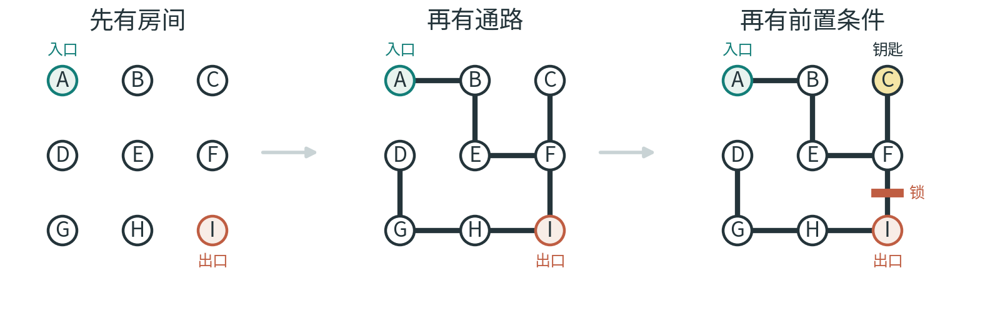

图 1 房间、通路与前置条件。本书的九房间原创模型。

暂时拿掉战斗和装饰后，通路上的问题就容易看清了：出口是否可达，哪扇门隔开了区域，钥匙会不会落在自己的锁后面，捷径又会不会绕过原定的任务顺序？

九个房间的路线可以逐条检查。后面的章节仍用这张图，只在需要时加入尺寸、资源、线索或重访。这样，每次增加一项条件，都能看到它具体改变了什么。

读图时只需记住：字母代表房间，连线代表通道。数字用于展示生成或检查的过程，可以跟着正文逐步核对。

#### 同一关卡里有三种问题

把房间画成点、通道画成线，就得到连接图。点叫节点，线叫边。房间扩大或换了形状，只要门仍连接同样的房间，这张图就不用变。增加一扇门则会改变连接关系，也就是拓扑。

第二种描述记录具体空间：走廊多宽，台阶多高，门在什么位置。这是几何。同一张连接图可以被做成长方形地牢，也可以被做成弯曲洞穴。只要允许的通行关系没有改变，它们的拓扑可以相同。

第三种描述记录任务依赖。比如“拿到铜钥匙之后，才能打开铜门；打开铜门之后，才有机会到达出口”。它说明先后条件，却不直接规定钥匙房间画在左边还是右边。Dormans 的研究将任务结构与空间结构分开，就是为了避免把这两类问题混在一起。[\[3\]](<https://pcgworkshop.com/archive/dormans2010adventures.pdf>)

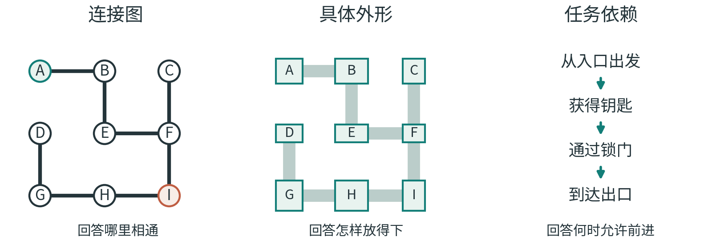

图 2 连接、几何与任务回答不同问题，三者需要保持一致。

房间 D 就在 A 的正下方。但如果它们之间没有门，玩家可能要绕过大半张地图才能到 D。拿尺子量出的直线距离，不能代替沿通道移动的距离；画面上的近，也不等于进度上的近。

这些描述必须相互核对。任务图要求先开锁，几何布局却可能让两条走廊交叉，形成一条绕锁捷径。玩家按实际空间行动，因此每完成一层，都要检查它是否保留了上一层要求的关系。

#### 从一个结果，转向一套会不断产出结果的规则

手工关卡可以逐间查看。生成器交付的却是一套能够反复生产关卡的规则。展示一张精彩地图，只能说明它至少产生过一个精彩结果，尚不能说明大多数时候表现如何。[\[4\]](<https://www.pcgbook.com/chapter12.pdf>)

检查中需要区分三项判断：规则允许玩家完成关卡；关卡保留了设计者要求的结构；玩家觉得这段经历有趣。前两项有时能通过计算确认，第三项还需要实际体验的证据。

后面会多次故意改坏这张图。移走一把钥匙、加一扇门，原先成立的保证就可能失效。沿着这些反例，可以查清一种方法究竟依赖哪些条件。

现在先决定怎样选门。我们会用一串可重现的数字，让每次选择都有迹可查。

### 第二章 种子不是地图身份证

#### 随机数怎样参与一次选择

程序站在一个房间里，面前可能有两扇尚未开的门。它可以固定选左边，也可以根据一个数字选其中一边。数字负责作出选择；有哪些合法选项，已经由规则决定。

游戏常用的是伪随机数：一连串数字由确定的运算产生，目标是具有用途所需的统计特性，并在相同条件下重现。用来初始化这串数字的输入，通常称为种子。Godot 的官方文档就明确区分了种子、当前状态与底层实现；本书不依赖该引擎运行案例，只借官方说明核对概念。[\[10\]](<https://docs.godotengine.org/en/stable/classes/class_randomnumbergenerator.html>)

发现坏地图时，若能重现当时的生成过程，就不必等它再次碰巧出现。不过，要回到同一张图，除了种子，还需要保留使用它的规则。

#### 一个刻意缩小的数字机器

为了把过程完全展开，我们使用一个玩具规则。先保存一个 0 到 15 的整数；每次需要新数，就把旧数乘以 5，再加 1，最后取除以 16 的余数。余数成为这一次的数字，也成为下一次运算的旧数。

“取余数”可以理解为分成整组后还剩多少。36 可以分成两组 16，还剩 4，因此 36 除以 16 的余数是 4。

从种子 7 开始：7 乘以 5 再加 1，得到 36，余数是 4；接下来 4 乘以 5 再加 1，得到 21，余数是 5；再下一次是 26，余数是 10。继续下去，前八个新数依次为 4、5、10、3、0、1、6、15。

这个例子只有十六种初始状态，周期很短，奇数和偶数还会交替出现。它只是用于展示完整过程，不能作为真实游戏随机源的推荐。下一章会让这些数字负责八次开门，第七章再查看全部十六个种子究竟能产生多少种结果。

#### 数字如何对应到房间

假如当前房间有三个合法出口，按固定顺序记成第 0、第 1、第 2 个。这次得到的数字是 10，就取 10 除以 3 的余数 1，选择第 1 个出口。这里从 0 编号，只是为了直接对应余数；第 1 个实际上是列表里的第二个。

假如合法出口依次是 D、F、H，这次就会选中 F。把顺序改成 F、D、H，相同的数字便会选中 D。因此，重演生成过程时，选项顺序与数字序列一样重要。

直接取余也不自动保证每个选项机会相同。把 0 到 15 分别除以 3，余数 0 出现六次，余数 1 和 2 各出现五次。这个小算例只说明一种可能的偏差；实际分支结果还受到数字之间的关系和此前选择的影响，不能只凭这一项就解释所有地图分布。

本书规定：即使只剩一个合法邻居，也取一个新数。另一种实现可以跳过这一步，但后续使用的数字便会错位。这个小约定也要保存下来，才能用同一个种子重演过程。

#### 为什么同一个种子仍可能给出另一张图

第一种变化来自选项顺序。同一个余数，会指向另一间房。

第二种变化来自取数次数。提前多取一次数，后面的所有选择就可能发生变化。比如装饰程序在造门之前先随机放了一盏灯，如果它与路线生成共用同一串数字，门的选择也可能被一起改变。

第三种变化来自生成规则与素材库。原本允许使用的房间被移除，新的房间加入，或某个连接条件改变，种子就会在一套不同的选项中工作。

第四种变化来自运行实现与版本。不同实现不一定采用同一随机算法，辅助操作也可能变化。Python 的官方文档明确区分同种子复用与有限的跨版本承诺，不能把某一函数的保证推广到所有随机操作。[\[11\]](<https://docs.python.org/3/library/random.html>)

因此，报告“种子7生成了坏图”时，还要附上生成器版本、参数、相关素材版本和必要的运行条件。否则，对方用另一套规则运行种子7，未必看见同一个问题。

#### 把互不相干的变化隔开

一种做法是给房间结构、敌人和装饰各自分配一串随机数。它们可以从同一个主种子和固定分类名称得到，但不互相消耗对方的数字。

这样，多放一盏随机灯通常不会把整张地图的门重新洗牌。结构仍由结构自己的序列决定。分类名称、计算规则和版本也必须保持一致，否则这种隔离仍无法独自保证复现。

分开使用数字序列，主要是为了避免装饰改动意外影响路线。至于这些序列是否具有所需的统计性质，仍取决于产生它们的方法；单是分组并不能证明统计独立。

#### 重演初始地图，与保存游玩经历

同一个种子能帮助重新造出最初的村庄，却未必能记住玩家修好了哪座桥。种子描述的是生成过程；玩家后来做过的事，需要另外保存。

可以把世界理解为两层：一层是规则与种子生成的基准，另一层是此后发生的变化。重访时，先重建基准，再恢复应当保留的变化。若游戏本来就设计成每次重置，则应清楚决定哪些内容重置、哪些记忆留给玩家。

第九章会再讨论这两层数据。一个地点之所以被认出来，可能既因为最初的布局，也因为玩家后来在这里修过桥、留下过东西。

先回到九个房间。下一章把刚才的数字序列接到开门规则上，完整走一遍生成过程。

### 第三章 路线是怎样长出来的

#### 一张地图其实藏着好几种距离

站在入口 A，房间 D 就在正下方。隔着墙看，它们像是邻居；沿门走，D 却可能是整张地图最后才能到达的地方。地图上的位置，和玩家实际经历的顺序，已经在这里分开了。

这一章仍用点代表房间，用连线代表可以穿过的门，暂不画墙厚和家具。这张图只记录“从哪里能去哪里”。路线理清之后，第四章再补上真实尺寸。

九个房间按三行排列：A、B、C；D、E、F；G、H、I。只允许上下左右相邻的房间开门，共有十二条候选连接。斜对角和穿墙都不在选项中，随机数也不能选出这些动作。

#### 生成者走过的路，不是玩家必须走的路

第二章给出了一个可逐项核对的数字序列。现在把它接到造地图的规则上：从 A 开始，把尚未进入的相邻房间按字母顺序排列，取下一个数字，再用余数选择其中一个。只要进入了新房间，就开一扇门。即使只剩一个选择，也照样取一个数，以免规则含糊。

如果周围没有新房间，就沿自己的记录退回上一间，继续找还没进入的邻居。这里的“退回”是在恢复生成者的工作位置，不会额外开门，也不消耗新数字。这个方法通常叫深度优先探索加回退。Jamis Buck 的原作者讲解展示了同类迷宫方法；本书的数字规则与九房间记录是另行构造的。[\[16\]](<https://weblog.jamisbuck.org/2010/12/27/maze-generation-recursive-backtracking>)

种子 7 的八次开门记录依次是：A—B，B—E，E—F，F—I，I—H，H—G，G—D，最后 F—C。最后一步之前，生成者已经从 D 沿记录退回 G、H、I、F；最后一次开门从 F 开始，不表示地图多了一条 D—F 通道。附录 B 列出了每一步的候选房间与余数。

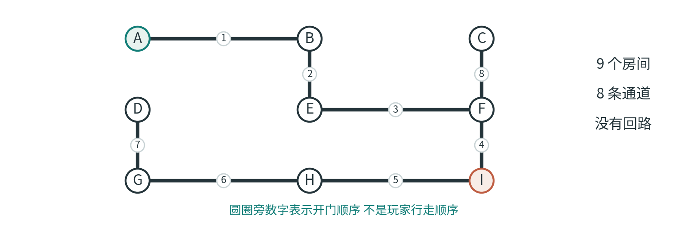

图 3 种子 7 的八次开门。圈旁数字表示生成顺序，不是玩家行走顺序。

造好以后，玩家可以停在B，也可以从F先去C。生成者的记录解释了门是怎样造出来的，玩家没有义务照着这份记录行走。

#### 为什么八扇门就能让九间房连通

每次开门，我们都从已到达的部分接入一间新房。因此，新房总能沿着刚开的门回到原来的区域。起初只有 A；接入 B 后有两间；再接入 E 后有三间。这个理由在每一步都成立，最终所有九间房就属于同一片连通区域。

除了起点，另外八间房各带来一扇新门，所以共有八条连接。另一方面，我们从不把门开向已经访问过的房间，因此不会把一条新路接回旧区域，形成绕行回路。这样的图既连通又没有回路，叫作树。

这里的回路不包括沿同一扇门出去再原路回来。树形地图里当然可以返回；它缺少的是一条不用沿原通道折返的绕行路线。

树中两间房之间只有一条不重复绕行的路线。在这条唯一路线上放锁，很容易判断锁控制了哪个区域。不过，玩家进入支路后通常只能原路返回；是否需要这种结构，还要看游戏希望怎样安排探索。

#### 一条回路能做什么

在B和C之间加一扇门，便形成B—E—F—C—B的回路。房间还是原来的房间，玩家却多了一种走法：从B直接去C，或绕经E和F。

这个变化可能有不同用途。一条路较短但有风险，另一条路较长却有补给，就可能产生取舍；一条新路也可能在完成任务后成为返回入口的捷径。如果两条路的长度、风险、奖励都相同，玩家又看不出任何区别，回路也可能只是让人多认几扇门。

回路数量只能描述结构。要让岔路值得权衡，还需要给不同路线安排代价和回报，并让玩家有机会了解差别；否则，多出来的门可能只增加辨路负担。

同样，死路也不是天生的坏设计。D 可以是一间可选宝箱房，只要奖励值得额外走一趟，来路又足够清楚。反过来，一条很长的死路若既没有新信息，也没有回报，就可能主要消耗耐心。算法不会仅凭“只有一扇门”这个结构特征知道二者的差别。

#### 哪些门是关键通道

回到还没加 B—C 的原始地图。如果把 F—I 视为不可通行，入口一侧只剩 A、B、C、E、F；另一侧是 I、H、G、D。一扇门把地图分成两部分。对于这张具体图，F—I 是关键连接：去出口必须经过它。

数学里，把一条边移除后会令原来连通的图断开，这条边叫桥。这个名字描述连接性质，与画面里是否画了一座桥无关。木桥未必是图论中的桥，一扇普通木门也可能是。

树里的每条边都是桥。加上B—C后，B—E、E—F、F—C和B—C之间可以相互绕行，这四条边不再各自承担唯一连接。F—I仍守着出口区域。加门时，需要分清它改变的是哪一部分。

如果新增的是 E—H，入口就能沿 A—B—E—H—I 到达出口，绕过 F—I。锁门仍在原位，看起来也没坏，但它已经不再约束进程。第五章会把这件事放进钥匙状态里完整检查。

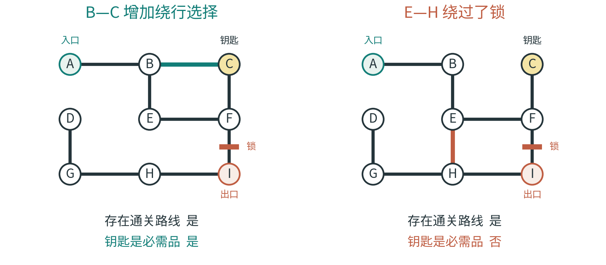

图 4 两种新增门的差别。第五章会进一步检查钥匙是否必需。

#### 走得到与回得来

至今每扇普通门都允许双向通过。如果 F 到 I 是一道可以跳下去、却无法跳回来的落差，就不能再用一条没有方向的线表达它。需要画成 F 指向 I 的箭头。

方向改变了问题。一个房间可能从入口可达，却无法回到入口；钥匙可能拿得到，却拿不回锁门旁。此时，仅把所有房间涂成“连着的”会掩盖实际困难。

静态单向门首先改变可移动的方向，不一定需要增加记忆变量。若开关能反转门的方向，检查器才还要记录开关状态。后面建立状态模型时，会按同样的办法判断该记住什么。

#### 路线长度有用，但它只是一个量

从 A 到 I，忽略锁门时的最短路线是 A—B—E—F—I，共四次跨门移动。这里每扇门的代价都算一。这是明确的计数规则，适合检查同一个小模型。

真实游戏可能不同。穿过一个空房只需几秒，穿过一间要观察机关的房间可能需要几分钟；一段路也可能消耗体力、弹药，或承担失败风险。需要比较这些成本时，连接上的代价就不再相同。地图上最少的门，不一定对应最快、最安全或最轻松的路线。

“主路”也有不同用法：设计者预期的路线、最短合法路线、实际玩家常走的路线，可能各不相同。本书报告计算结果时，会明确使用“最短合法路线”，不据此推断玩家一定怎样走。

现在已经知道地图是否连通、哪里能绕行、哪些门控制关键区域。门宽、角色尺寸和锁钥规则仍在图外。接下来分别补上这些信息，看看原先的通路是否还成立。

## 第二部 把规则变成世界

### 第四章 从纸上通路到真实移动

#### 点能过去，角色未必能过去

第三章的树保证：忽略锁和其他阻碍时，各房间在连接图上可达。真实角色还占有空间，图中的一条边是否走得过去，需要再查尺寸和移动规则。

把 E—F 画成一条宽 0.8 米的走廊，而程序用来判断角色是否撞墙的外框，也就是碰撞体，宽 1 米。图上存在这条连接，角色实际移动时却会被卡住。

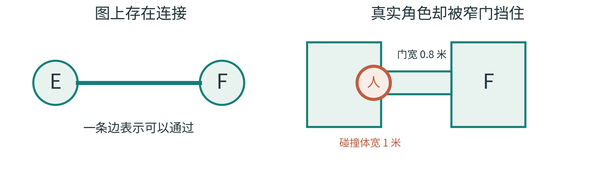

图 5 图上存在连接，真实角色却可能被窄门挡住。

连接图把角色当作没有大小的点，因此没有描述肩膀宽度、跳跃高度和转身空间。图上的证明仍然成立，只是它没有包含角色被卡住的条件。

这里的 0.8 米和 1 米只是解释尺寸关系的假设值，不是游戏制作的通用推荐。真实结果还取决于碰撞形状、移动方向、门框和具体物理规则。

#### 房间相邻，不等于门口对齐

空间切分可以让两个房间互不重叠，却不自动让门出现在对应位置。左边房间的出口在北侧，右边房间的入口在南侧，中间就可能没有真正连起来。

同样，连接两个房间的走廊可能在直线段足够宽，转角却过不去；台阶表面看似相接，实际高度超过角色可跨越的范围；出生点可能落在桌子里面，或恰好生成在一段无法离开的平台上。

落实几何时，应使用游戏自己的移动规则检查：角色能否从所需的起点到达另一处？只确认地板连成一片，还没有回答角色是否过得去。

二维平台游戏尤其容易暴露这个区别。落到下方通常可行，跳回上方未必可行。一个没有方向的房间连接，可能把这种差别完全藏起来。即使高低差相同，助跑距离、起跳点和上方障碍也可能改变结果。

#### 几何也会偷偷增加一条路

另一类错误方向正好相反：图里没有的连接，在真实空间里出现了。

设想两条走廊在同一高度交叉。如果交叉处没有墙，玩家就可以从一条走廊转到另一条。任务图可能把它们当作独立路线，实际地图却多了一个岔路口。若交叉连到了锁门另一侧，玩家就可以绕过原先的进度要求。

可以把其中一条走廊做成高架桥，避免交叉处相通。但桥的高度、边缘和碰撞都必须落实；设计图上的标注本身不会限制角色移动。

“补上一条短走廊”“把洞穴边缘抹平”“挪开一块石头”都可能改变连接。某些改动会移除本来允许的动作，某些会增加本来禁止的动作。两种方向都需要检查。

#### 从真实可走区域反推连接

一个实用思路是，在空间已经生成之后，按照真实移动规则重新分析可走区域，再与原先希望得到的连接关系比较。

如果原图说 E 和 F 应当相通，实际分析却发现不可达，就要检查门宽、碰撞、台阶或其他阻挡。如果原图说锁门外无法进入终点区域，实际分析却能找到另一条路线，就要检查走廊交叉、意外缝隙或未建模的移动能力。

检查方法随玩法而变。俯视游戏可以分析格子或可走区域，平台游戏要加入跳跃与落差，允许攀爬、传送或破墙的游戏还得加入这些动作。遗漏的能力可能让检查器错过真实路线。

自动代理走通了，也只能提供其能力范围内的路线。若它精确掌握跳跃时机，或者预先知道隐藏通路，初学玩家仍可能失败。信息是否清楚、操作要求是否合适，需要另外判断。

#### 一个研究例子能保证到哪里

Tanagra 是面向二维平台关卡的设计辅助研究。它把玩家运动模型和几何组件内部、组件之间的约束放进生成过程，用这些明确建模的条件支持可玩性保证。[\[14\]](<https://ojs.aaai.org/index.php/AIIDE/article/download/12379/12238/15907>)

Tanagra的做法提示我们，移动能力应当进入生成条件。后来若增加动作、改变碰撞或加入新机制，就要更新模型；旧条件给出的保证无法自动覆盖这些变化。

本书只借这个例子解释可玩性保证的前提，不复刻Tanagra，也不把它的结果推广到所有引擎。使用“可玩”一词时，应说明对应的角色能力、规则与空间表示。

#### 装饰之后还要再走一次

地形和房间通过检查后，美术也可能再次改变体验。一个挡路的箱子、一棵遮住门的树，或一片让关键符号难以辨认的纹理，都可能破坏此前的可用性。

装饰造成的问题也要分开查。箱子挡住门，属于通行问题；门可以通过，玩家却认不出它是门，属于信息问题。两者需要不同的修正。

因此，完成美术和装饰后，还要复查通行与信息可读性。检查通过之后的每次重要改动，都可能再次触及原来的条件。

下一章先固定几何：普通门足够宽，房内没有障碍，通道双向。随后只加入钥匙，观察它怎样改变允许的行动。

### 第五章 钥匙让地图有了记忆

#### 同一个房间，为什么需要检查两遍

原来的九房间地图已经连通。现在锁住 F—I，把钥匙放在 C，入口仍是 A，出口仍是 I。普通通道双向，房间内部没有障碍；钥匙拿到后永久有效；玩家需要主动使用出口，关卡才结束。

不考虑锁时，最短路线是 A—B—E—F—I。加上锁，玩家第一次到 F 时还过不去，必须先去 C，再回到 F：A—B—E—F—C—F—I，共六次跨门移动。

F 出现了两次。位置相同，接下来允许做的事却不同。第一次是“在 F，没有钥匙”；第二次是“在 F，已经有钥匙”。如果检查程序只记住“F 去过了”，就可能把第二次到达当成无用的重复，从而漏掉真正的通关路线。

检查器需要比房间名更完整的描述，这就是状态。它保存会影响后续行动的信息。本例只需记录位置和是否持有钥匙；此前绕过几次路不会改变未来动作，暂时无须保存。

若钥匙用一次就消失，或开关能独立控制门，原来的状态就不够了。每增加一种机制，都要重新判断哪些过去发生的事会影响下一步。

#### 把地图展开成状态地图

可以想象给每个房间准备两张卡片：一张写“无钥匙”，一张写“有钥匙”。进入 C 并拾取钥匙后，玩家从无钥匙那层转到有钥匙那层。在有钥匙那层，F—I 的移动才被允许。

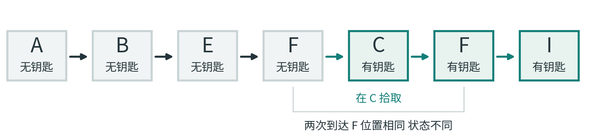

图 6 两次到达 F，位置相同，钥匙状态不同。

检查器从起点卡片出发，列出每个状态可以走到的下一个状态，再从这些新状态继续展开。已经完整检查过的同一状态不必重复展开，但“F，无钥匙”和“F，有钥匙”必须分别对待。最终如果能碰到合法的出口状态，就找到了通关证据。

如果每次跨门的代价都相同，按“一步能到哪里、两步能到哪里、三步能到哪里”的顺序展开，就能先找到跨门次数最少的合法路线。这种一层一层检查的办法叫广度优先搜索。这里说的是本模型的最少移动次数，不是最快的真实游玩时间。

九个房间乘以两种持钥匙情况，最多有十八种组合。但按本书规则，首次进入C就会获得永久钥匙，因此“在C且无钥匙”不会留作可继续行动的状态。组合上限不等于实际可达状态数。

#### 钥匙不能在自己的锁后面

暂时把 F—I 对应的通道视为不可通行，入口 A 这一边能到达 A、B、C、E、F。把钥匙放在其中一间，玩家可以在开锁之前拿到它。

现在故意把钥匙挪到 D。D 位于 I、H、G、D 这一侧。要拿钥匙必须先经过锁门，要经过锁门又必须先拿钥匙。地图的墙和地板全都合法，却没有通关路线。

在双向普通通道、永久钥匙和单把锁的条件下，可以先划出锁门关闭时入口能到达的区域，再从这个区域选钥匙位置。这是一条容易说明的构造规则。它避免自锁，也让错误更容易被找到。

这条构造规则保证钥匙在开锁前可取。若通道改成单向，还要查拿到后能否回到锁旁；若增加第二把锁或会关闭的机关，也得把它们一起纳入检查。

#### 有一条正确路线，还不够说明钥匙必需

在原地图增加 E—H，玩家可以沿 A—B—E—H—I 到达出口，不拿钥匙也行。程序若只去寻找“先拿钥匙、再通关”的路线，仍可能找到一条，于是误以为设计成功。

更隐蔽的情况是增加 D—E。此时，带钥匙的 A—B—E—F—C—F—I 和不拿钥匙的 A—B—E—D—G—H—I 都是六步。一种最短路线搜索可能恰好返回前者。它的结果没有算错，错的是我们拿它回答了另一个问题。

“存在一条遵守设计意图的路线”与“所有通关路线都遵守设计意图”，强度不同。想确认钥匙确实必需，可以移除钥匙的拾取效果，但仍允许进入原来的钥匙房，再检查出口是否仍可达。若仍可达，就存在绕行。

不过，也不能只看这个检查。一个根本无法通关的地图，当然也不存在不拿钥匙的通关路线。因此至少要一起确认两件事：正常规则下能够通关；禁用钥匙后无法通关。二者合在一起，才说明钥匙在一个有解关卡里确实承担必要作用。

有些游戏本来就允许熟练玩家跳过钥匙，此时绕行可以保留。是否修复，取决于任务要求；检查器应当落实这款游戏允许的走法。

#### 每个人都拿过，不等于钥匙发挥了作用

前面的检查关心一项功能依赖：如果玩家不能获得钥匙，关卡是否仍能完成。它与“正常游玩的记录里，是否出现过拿钥匙”，还不是同一个问题。Nelson 关于游戏分析的研究区分了规则允许或要求发生的事情，与实际试玩里观察到的行为；观察到所有人都做过某件事，不足以证明它由规则必然要求。[\[20\]](<https://www.kmjn.org/publications/Metrics_IDP11.pdf>)

再改一次九房间例子：把永久钥匙从 C 移到 B，并加入 E—H。A 只有通往 B 的门，因此所有正常出发的玩家都会经过 B，并自动拿到钥匙。但玩家仍然可以走 A—B—E—H—I，完全不经过锁着的 F—I。

此时，日志里可以有百分之百的钥匙拾取记录，却不能据此说钥匙是开辟出口路线的必要条件。把 B 的钥匙拿走，仍允许玩家正常经过 B，同一条 E—H 绕行依然能完成关卡。这里改变的是获得钥匙的效果，不是禁止玩家进入 B。

这里，拾取事件发生在每条成功路线中，因为B是必经房间，钥匙又会自动拾取。但开锁能力没有参与E—H那条路线的成功。检查前应明确：要保证玩家经过一次拾取，还是要保证通关确实依赖这把钥匙？

#### 一把会消耗的钥匙，让“过去”变得重要

先回到只有原始八条连接、钥匙位于 C、锁门位于 F—I 的地图，不保留前面为比较而增加的门。接下来改变钥匙的规则，并加入一个小小的选择：钥匙不再永久有效。它用一次就消失；F—I 被打开后保持打开。再在 C 放一个可选宝箱，开宝箱也会消耗同一把钥匙。整张地图只生成这一把钥匙，不会重新出现。这个变体把拾取和开锁视为独立动作，便于看清资源变化。

玩家仍然能通关：在 C 拿钥匙，不开宝箱，返回 F，打开 F—I，最后去 I 使用出口。初始状态的“存在通关路线”检查会通过。

但玩家也能在 C 拿钥匙后立刻打开宝箱。钥匙用掉了，出口门还关着，地上又不会再生一把。玩家仍能在 A、B、C、E、F 之间走动，却已经无法完成关卡。这是一种永久困境，有时也被称为软锁：不是角色不能移动，而是目标已经不可能达成。

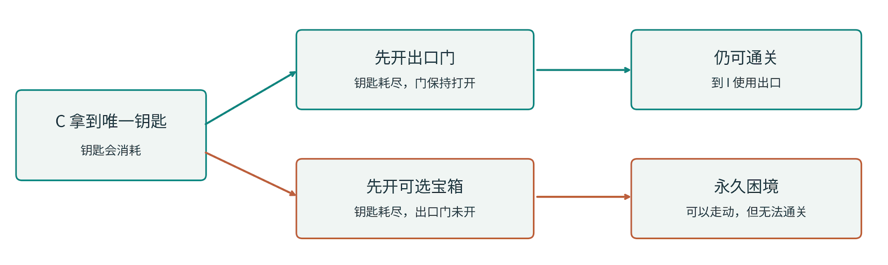

图 7 同一把消耗钥匙，两种使用顺序。打开出口门后，钥匙虽消耗，门仍保持开启。

如果状态只记录“在哪间房”和“还有没有钥匙”，它会漏掉至少两件事。第一，地上的钥匙是否已经拿过：初次到 C 时没钥匙，与在 C 花掉钥匙后没钥匙，看起来库存相同，未来却不同。第二，出口门是否已经打开：钥匙被消耗之后，开过的门仍应允许通行。

本例记录位置、地上是否还有钥匙、是否持有钥匙、出口门是否打开、宝箱是否打开。编码可以更紧凑，只要保留所有会影响后续动作的区别。

若宝箱开启状态不影响移动、资源或后续动作，而问题只关心出口是否可达，某些实现可以省去这个变量。状态所需的信息，由游戏规则和检查的问题共同决定。

#### 从“有一条出路”到“不会走进永久困境”

更强的检查会先找出所有从起点可以到达的非终局状态，再看每个状态是否还存在通往目标的路线。在刚才的例子中，“C，宝箱已开，钥匙已耗尽，出口门未开”是可达状态，却再也到不了出口，因此检查失败。

一种直观做法是把状态之间的箭头反过来看：从合法终点出发，沿反向箭头找出哪些状态还有机会到达终点。再与起点可以到达的状态比较。如果某个状态能被玩家走到，却不属于“仍有机会通关”的集合，就值得调查。

检查通过意味着每个状态还留有通关机会。玩家可能没有发现出口路线，也可能一直绕路，因此不能据此预测他最终一定通关。

这项要求更强，也可能排除游戏本来需要的失败。生存游戏可以允许把最后的补给用错，解谜游戏可以允许失败后立即重来，冒险游戏也可能把高风险选择当作主题。设计者要先决定，永久困境应该被禁止、明确警告，还是成为一种有意的结果。

物品数量无上限、数值不断增长或世界持续变化时，状态空间可能大得难以检查。简化模型可以降低成本，但结论也随之收窄。例如，忽略战斗和体力的搜索结果，无法保证玩家有资源走完全程。

#### 多把钥匙不只是把一个开关复制几次

有两把永久钥匙时，可以区别“都没有”“只有铜钥匙”“只有银钥匙”“两把都有”。这些是可能的组合标签，尚不表示每种组合都能在具体关卡里出现。

仍使用原来的八条连接，不加绕行。铜钥匙放在 C，用来通过 F—I 的铜门；银钥匙放在 D，用来启用 I 的出口。两把钥匙都不会消耗。本变体新增了出口条件：走进 I 不算完成，必须已经取得银钥匙，才能使用出口离开。

任务顺序因此是：在 C 获得铜钥匙，穿过 F—I，经过 I、H、G 到 D 获得银钥匙，再返回 I 使用出口。最短路线为 A—B—E—F—C—F—I—H—G—D—G—H—I，共十二次跨门移动；拾取和使用出口不计入这项跨门次数。

第一次到I时，玩家还没有银钥匙，只能经过出口位置；第二次返回时才满足离开条件。第一章约定出口需要主动使用，正是为了把到达位置与完成关卡分开。

“只有银钥匙”在这个模型中不可达，因为去D之前必须先持铜钥匙通过铜门。虽然可以列出四种持有组合，实际搜索只会遇到三种；这是任务顺序造成的限制。

现在再加上 E—H。玩家可以沿 A—B—E—H—G—D—G—H—I，八步取得银钥匙并到出口，完全不需要铜钥匙。终局条件仍在检查银钥匙，原来的铜钥匙顺序却已被绕开。正常能完成，没有替我们保证完整任务链。

可以把这段依赖先写成任务图，再让空间承接它。Dormans 的研究将任务与空间分开处理，目的之一就是明确表达这种关系，而不是完全交给房间位置碰运气。[\[3\]](<https://pcgworkshop.com/archive/dormans2010adventures.pdf>) 落实后仍要检查实际动作；任务图表达意图，状态图表达游戏允许发生的事。

从永久钥匙到消耗钥匙，再到两把钥匙，连接图可以不变，允许的行动却一直在变。检查器只有记住这些状态差异，才能判断同一地点接下来有哪些走法。

### 第六章 给不同方法分工

#### 选择方法之前，先知道最怕哪一种失败

选方法时，可以先看要生成的对象：房间连接、地板形状，还是任务关系。常见算法各有擅长处理的表示，名字相近也未必提供相同保证。

房间重叠可以从空间分区入手；钥匙顺序需要任务和状态模型；洞穴轮廓可以用局部格子规则处理。解决其中一个问题以后，其余问题仍要有人负责。

同一个生成器可以先用图安排区域，再分区放房间，用局部规则调整轮廓，最后检查实际移动。本章按各方法负责的工作介绍它们，便于看出怎样组合。

#### 挖掘者：从已有地面继续生长

一种简单办法是让“挖掘者”在实心区域里移动，走到哪里就把哪里挖开。只要它始终从已有地面向相邻位置继续挖，新挖出的地面便与旧地面相连。

它容易产生弯曲、连续的通道，也可能在同一区域反复徘徊，留下很大一片未使用空间。可以加入方向偏好、房间放置或向前查看的规则，但每种改动都可能改变输出的形状和分布。[\[2\]](<https://www.pcgbook.com/chapter03.pdf>)

第三章的方法还规定：门只开向未访问房间，走不下去就回退。在连通的候选网格中完整运行后，所有房间都会被访问，且不会形成回路。一般随机游走没有同样的规则，不能直接沿用这两项保证。

#### 空间分区：先给房间各自的地盘

另一种办法是把大矩形切成两块，再把每块继续切分，直到每个小块适合放一间房。这叫二叉空间划分，常写为 BSP。[\[2\]](<https://www.pcgbook.com/chapter03.pdf>)

如果每间房都严格放在各自互不重叠的区域里，就容易避免房间相互重叠。随后再连接这些房间。可以沿着分区层级，把同一个大区内部的房间先接起来，再连接更大的区域。

分区能组织房间占地，却还没决定钥匙位置、门宽和走廊交叉。连接房间之后，仍要检查门口是否对齐，以及新通道有没有改变任务顺序。

分区还可以组织主题或难度阶段。若希望玩家按顺序进入这些区域，就需要检查跨区通道，确认它们没有绕开前置条件。仅给区域命名还不够。

#### 细胞规则：让每个格子看自己的邻居

把地图当作格子画布，每格只有墙和地面两种状态。每轮查看周围格子，按规则决定下一轮变成什么。例如周围墙很多，就把当前格子也变成墙。所有格子根据上一轮状态同时更新。这类局部更新叫细胞自动机。[\[19\]](<https://pcgworkshop.com/archive/johnson2010cellular.pdf>)

细胞规则常用于调整洞穴轮廓：随机初始分布提供变化，随后几轮更新使一些形状扩张、另一些消失。同一套更新规则，也会因初始状态不同而得到不同结果。

问题是，格子看见的邻域并不等于整个入口到出口的路线。两个地面区域可以各自很好看，中间却隔着厚墙。生成后可以保留一片区域、挖通连接，或者重新生成；这些处理也会改变面积和路线结构。

挖通之后若再做平滑，细通道还可能重新封闭。我们另外构造了一个小反例：两片房间原本由一格宽通道相连；按“八个邻居里至少五个是墙，就变成墙”的规则同步更新一轮，中间通道被封住。这个例子只证明此类变化可能发生，不表示所有平滑规则都会断路。

这个反例说明，连通检查应当放在最后一次可能改变通行的处理之后。后面若再平滑或修饰，也要重新检查。

#### 生成语法：替换的不是单块地板，而是一段关系

如果希望生成器理解“先拿钥匙，再通过锁门”，只控制房间轮廓就不够了。可以规定一种结构替换：把一段普通通路换成分岔，其中一条支路放钥匙，继续前进的门需要那把钥匙。

这样的替换属于生成语法的思路；图上的节点和边都可以参与替换。Dormans 的研究用任务图表达前后依赖，再让空间生成承接这些关系。[\[3\]](<https://pcgworkshop.com/archive/dormans2010adventures.pdf>)

应用替换规则前，还要查看周围连接。若旁边已有直达终点的路线，新锁就可能被绕过。替换片段内部正确，并不能省去对整图的检查。

任务顺序和信息顺序也要分开处理。玩家必须拿钥匙才能开门，却可能先拿到钥匙、后看见锁。若希望他先看见锁，需要安排视野、必经观察位置或其他线索，任务图无法代替这些设计。

#### 局部匹配：每块拼对了，整张图仍可能不通

另一种方法叫波函数坍缩，英文 Wave Function Collapse，缩写 WFC。理解它不需要量子物理。可以把它想成拼瓷砖：每个位置列出还能放哪些砖；确定一块后，把邻居里与它不相容的选项删掉；新的限制继续传到更远处。[\[6\]](<https://www.boristhebrave.com/2020/04/13/wave-function-collapse-explained/>)

Gumin 的原始实现说明了局部模式约束，也明确描述当前生成尝试可能出现矛盾、无法继续的情况。[\[9\]](<https://github.com/mxgmn/WaveFunctionCollapse>) 某次尝试失败，不等于整个问题无解；换一个选择、回退或重启，可能得到不同结果，具体行为取决于实现。

本书的双回路反例里，每块道路砖的接口都对得上，但入口在左环，出口在右环，中间隔着墙。所有普通邻接规则都可以满足，仍然没有从入口走到出口的路线。

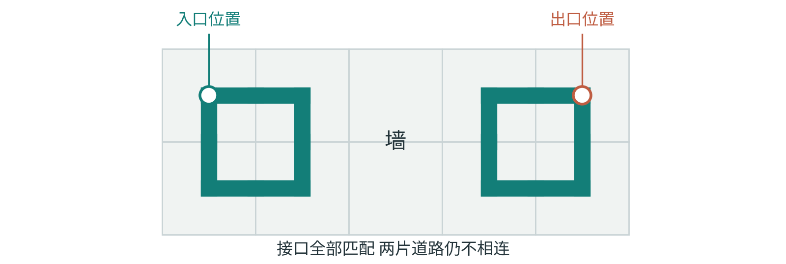

图 8 相邻接口都匹配，入口与出口仍然可能不连通。

这不是说 WFC 永远无法生成连通关卡。特殊的砖集、额外的全局约束或与其他方法配合，都可以加强保证。例如扩展工具 DeBroglie 提供路径连通约束，其官方文档也提醒，这类约束通常更耗时，往往需要借助回退。[\[18\]](<https://boristhebrave.github.io/DeBroglie/articles/path_constraints.html>)

WFC的限制可以传播到很远的位置，但具体保证仍取决于写入了哪些约束。接口相容和入口到出口可达是不同条件，后者需要另行保证。

#### 搜索与约束：先说清怎样才算合格

还可以先产生候选，再检查、比较或修改。比如先剔除无解地图，再在合格地图里优先选择主路长度接近目标、返回距离较短的结果。难点在于：给候选打分的评价函数，是否真能代表目标体验。[\[7\]](<https://www.pcgbook.com/chapter02.pdf>)

出口可达这类必须满足的条件，称为硬约束；路线略长、布局更对称这类可以权衡的偏好，称为软目标。若通关是硬约束，地图再漂亮，也不能用美术得分抵消无解。

逻辑约束方法会明确写出允许的结构和条件，让程序寻找同时满足它们的结果。[\[17\]](<https://www.pcgbook.com/chapter08.pdf>) 它提供的是已表达条件之内的保证，仍依赖模型是否正确、问题能否在预算内求解，以及生成后的几何和动作是否保持一致。

还要观察合格结果的分布。每张图都通过检查，仍可能总是同一种布局。第七章会继续比较：生成器能产生哪些结果，又多大概率产生它们。

组合方法时，可以让语法安排任务、空间方法放房间、局部匹配填细节，再由检查器核验路线。若某一步可能改变前面成立的条件，就在它之后安排复查。

## 第三部 让变化成为体验

### 第七章 为什么一万个种子仍可能重复

#### 先把“不同”说清楚

灯的位置、房间连接和玩家行动，都可以拿来比较地图的差别。前两项发生变化，行动仍可能相同。因此，报告多样性前，应先说明具体比较什么。

本书的九房间模型暂时只比较连接。A 到 I 的位置标签保持固定，同一对房间之间的门视为同一条无向连接。开门顺序不同，但最后留下的门完全相同，就算同一张布局。旋转或镜像后的结果，在这次计数中不合并。

若方向不影响玩法，旋转后的地图可以按同一种结构计数；若入口、光照或线索与方位有关，就可能需要分开。本书采用保留位置标签的规则，后面的数量都按这一口径计算。

#### 十六个种子的完整结果

玩具随机数只允许 0 到 15 这十六个初始值，因此可以把全部结果列出来，而不必抽样猜测。按照第二章的数字规则与第三章的开门规则，十六个种子最后只给出六种布局。

种子 0、2、4 生成同一张图；1、3、5 生成另一张；6、8、10 生成第三张；7、9 生成第四张；11、13、15 生成第五张；12、14 生成第六张。因此六张图出现的次数是 3、3、3、2、3、2。

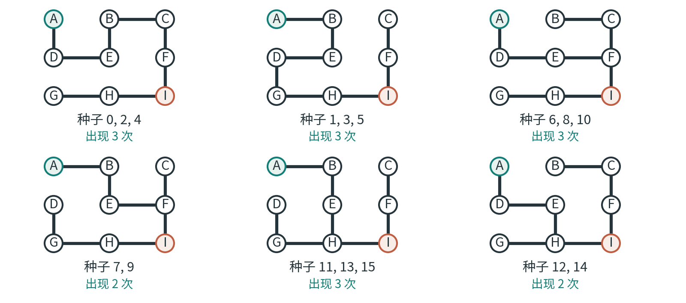

图 9 十六个种子的全部六种布局。计数保留位置标签，不合并旋转或镜像。

不同数字除以候选数量，可能得到相同余数；不同中间选择，也可能留下相同连接。因此，种子不同并不保证最终布局不同。

六种布局就是本模型的全部输出，十六个种子都已列入。它们全是连通的九房间树，但会重复出现，出现次数也不相同。连通检查与多样性检查在这里给出了不同信息。

#### 限制不只来自随机数

九宫格一共有十二条可能的相邻连接。从中挑八条，共有 495 种组合。逐一检查是否连通九个房间，会留下 192 棵生成树。这是这个有限网格的完整计数，不是任何商业游戏的关卡数量估计。

为什么我们的结果只有六种？一部分限制来自故意缩小的数字序列，一部分来自开门方法本身。换一个更好的随机数源，不会自动改变“只开向未访问房间”“遇到死路才退回”“起点固定在 A”这些结构规则。

可以看一个具体差别。有些合法的九宫格树，会让 A 同时向 B 和 D 开门。但在本章所用的回退式探索里，一旦从 A 走向其中一边，生成者就会先把其余相互连通的未访问房间全部探索完，才回到 A；另一边已经去过，便不会再从 A 为它开门。这个排除与随机数字好不好无关。

换随机源主要改变怎样抽取现有选项，修改生成规则则可能改变可出现的结果集合。覆盖更多树也未必符合任务需要；有些结构可以被有意排除。

#### 等概率不是自动的设计目标

假设六种布局各出现同样多，数学上的分布会更均匀。但如果其中一种特别冗长、另一种缺少需要的准备区，均匀出现也不会使它们更合适。

有些体验需要常见的平稳路段和少量罕见事件。让每一种事件同样常见，反而会冲淡罕见事件的意义。设计者需要决定希望哪些变化经常出现，哪些偶尔出现，哪些只在特定条件下出现。

有意让安全路线常见，与取余操作无意偏向某些选择，需要分开记录。两者都会造成不均匀，却应当用不同办法判断和调整。

还要区别单独的数量与组合关系。两批地图都可能平均有三间战斗房和一间补给房，但一批总把补给放在战斗之后，另一批把补给放在适当的中途。单独统计物品数量，无法看出它们的顺序差别。第八章会用生命值例子把这种差别具体算出来。

#### 筛掉坏图，会改变留下来的世界

假设先生成 50 张短主路候选与 50 张长主路候选。检查后，短主路留下 45 张，长主路只留下 5 张。最终交给玩家的 50 张图里，短主路占了 90%。这是一个假设算例，不是本书采样出来的实测数据。

筛选前看起来各占一半，筛选后却明显偏向一边。原因可能是长地图更容易违反资源限制，也可能是检查器把某些正常情况误判为失败。只检查原始候选的分布，就看不到玩家真正收到的分布。

追查后可以分别处理：修改生成规则，减少长地图的资源问题；修正误判；或者在确实需要更多长地图时调整候选比例。改完还要看最终留下来的结果，不能只看输入权重。

有限次数重试还会引入另一个结果：备用地图。如果某类候选总是生成失败，系统可能频繁回落到同一张备用图。玩家看到的重复，就可能主要来自失败处理，而不来自成功生成的那部分。第十章会讨论为什么失败率和备用比例也属于生成器的表现。

#### 把一批地图摆到同一张坐标纸上

只报“有六种图”仍然太粗。六种图可能全部很短，也可能覆盖从紧凑到曲折的不同路线。需要选择能描述目标体验的量，把结果摆在一起比较。

例如，一个轴记录入口到出口的最短合法路线长度，另一个轴记录可选支路数量。把许多结果放上去，就能看到哪些组合经常出现，哪些位置始终空着。这种查看生成器能够产生什么、又偏向什么的办法，叫表达范围分析。[\[4\]](<https://www.pcgbook.com/chapter12.pdf>)[\[8\]](<https://www.pcgworkshop.com/archive/smith2010analyzing.pdf>)

坐标纸上的空白需要结合目标解释。违反任务条件的组合应当缺席；设计者需要的“短主路、多支线”一直没有出现，则应检查是哪条规则限制了它。

指标的解释也要收窄。最短路线用于比较连接距离，不能直接当作游玩时间；支路数描述岔路多少，不能据此判定探索是否有趣。选轴时就应说明它要回答的问题。

有些指标是在核对输入有没有落实。例如要求放三间战斗房，再确认结果确有三间，属于实现检查。战斗出现的顺序、玩家收到的信息，以及其他未预料的效果，还需要另行分析。

#### 数学上不同，感觉上相同

Kate Compton 用“一万碗燕麦粥”说明一种常见落差：细小差异可以让每个结果都不一样，但人未必感到它们真的有区别。[\[13\]](<https://ems.andrew.cmu.edu/2018_60212f/wp-content/uploads/2018/09/kate-compton-oatmeal.pdf>)

回到我们的地牢。如果每次只是把 C 的钥匙换成另一种颜色，而玩家仍沿同一路线取钥匙、返回、开门，结构体验可能几乎没有变化。相反，一次有意安排的捷径、一个需要放弃的宝箱，或一条先看见危险再决定是否进入的支路，都可能改变行动。

这些是设计设想，没有经过本书自己的玩家实验。差别是否被注意到、是否值得花时间，仍取决于实际视角、操作与试玩反馈。

下一步可以据此确定哪些关系需要变化、哪些参照应当稳定，再观察输出范围和出现比例。玩家是否感到新鲜，则留给试玩验证。

### 第八章 难度藏在顺序和信息里

#### 三只怪物并不是一个完整的难度描述

现在给地牢加敌人。最容易实现的办法，是把难度设成一个数字，再按比例增加怪物。但同样三只怪物，分别站在开阔房间、狭窄门口和补给点旁边，造成的压力可能完全不同。

怪物数量便于统计，实际压力还取决于攻击方式、已知信息、退路和失败代价。数量相同，只能说明其中一个条件相同。

Smith 与 Whitehead 在分析生成器表达范围时，特意区分了根据关卡特征计算的宽松程度指标，与主观且依赖排列的实际难度。[\[8\]](<https://www.pcgworkshop.com/archive/smith2010analyzing.pdf>) 本章不会把一个简单数字包装成普遍的难度公式，而是用它揭示顺序为什么重要。

#### 数量相同，结果不同

设定一个极简的生命值模型：角色最多有 10 点生命，开始时满血；每场战斗固定损失 4 点；一份药水恢复 6 点，但不能超过上限；生命降到 0 或以下就失败。这里没有操作技巧、随机伤害或其他治疗。

先连续进行三场战斗，之后才有药水：生命从 10 变成 6，再变成 2，第三场战斗就失败了。后面的药水并不能挽救此前已经发生的失败。

把同一份药水移到第一场战斗之后：生命从 10 变成 6，喝药回到上限 10，再经过两场战斗，依次剩下 6 和 2。角色能够走完。

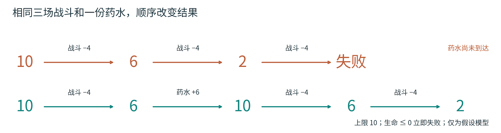

图 10 同样的内容，顺序改变结果。药水受生命上限限制，6 点生命最多恢复到 10。

两个安排都包含三场战斗和一份药水，顺序却决定了角色能否走完。这些数字是用于解释的模型设定，未取自真实游戏实测。

药水还受生命上限限制：第二种安排里，标为恢复6点的药水实际只恢复4点。因此，直接相加全部伤害和治疗量，会遗漏上限以及途中死亡这两个条件。

#### 可达的补给，不一定来得及使用

把药水随机放在一个可以到达的房间里，只说明理论上能到，不说明玩家能活着到，也不说明能在需要的时候发现它。

在九房间图中，若补给放在 D，而玩家必须先穿过危险的 F—I 才能绕到 D，它对第一次通过锁门附近的战斗可能没有帮助。若补给在可选支路里，还需要明确：玩家是否知道那里有补给，返回距离是否合理，错过之后能否恢复。

安全与否也要结合进入时的生命、资源和能力来算。“低难度区域”只是设计标签，不能代替这些条件。

资源紧张和判断失误可以是有意设计的风险。需要排查的是，哪些失败符合玩法目标，哪些只是生成时漏掉了条件。

#### 节奏也包含认识和准备

节奏不只是战斗间隔。玩家第一次接触机关时，先看见它如何运行，再在有风险的场景中使用这项知识，与同时遇见陌生机关和新敌人，是两种不同安排。

设计者可以先安排认识、准备、压力和缓解等阶段，再让不同空间承接它们。这是一种表达顺序的办法，具体阶段应随游戏需要调整。

阶段内仍可以更换房型、敌人外观和支路。若连阶段顺序也要变化，就需要明确允许哪些变化，以及怎样检查新的安排。

四间空屋可能很快走完，两间机关房却可能需要长时间观察。所以这里仍把路线长度用于比较规模和结构，不把它直接换算成时长或难度。

#### 有选择之前，需要有一点可判断的信息

第三章在 B 与 C 之间加了一扇门，让地图出现回路。如果两边都通往同一目标，怎样让这条回路成为真正的决定？

一种设计设想是，短路能提前听见敌人声音，长路能看见补给标记。玩家据此选择，是承担危险换时间，还是绕路换资源。这里的声音和标记是原创示例，并不是经过实验验证的万能方案。

如果两条路外观完全一样，玩家在选择时不知道任何区别，那次选择更接近碰运气。碰运气本身也可以是作品的意图，但它与权衡已知风险不是同一种体验。

信息也可以逐步展开。先看见锁，再找钥匙，可能形成一个明确的小目标；先拿到钥匙再遇见锁，则可能带来“原来它用在这里”的理解。第五章的通关检查能验证钥匙条件，却不能自动决定这两种叙事顺序。

安排物品时，还应记录玩家从哪里能够看见、听见或推断它。相机、照明、遮挡和符号都参与这个过程，改变它们也可能改变玩家的判断。

#### 回头路可以是成本，也可以是重新理解

拿到钥匙后回到 F，是本书原图中的必要返回。如果返回途中什么都不变，路线又很长，它可能只是重复移动；如果新的能力打开了此前看见的捷径，返回就可能让旧空间获得新含义。

返回是否合适，需要结合距离、信息和目的来判断。探索、资源规划和熟悉地点都可能需要重访，单纯减少回头路并不能保证改善体验。

同一条路的意义也可能随玩家变化。第一次经过时需要观察，第三次经过时已经熟悉。自动检查通常看到的是静态成本，玩家却带着学到的知识在行动。

检查本章的例子时，可以沿着行动顺序追问：资源来不来得及用，决定前能知道什么，返回时又多了哪些知识？只统计物品数量，会漏掉这些影响。

### 第九章 为什么会怀念一个虚构的故乡

设想一座由程序生成的小镇。第一次抵达时，你只看见桥、集市和几条岔路。后来，你知道从哪里可以抄近路，习惯在桥头整理行囊，还在某次失败后回到这里重新出发。许久以后，别的小镇也有相似的房屋，你却仍想找回这一座。

同一座桥逐渐关联了走过的路线和发生过的事。“像故乡”在这里是一种比喻，指向玩家与地点积累的关系，不要求虚构地点承担现实故乡全部的亲缘、历史与生活责任。

#### 先分清：熟悉、依恋、记忆与怀旧

熟悉，是认得一个地方，也大致知道如何在其中行动。依恋，是这个地方对自己有了特别的意义。一个人完全可能熟悉某张地图，却不想再回去；也可能只短暂到访，却一直惦记它。有关地方关系的理论也提醒我们，实用的熟悉感与喜欢、归属感需要分开讨论。[\[21\]](<https://doi.org/10.1177/07352751211037724>)

记忆回答“我记得什么”。怀旧则带有时间方向：当我们回望过去，可能同时感到温暖、留恋和一点失落。记住传送门的位置是一种记忆；想起多年前在那儿等朋友的晚上，可能进一步成为怀旧。它们可以相互交织，却不是同一种感受。地方依恋研究则关心人如何通过情感、认识和行动，与一个具体地点建立联系。[\[22\]](<https://doi.org/10.1016/j.jenvp.2009.09.006>)

#### 地点可以虚构，关系仍值得认真对待

这不只是文学式的解释。一项针对740名大型多人在线游戏玩家的调查，让每个人分别评价现实中认为是“家”的地方，以及自己喜爱的游戏地点。研究观察到了对游戏地点的依恋，但现实与虚拟地点在不同维度上的评分差异并不一致。[\[23\]](<https://discovery.ucl.ac.uk/id/eprint/10072707/>)

这项问卷记录的是玩家自述，参与者自愿加入，样本又以男性为主，不能用来代表全体玩家。它也没有测出需要停留多少次才能形成依恋，更未证明某种建筑或美术风格会造成依恋。它支持的判断较有限：一些玩家确实报告了对游戏地点的依恋。

另有对40名玩家的访谈，归纳出互动、探索与沉浸三组主题。受访者谈到的地方体验包括与环境打交道、认识路线，以及暂时离开任务目标去探索。这有助于理解地点如何变得有意义，不过访谈主题不能当成经过控制实验验证的配方。[\[24\]](<https://sure.sunderland.ac.uk/id/eprint/18982/>)

#### 想念的内容，可能有好几层

游戏记忆可能同时涉及故事与游玩本身：一座城堡在故事中的命运，以及自己第一次找到它的经过。朋友当时说过的话、那段时间的生活，也可能与景物连在一起。这是对几种记忆关系的综合解释，不表示每位玩家都会这样体验。

一般记忆研究发现，人们能回想虚构事件，并在若干主观体验上与个人生活记忆相比较；整体而言，生活记忆对自我和行动的意义通常仍更高。相关研究主要涉及电影、电视和书籍，因此不能据此宣称游戏经历与现实经历在心理上完全相同。[\[25\]](<https://pubmed.ncbi.nlm.nih.gov/34735187/>)

游戏怀旧也有更直接的证据。一项582人的随机回忆实验中，回想童年或少年时期的愉快游戏经历，比回想近期经历更易唤起怀旧。但回忆多人游玩并未直接比独自游玩带来更多怀旧；回忆中的联结感值得单独考虑。重要的未必只是屏幕上有多少人。[\[26\]](<https://doi.org/10.1037/ppm0000208>)

独自摸清山路、学会技能、回到某处休息，都可能成为个人经历的一部分。重玩时，朋友、时间安排和自己的期待却未必还一样。因此，怀念一个地点，并不能预测再次游玩会有同样的感受。

#### 程序生成可以为这种关系留下什么

下面几项是由这些研究引出的设计推论，用于思考怎样保留经历积累的空间。现有材料不能保证照做就会产生“故乡感”。

可以先留下一些可辨认的参照。村口古树、桥的位置或山形相对稳定时，玩家较容易把上次的经历对应到眼前，再辨认天气、支路和居民活动的变化。具体保留多少，仍应服从这款游戏需要的体验。

重访也可以带来新的理解。获得能力后，一条旧路可能有了另一种走法；旧营地可以帮助判断新区域的位置。让玩家有机会比较两次经过的差别，比单纯再发一份奖励多了一种设计方向。

玩家做过的事也可以留下痕迹，例如修好的桥、自取的地名或布置过的房间。后续重访时，这些变化能够对应到具体行动。哪些长期保存、哪些可以撤销，需要在游戏规则中说清。

也可以给日常活动留一点余地。若每个地点都只在战斗高潮中出现，玩家拥有的主要是一次性事件。停留、整理、闲逛、观察同一处风景，也能提供不同的生活节奏。不过，延长停留时间不等于增加意义。一项针对《Pokémon Go》玩家的相关调查里，游戏满意度和社交与现实地点依恋相关，游玩时长却没有显示出同样关系。它研究的是现实地点，不能直接套到虚构地图上。[\[27\]](<https://doi.org/10.1016/j.chb.2017.06.008>)

#### 重演地图，不等于保存经历

第二章讨论过种子和后续变化的区别。在小镇例子里，种子可帮助重建最初的断桥；若要在重访时看见修好的桥，还得另存玩家的修桥行动。

一种做法是保存生成基准，再叠加应持续存在的变化。生成规则更新时，还需要处理旧存档与新世界的对应关系。这能解决技术上的连续性，是否促进依恋则仍待体验研究。

图 11 重演初始地图与保存后续改动。技术连续性不是依恋的心理保证。

每次重置也可能符合玩法需要。玩家可以记住一局冒险、反复出现的场景类型或同伴，即使地图已经消失。是否保存地标和改动，要看作品希望哪部分经历延续到下一次。

本书所核查的材料中，没有直接比较“持久程序生成地图”与“每次重置地图”对长期地方依恋影响的实验。因此，这一差异仍不能在这里作出因果判断。

对于生成器，重访提出了一个具体问题：再次来到这里时，玩家还能认出什么，又能看见哪些由自己造成的变化？回答这个问题，需要把地图规则、存档和内容安排一起考虑。

## 第四部 完成一个可靠的生成器

### 第十章 测试一类世界

#### 检查对象不只是一张漂亮截图

生成器会持续产出不同结果。测试应覆盖常见布局，也要留意极端和罕见情况，以及失败后实际交给玩家的备用地图。

测试因此有两个层次。一层检查某张地图是否符合规则；另一层检查生成器整体会反复产出什么。关卡能通关，并不说明输出有足够变化；输出变化很多，也不说明每张地图都合格。评价方法必须对应正在主张的事情。[\[4\]](<https://www.pcgbook.com/chapter12.pdf>)

本书只有十六个种子，可以全部枚举。真实系统的种子空间通常大得多，测试范围和结论都应重新说明。

#### 几项检查回答不同的问题

普通连通检查先忽略锁，从入口出发，把能到达的房间逐个标记，直到没有新房间。如果最终只标记八间，剩下的一间就是未连上的区域。

钥匙可获得检查把锁门通道视为不可通行，再确认入口能到 C。钥匙必要性检查则移除钥匙的拾取效果、保留进入房间的能力，确认出口无法到达。正常通关检查把房间与持钥匙状态一起展开，寻找合法终点。

每项检查回答的问题不同：钥匙可取，还要看拿到后能否回到门边；禁用钥匙后无解，还要确认正常规则下有解；找到一条带钥匙路线，也仍需检查其他路线是否能够绕锁。

实际移动检查还需要按照碰撞和动作规则验证。图上的边不够宽，或者装饰挡住门，都可能让逻辑上成立的路线在真实空间里失效。

如果设计不允许永久困境，还需要检查每个可达的非终局状态是否仍有机会到达目标。第五章的消耗钥匙例子说明了它为什么强于初始状态可通关。

#### 把反例保存下来

发现错误时，保存种子、版本、参数和失败位置，再尽量缩成一个容易重现的反例。后续修改便有了明确的检查对象。

“加了 E—H 后，无需钥匙就能到出口”比“偶尔生成奇怪关卡”更容易定位。它说明了具体改动、被破坏的性质和可以重现的路线。修复后，把这个例子留在检查中，避免后续改动又带回同一个问题。这类持续保留的检查通常叫回归测试。

如果去掉装饰、敌人或多余房间后错误仍在，小例子通常更便于定位。不过，缩减时要保留导致错误的关键规则，否则检查的已是另一个问题。

测试程序本身也可能出错。例如，只用房间名记录访问状态，会漏掉“同一房间，钥匙状态不同”；只检查第一条成功路线，会漏掉另一条绕锁路线。一个可靠的检查器，也应在已知正确与已知错误的例子上分别测试。

#### 零次失败为什么不是安全证明

假设某种故障恰好以千分之一的概率发生，每次又是独立抽样。只测一百次，仍然一次故障也看不到的概率约为 90.5%。这个数字来自假设概率的计算，不是对本书生成器的故障率估计。

即使一百次全部通过，这种罕见故障仍可能存在。若测试还反复使用相近参数或种子，覆盖就会更窄。记录测试范围时，应把抽样与完整枚举明确区分。

测试可以同时保留随机样本和刻意构造的边界情形。例如地图最小尺寸、最大尺寸、几乎没有可用素材、锁门附近新增捷径、资源恰好够用或恰好不够用。随机测试帮助发现未想到的组合，边界测试帮助检查已知敏感条件。

失败候选也应保留。若长地图大多在筛选时被淘汰，只保存成功结果，就难以发现生成器实际上很少提供长地图。

#### 用不会改变问题的变换检查检查器

对一张已经生成的图，把所有房间一致地换个名字，不应改变它是否连通。入口、出口、钥匙和锁的标签也必须一起对应过去。这可以帮助发现检查器是否错误依赖某个特殊字母。

但同样的重命名，不一定保持本书生成器的输出。因为生成过程按字母排序候选，改了名字就可能改了选择顺序。检查“图的性质”和检查“生成过程的重演”，不能混为一谈。

这类检查先确定一个应当不变的性质，再验证实现是否保持它。重命名对连通性和对生成顺序的影响不同，因此不能笼统要求相似输入得到同一结果。

另一个简单检查是：在没有额外限制的普通无向图中增加一条边，不应让原本可达的房间变成不可达。但在有资源消耗或自动触发机关的游戏里，增加一个动作究竟意味着什么，需要重新定义；图论性质不能脱离规则机械套用。

#### 生成失败也需要一个有边界的结果

生成器应有尝试次数或计算时间上限。耗尽后可以返回已验证的备用布局，或告诉设计者尚未找到合格结果。否则，一张难以生成的地图可能让整个流程陷入无限重试。

耗尽预算只能报告超时或未知。若要报告无解，还需在对应模型中完成可靠的穷举或不可满足证明；一次随机尝试失败没有同样的含义。

备用布局也必须与当前玩法参数兼容。如果角色能力、任务或必需物品发生变化，旧备用图可能已经不合格。还应观察备用结果出现得多不多；若玩家频繁收到同一张备用地图，它会影响真实的多样性。

#### 最后仍需要人实际游玩

自动检查先排除明确违反规则的结果。线索是否显眼、路线是否令人疲倦、宝箱是否值得绕路，这些尚未充分进入模型的问题，再通过实际游玩观察。

玩家停留很久，可能在找路，也可能欣赏风景、思考机关或主动探索。需要结合行动过程与本人解释，再判断是否存在问题。停留时间本身不足以说明原因。

表达范围分析回答结构与分布问题；若主张玩家更投入、更喜欢，就需要玩家体验的证据。[\[4\]](<https://www.pcgbook.com/chapter12.pdf>)

把失败保留下来，并说明它违反了哪条规则，下一次修改才有可核对的目标。

### 第十一章 人的设计仍在场

#### 规则里已经有人的选择

使用生成器后，一部分设计工作变成了制定房型、组合方式和例外条件。素材库、约束与筛选标准仍由人选择，这些选择会反复出现在生成结果中。

若素材只在外观上变化，规则又只会拼空走廊，多运行几次也不会自动生成新的任务关系。希望出现钥匙、奖励与探索之间的联系，就要在相应表示中加入条件，或让设计者能够编辑。

规则仍可能产生事先没有画过的组合。设计者可以查看这些结果，保留符合目标的新安排，也用不合适的结果反查规则。

#### 保留一个房间，再改变周围

不必每次都让程序重新决定全部内容。一个重要场景可以保留手工设计，周围道路和支线再变化；一个合适的布局可以固定下来，只重做某间房的细节。

这里的固定指保留已经编辑好的内容。设计者调整另一处时，不必把满意的部分一并重新生成。

不过，局部修改仍会影响整体。换了房间的门位，需要重新检查相邻通道；给宝箱增加一道门，需要重新检查资源与任务；把某个区域固定后，也可能让剩余区域无处安放。编辑工具应尽量说明哪些条件受到了影响。

在人机共同创作的研究中，系统可以提出候选、检查约束，人可以选择和修改，人的修改又影响下一轮建议。[\[5\]](<https://www.pcgbook.com/chapter11.pdf>) 它强调的是反复配合，而不只是按一次生成按钮后人工验收。

#### 为什么不只给一个最高分答案

假设设计者正在比较“短主路、多支线”和“长主路、少支线”。这两种安排可能各有价值，过早把它们压进同一个总分，会让某一种选择消失在候选列表中。

Alvarez 等人的地牢设计研究利用交互式约束 MAP-Elites，在不同特征方向上保留按预设指标评价较好的候选。[\[15\]](<https://arxiv.org/abs/1906.05175>) 这里的“较好”首先是评价函数意义上的结果，不等于已经证明玩家更喜欢。

借用这种思路，工具可以展示一组具有不同结构特征的建议，让人比较后再决定。设计者还可以改动评价目标，或者保留一个系统分数不高、却与作品意图相符的结果。

工具还应解释分数怎样计算。若只使用路线长度和房间数，就标出这两个指标，避免把分数命名为“好玩程度”。这样也更容易发现评价遗漏了什么。

#### 美术也是信息的一部分

回到九房间地牢，C 房间的铜色光线可以与 F—I 的铜门呼应；D 的宝箱可以先通过不能穿过的窗户被看见；出口附近的照明可以帮助玩家理解返回路线的终点。

这些都是本书的原创设计示例，尚未经过玩家实验。其可读性取决于相机、对比度、音效、玩家经验和实际操作，仍需试玩核对。

关键符号也承担路线信息。若它们每局更换含义，玩家可能无法沿用上次学到的判断；保留某些稳定含义，则可以让房型和支路在此基础上变化。美术安排因此需要与玩法规则一起讨论。

熟悉的地标可以与新支路、天气和事件共存。制作时应说明哪些视觉线索帮助认路，哪些变化可以自由出现。

#### 从实际游玩中获得什么

自动检查通过后，可以观察玩家在哪里停下、怎样选择岔路、是否回头找钥匙，以及是否理解出口的使用方式。再结合玩家对这些行动的解释，判断问题来自路线、信息、操作还是期待。

试玩问题可以具体到一次行动：为什么在岔路停下，为什么错过钥匙，是否看懂出口？路线清楚却奖励不足，与探索有趣但门不易辨认，需要不同的修改。只问“好不好玩”很难定位这些差别。

不同经验、目标和游玩情境会影响反馈。少量试玩适合发现具体问题，不足以支持“所有玩家都更喜欢”的判断。

有关生成器评价的研究强调，方法应与目标相匹配；结构统计与玩家体验可以互相补充。[\[4\]](<https://www.pcgbook.com/chapter12.pdf>) 本书没有替代这一步，只提供了一套较容易讨论和检查的描述方式。

#### 人并不只在最后补救

人在起步时说明意图，制作中保留关键决定，再观察试玩结果；系统负责组合候选和检查明确的条件。这样的分工可以贯穿全过程，减少最后逐张修补的工作。

若每张地图都要大修，应回看生成规则漏掉了什么；若系统只允许同一种结果，则可以检查是否把某些偏好误设为硬约束。

除了生成按钮，工具还需要让人看见结果怎样产生、哪些部分能够保留，以及修改会触发哪些检查。这些信息能帮助创作者继续做决定。

### 第十二章 从意图到完整流程

#### 先写希望发生的事

现在把前面的方法串起来。先写这一小段希望玩家经历什么：必须取钥匙，允许绕路，有一条可以放弃的奖励支线。再决定连接、房型和内容分别允许怎样变化。

把规则边界也写清：普通门双向；钥匙永久有效；出口需要主动使用；每次跨门暂时算同样代价。若改成消耗钥匙、单向落差或真实战斗，就承认模型已经变化，并更新相应检查。

这些约定决定了如何判断通关、捷径和失败。先把它们写清，后面的检查才知道该回答什么问题。

#### 一条可以组合的流程

第一步明确玩法条件，上一节的角色、钥匙和出口约定就是起点。第二步建立连接与任务骨架。决定哪些区域必须存在，哪些先后关系不能被随机删掉。九房间模型先生成树，再安排锁钥，只是为了让过程容易观察；解谜关卡也可以先写任务，再安排空间。

第三步把骨架落到具体空间。放置房间、走廊、门和落差，按真实移动规则检查。图上有边，不能替代碰撞与动作验证。

第四步安排内容和变化。放钥匙、风险、补给与奖励；加入不会破坏前置条件的回路；替换兼容房型。需要记录状态的机制，就用相应状态模型检查。

第五步验证与筛选。先剔除违反硬约束的候选，再在合格结果之间比较软目标。同时观察失败率、重试次数和最后交给玩家的分布。

第六步加入美术和细节，让信息更容易被理解。第七步在这些处理完成后复查通行与可读性，避免装饰破坏此前成立的条件。

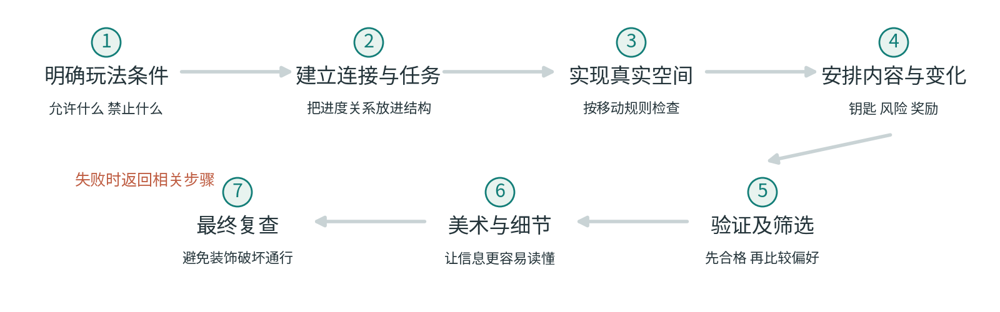

图 12 一种可组合的生成流程。改动之后需要重新检查相关条件。

失败后，回到与原因有关的步骤。门太窄就检查几何与角色尺寸；出现绕锁路线就检查连接和任务条件。这样不必每次都从头重做。

#### 把同一张图走完一遍制作流程

现在把前面分开讨论的部分放到同一张关卡上。这里是一份原创的完整制作示例，不是某款游戏的还原，也没有经过玩家试玩。

目标先写得具体一点：玩家必须取得钥匙才能离开；主路较短；允许一段不影响通关的可选探索。普通门双向，钥匙永久有效，终点仍需主动使用。战斗继续采用第八章的极简规则：初始生命与上限都是 10，每场固定损失 4，药水恢复 6，生命不高于 0 就失败。

连接骨架使用种子 7 的八条门，再增加 B—C。增加这扇门后，A—B—C—F—I 成为四次移动的主路，钥匙仍在 C，锁仍在 F—I。关闭 F—I 时，I 仍不属于入口能到达的区域，所以捷径没有替玩家绕过钥匙。这里验证的是这张具体图，不是所有加门都安全。

接着安排事件：B 有一场战斗；第一次进入 C 时自动取得钥匙、喝下药水，再自动结算一场战斗；F 有另一场战斗。B 与 F 的战斗也在第一次进入时自动结算。沿上述主路，生命依次为 10、6、10、6、2。为了让这条轨迹明确，本例规定房间战斗与药水都是一次性事件，不因来回走动而重复触发。正因为事件只触发一次，除了位置、生命和钥匙，检查器还必须记住哪些战斗已经结算、药水是否已经用过。

这条计算只证明一条能够存活的事件顺序。它没有证明玩家会按这个顺序走。B—E—F 仍然存在：沿 A—B—E—F—C—F—I 绕行六步，生命轨迹变成 10、6、2、8、4，通关时反而比四步主路多两点生命。原因是主路在生命 6 时喝药，受上限影响只能恢复 4；绕路在生命 2 时喝药，可以恢复足额的 6。较短的路线与较高的终点生命余量，在本例里不是同一个目标。这也不说明绕路在实际操作中更容易。

如果只把 C 的药水改到该房间战斗之后，四步主路仍然能活着通过：10、6、2、8、4。但刚才的六步绕路会先连续结算 B、F、C 三场战斗，生命 10、6、2、负 2，在喝药前已经失败。同样的地图、同样的物品数量，事件先后改变了哪些行动能够成功。

因此，检查器要把位置、生命、钥匙、药水是否用过，以及三场战斗是否完成一起记录。对药水在 C 战斗之前的原方案，完整展开这个有限模型，所有可达的非终局状态都仍有通关机会；改为战斗之后，便出现可达的死亡与无望状态。这是模型范围内的检查，不包含反应速度、命中率或战斗操作。

可选探索放在 I—H—G—D 一侧。到达 I 后，玩家可以立即使用出口，也可以先去 D 阅读一段不消耗资源的环境文字，再沿原路回来。本例刻意让这段探索没有额外战斗，避免把尚未定义的资源风险混进来。是否值得绕路则属于内容与体验问题，不能由“这条路走得通”推断。

到了几何阶段，每扇门都要按角色尺寸检查；到了美术阶段，C 的药水与钥匙如何获得、产生了什么效果，需要清楚反馈，I 的出口操作与继续探索的方向也需要区分。视觉说明可以帮助玩家理解选择，但实际可读性仍需试玩。把出口做得像一扇普通门，就可能让人误以为踩上去便会结束，或根本不知道如何离开。

最后分别保存规则检查和试玩记录。检查结果包括路线、状态与失败反例；试玩记录则说明玩家怎样理解药水和出口，在哪犹豫，是否愿意去D。前者核对机制，后者用于判断体验。

这张小地图已经经历了连接、任务、事件、几何和信息安排。每增加一项机制，都能指出需要补充的状态和检查；更复杂的生成器也可以沿着这条流程逐步建立。

#### 一个真实开发者的分阶段例子

Joris Dormans 在 Unexplored 2 的开发文章中，描述了从粗略布局、图结构与玩法特征，到高分辨率地图、地表、水和植被的多阶段过程。[\[12\]](<https://www.ludomotion.com/blogs/level-generation/>)

这篇文章介绍的是开发者自己的系统。本书借它观察分阶段工作的方式，九房间模型并未复刻该游戏的算法。

可以看到，连接和玩法关系先在较粗的表示中安排，再落实为细致空间。每个阶段处理不同任务，同时保留前面仍然有效的条件。

阶段之间也可能反复调整。房间放不下，需要回改连接；任务不合适，可能需要换房型。保留这些对应关系，才容易追踪一次修改影响了哪些条件。

#### 提前生成，与每次开局生成

若生成器是设计工具，可以提前产生候选，由人挑选并固定最终关卡。创作者有机会查看罕见结果，也能安排手工修整。

若每次开局都即时生成，就要约束耗时、失败处理和输出稳定性。交给玩家之前，系统需要自行处理那些原本可以由设计者检查的问题。

持续生成的世界还多一层问题：已访问区域是否保持，玩家改动如何保存，版本更新之后如何重现旧世界。第二章的种子与版本，第九章的熟悉地点与个人痕迹，在这里成为同一套设计的一部分。

需要精确演出和人工打磨的内容，可以提前生成后固定；需要反复探索的系统，则可能更适合运行时生成。选择时应比较各自的制作与运行要求。

#### 生成器也有制作成本

开发规则、准备兼容素材、制作调试视图、维护检查、研究失败样本，都需要时间。素材越多，接口和组合条件也可能越复杂；玩法不断变化，原有检查也需要跟着维护。

如果一段体验只会出现一次，而且价值来自精确到秒的演出和空间安排，直接手工制作可能更合适。如果系统会被反复使用，希望在清楚的边界内持续变化，规则化的投入才可能产生更大价值。

因此，成本比较还应包括复用次数、允许的变化范围、维护检查和人工修整的工作量，以及生成失败时对玩家的影响。只比较造一张地图的用时，会遗漏这些支出。

起步时可以先把生成器做小，确保出现错误后能定位。每增加一种机制，再补上它改变的条件和相应检查。

#### 把新鲜感留给真正影响行动的变化

九个房间几乎没有换过，玩家的选择却随着门、钥匙和事件顺序多次改变。新增一扇门，可以提供捷径，也可以绕过任务；移动一份药水，可以改变某条路线能否存活。值得保留的变化，需要这样逐项判断。

世界中也可以留下一些稳定的参照，让玩家辨认已经走过的地方，再发现新的路线。哪些改动保存到下次，哪些每局重置，应当和探索目标一起决定。

连接图用于查路，几何模型用于查实际移动，状态模型记住行动留下的后果。输出统计帮助观察重复和偏差，试玩再检查信息与体验。它们各自回答一部分问题，合起来支持后续修改。

下一张图出了问题时，可以从具体条件查起：是哪条边多了，哪个状态漏记了，哪次筛选改变了分布？把原因找到并保存为反例，生成器才会随着修改变得更可靠。

## 附录 A 术语与模型边界

程序化内容生成（PCG）：用规则与算法产生内容。本书只讨论可行走、探索、获取物品并到达目标的关卡空间。

种子（seed）：用于初始化可重现数字序列的输入。重演还依赖算法、版本、参数、素材和调用顺序。

节点与边：图里的点与连接。本书通常分别对应房间与通道。

拓扑（topology）：哪些地方相连，以及怎样相连。具体大小和形状可以另行描述。

几何（geometry）：空间的尺寸、形状、位置和实际构造。

连通：在本书的无向房间图中，任意两间房都能沿连接到达。带方向和动作限制时，要按具体规则讨论可达性。

可达性（reachability）：从指定起点出发，按照允许的动作，能否到达指定位置或状态。

树（tree）：连通且没有回路的无向图。树中两点之间只有一条不重复绕行的路线。

回路（cycle）：沿不同通道绕回起点的闭合路线，不把原路折返算作回路。

桥（bridge）：移除后会让原来连通的图断开的边。它描述连接性质，不是画面里桥梁的材质或外观。

深度优先探索与回退：沿当前方向继续探索未访问部分，不能继续时再退回寻找别的分支。

广度优先搜索：先检查一步可以到达的状态，再检查两步、三步等。在每步代价相同的模型里，可用于找最少步数路线。

状态（state）：当前地点，加上会影响后续行动的信息，例如持有物品、门是否打开或资源剩余量。

任务依赖：一个行动或目标成立之前需要满足的条件。任务先后不自动等于玩家看见信息的先后。

永久困境或软锁：仍然可以进行某些动作，但在当前规则下已无法完成目标。是否禁止这种结果取决于游戏设计。

硬约束（hard constraint）：结果必须满足的条件，例如出口可达。

软目标（soft objective）：合格结果之间可以权衡的偏好，例如某种路线长度或布局特征。

评价函数：为候选结果计算分数的规则。分数反映写入其中的指标，不自动等于玩家体验。

表达范围（expressive range）：生成器能够产生哪些类型，以及偏向哪些类型；通常通过选定指标观察大量输出。

人机共同创作（mixed initiative）：人与生成系统反复提出、修改和选择内容的过程。

地方依恋（place attachment）：人与特定地点之间具有个人或共同意义的关系。研究中的具体定义和测量维度并不完全相同。

怀旧（nostalgia）：回望过去时产生的情感体验，可以温暖，也可能带有留恋和失落。它与熟悉、记忆或依恋不可直接互换。

本书的计算只证明明确写出的模型。九房间基础例子没有战斗、物理误差或视野遮挡；普通通道双向，只有一把永久钥匙。消耗钥匙、真实移动和生命值例子是分别说明规则的变体，不应在没有声明的情况下混成同一个系统。

关于奖励、光线、稳定地标与重访的建议，是基于机制或文献提出的设计分析，未经过本书自己的玩家实验。心理研究涉及的游戏类型、样本和方法各有范围，不能把有限研究变成普遍的乐趣或归属感公式。

## 附录 B 原创模型的计算说明

#### 九房间生成规则

房间按三行排列：A B C；D E F；G H I。仅上下左右相邻的房间之间允许开门。十二条候选边为 AB、AD、BC、BE、CF、DE、DG、EF、EH、FI、GH、HI。

从 A 开始。每次把未访问邻居按字母顺序排列；先更新数字状态为“旧数乘以 5，加 1，取除以 16 的余数”，再用这个新数除以候选数量的余数选择邻居。候选从 0 编号。即使只有一个候选，也消耗一次数字。

进入新房时开门并记录来路。没有未访问邻居时沿记录退回，不开新门，不取新数。回到起点且没有剩余候选后结束。比较输出时，将同一对房间的门视为无向边，保留 A 到 I 的固定位置标签，不合并旋转或镜像。

#### 种子 7 的完整开门记录

第 1 次：当前 A；候选 B、D；新数 4；余数编号 0；新增 A—B。

第 2 次：当前 B；候选 C、E；新数 5；余数编号 1；新增 B—E。

第 3 次：当前 E；候选 D、F、H；新数 10；余数编号 1；新增 E—F。

第 4 次：当前 F；候选 C、I；新数 3；余数编号 1；新增 F—I。

第 5 次：当前 I；候选 H；新数 0；余数编号 0；新增 I—H。

第 6 次：当前 H；候选 G；新数 1；余数编号 0；新增 H—G。

第 7 次：当前 G；候选 D；新数 6；余数编号 0；新增 G—D。

随后从 D 沿记录退回 G、H、I、F；退回不消耗数字。第 8 次：当前 F；候选 C；新数 15；余数编号 0；新增 F—C。

最后的无向边集合为 AB、BE、CF、DG、EF、FI、GH、HI。九点八边，连通且无回路。

#### 布局数量与路线

完整遍历种子 0 到 15，得到六种不同连接布局，分别对应种子组 0/2/4、1/3/5、6/8/10、7/9、11/13/15、12/14。

192 棵生成树的参照数量，来自完整枚举十二条候选边中所有八边组合，再保留连通全部九点的组合；连通的九点八边图必定为树。该结果还用网格拉普拉斯矩阵余子式的精确行列式作了独立交叉核对。正文不要求读者掌握这项额外计算方法。

基础锁钥模型：入口 A，出口 I，钥匙 C，锁门 FI；普通通道双向，钥匙永久有效，首次进入 C 即获得钥匙，主动使用出口才结束。最短合法路线 A—B—E—F—C—F—I 为六次跨门移动。加入 BC 后缩短为四次且钥匙仍必需；加入 EH 后出现无钥匙四步路线；加入 DE 后存在有钥匙与无钥匙的六步路线。

钥匙必要性与正常有解性分别检查。无钥匙检查移除拾取效果，但仍允许进入原钥匙房；正常检查使用“房间与是否持有钥匙”组成的状态。路线长度按跨门次数计算，不包含真实时间、体力或操作难度。

#### 消耗钥匙变体

此变体使用原始八条连接，不保留此前增加的门，并把 C 的钥匙改为一次性消耗物品。拾取、打开出口门、打开可选宝箱是独立动作；钥匙在 C，宝箱也在 C；F—I 被打开后保持打开；物品不会再生。普通通道仍双向。

状态记录位置、地上是否仍有钥匙、是否持钥匙、出口门是否打开、宝箱是否打开。检查分别找出从初始状态可达的状态，以及仍能到达 I 的状态。先把钥匙花在宝箱上，会进入仍能行走却无法到达出口的状态；用钥匙先打开出口门，则保留通关机会。

这个变体的计算用于验证状态区别和永久困境，不是对真实游戏经济系统的模拟。

#### 两把永久钥匙与必经拾取变体

两钥匙变体重新使用基础八条边，不叠加宝箱或消耗规则。铜钥匙在 C，控制 F—I；银钥匙在 D，控制 I 的出口使用。两者首次进入房间即拾取，永久持有。跨门次数最短为十二；正常可达状态只出现无钥匙、仅铜钥匙、两把都有三类持有组合。

加入 E—H 后，即使移除铜钥匙的拾取效果，仍可沿 A—B—E—H—G—D—G—H—I 八步完成；银钥匙仍为出口所需。这里进入 I 与使用 I 的出口是不同动作。

必经拾取变体只使用一把永久钥匙：将它移到 B，控制 F—I，再加 E—H。正常出发必经 B 并自动拾取，但移除拾取效果、仍允许进入 B 后，A—B—E—H—I 四步路线依旧成立。各变体分别检查，不把它们的钥匙位置或规则混用。

#### 完整流程中的生命与事件模型

第十二章的综合例子使用种子 7 的基础八条边，再加 B—C；钥匙 C、锁门 F—I、出口 I。B、C、F 各有一场战斗，第一次进入时自动结算，以后不会再触发；C 同时自动给钥匙并使用唯一药水。原方案中，C 的药水先于该房间战斗。没有等待回血、额外敌人或其他消耗。出口需要主动使用。

状态为位置、生命、是否持钥匙、药水是否用过，以及三场战斗各自是否完成。完整枚举得到 30 个仍在地图内的可达状态，均仍有到达合法出口的路线；这里不另计主动使用出口后的终局标记。四步主路 A—B—C—F—I 的事件生命轨迹为 10、6、10、6、2；六步绕路 A—B—E—F—C—F—I 为 10、6、2、8、4。跨门与事件分别计数，重新进入已经结算的房间不产生额外生命变化。

仅将 C 的药水移至该房间战斗之后，四步主路仍可完成；六步绕路在第三场战斗后死亡，尚未用到药水。死亡为终止状态，不能再移动或喝药。这项计算用于比较明确规则下的路径和事件顺序，不是完整战斗系统或玩家体验预测。

#### 其他说明性算例

生命值模型：上限与初始生命均为 10，每场战斗损失 4，药水恢复 6 但不超过上限，生命到 0 或以下立即失败。战斗、战斗、战斗、药水会在第三场失败；战斗、药水、战斗、战斗的生命轨迹为 10、6、10、6、2。

平滑断路反例使用固定墙边界的 7×13 格地图，两片地面通过一格宽通道连接。每轮按上一轮八邻居状态同步更新，至少五个墙邻居则变墙，否则变地面。一轮后中间通道关闭。这里只验证该具体反例。

筛选比例的 50/50 变为 45/5，以及千分之一故障率下百次独立抽样仍零失败约 90.5%，都是假设算例。它们不代表本书测得的故障率、玩家偏好或商业游戏表现。

## 附录 C 来源与继续阅读

正文编号可打开对应材料。资料优先采用作者原文、研究机构版本、官方文档与开发者说明。图解及教学模型为本书原创，不复用论文图、游戏截图或商业素材。

[\[1\] PCG 教科书第 1 章 Introduction](<https://www.pcgbook.com/chapter01.pdf>)

Julian Togelius、Noor Shaker、Mark J. Nelson，2016。用于 PCG 定义及本书范围。

[\[2\] PCG 教科书第 3 章 Constructive Generation Methods for Dungeons and Levels](<https://www.pcgbook.com/chapter03.pdf>)

Noor Shaker、Antonios Liapis、Julian Togelius、Ricardo Lopes、Rafael Bidarra，2016。用于分区、挖掘等构造方法的比较。

[\[3\] Adventures in Level Design Generating Missions and Spaces for Action Adventure Games](<https://pcgworkshop.com/archive/dormans2010adventures.pdf>)

Joris Dormans，2010。用于任务与空间、生成语法及二者衔接。

[\[4\] PCG 教科书第 12 章 Evaluating Content Generators](<https://www.pcgbook.com/chapter12.pdf>)

Noor Shaker、Gillian Smith、Georgios N. Yannakakis，2016。用于表达范围与玩家评价方法的边界。

[\[5\] PCG 教科书第 11 章 Mixed Initiative Content Creation](<https://www.pcgbook.com/chapter11.pdf>)

Antonios Liapis、Gillian Smith、Noor Shaker，2016。用于人机反复共同创作。

[\[6\] Wave Function Collapse Explained](<https://www.boristhebrave.com/2020/04/13/wave-function-collapse-explained/>)

Boris the Brave，2020。开发者对选择、约束传播、矛盾与扩展的说明。

[\[7\] PCG 教科书第 2 章 The Search Based Approach](<https://www.pcgbook.com/chapter02.pdf>)

Julian Togelius、Noor Shaker，2016。用于搜索、表示与评价函数。

[\[8\] Analyzing the Expressive Range of a Level Generator](<https://www.pcgworkshop.com/archive/smith2010analyzing.pdf>)

Gillian Smith、Jim Whitehead，2010。表达范围的原始研究，区分计算指标与实际体验。

[\[9\] WaveFunctionCollapse 原作者仓库说明](<https://github.com/mxgmn/WaveFunctionCollapse>)

Maxim Gumin。用于核对局部模式、约束传播与尝试失败；未复用仓库图片或砖块素材。

[\[10\] Godot RandomNumberGenerator 官方文档](<https://docs.godotengine.org/en/stable/classes/class_randomnumbergenerator.html>)

用于种子、状态和底层实现边界；本书没有依赖 Godot 运行玩具模型。

[\[11\] Python random 官方文档](<https://docs.python.org/3/library/random.html>)

重点为 Notes on Reproducibility。用于区分同种子复用与跨版本算法承诺。

[\[12\] Level Generation in Unexplored 2](<https://www.ludomotion.com/blogs/level-generation/>)

Joris Dormans，Ludomotion 开发博客，2019。用于核实该游戏的分阶段生成过程。

[\[13\] So You Want to Build a Generator](<https://ems.andrew.cmu.edu/2018_60212f/wp-content/uploads/2018/09/kate-compton-oatmeal.pdf>)

Kate Compton，2016 原文，链接为卡内基梅隆大学课程保存的 PDF。用于数学差异与感知差异；一万碗燕麦粥为其原有比喻。

[\[14\] Tanagra An Intelligent Level Design Assistant for 2D Platformers](<https://ojs.aaai.org/index.php/AIIDE/article/download/12379/12238/15907>)

Gillian Smith、Jim Whitehead、Michael Mateas，2010。用于运动模型、几何约束与辅助设计的有条件保证。

[\[15\] Empowering Quality Diversity in Dungeon Design with Interactive Constrained MAP Elites](<https://arxiv.org/abs/1906.05175>)

Alberto Alvarez、Steve Dahlskog、Jose Font、Julian Togelius，2019。用于按不同特征保留评价较好的候选；不据此宣称玩家偏好已获证实。

[\[16\] Maze Generation Recursive Backtracking](<https://weblog.jamisbuck.org/2010/12/27/maze-generation-recursive-backtracking>)

Jamis Buck，2010。作者对回退式迷宫生成的讲解；本书数字规则与九宫格轨迹为原创。

[\[17\] PCG 教科书第 8 章 ASP with Applications to Mazes and Levels](<https://www.pcgbook.com/chapter08.pdf>)

Mark J. Nelson、Adam M. Smith，2016。用于逻辑约束与生成目标。

[\[18\] DeBroglie 官方路径约束文档](<https://boristhebrave.github.io/DeBroglie/articles/path_constraints.html>)

用于 WFC 扩展中的全局路径约束，以及计算与回退成本的说明。

[\[19\] Cellular Automata for Real Time Generation of Infinite Cave Levels](<https://pcgworkshop.com/archive/johnson2010cellular.pdf>)

Lawrence Johnson、Georgios N. Yannakakis、Julian Togelius，2010。用于细胞规则与洞穴连接处理；未沿用旧硬件性能数字或将外观评价当玩家实验。

[\[20\] Game Metrics Without Players Strategies for Understanding Game Artifacts](<https://www.kmjn.org/publications/Metrics_IDP11.pdf>)

Mark J. Nelson，2011。区分规则允许或要求发生的事情，与实际试玩观察到的行为；用于必要性、依赖关系和分析边界。

#### 空间体验与记忆研究

[\[21\] Familiarity as a Practical Sense of Place](<https://doi.org/10.1177/07352751211037724>)

Maxime Felder，2021。概念研究，用于区分熟悉的实用关系与情感依恋，不作为新的游戏实验。

[\[22\] Defining Place Attachment A Tripartite Organizing Framework](<https://doi.org/10.1016/j.jenvp.2009.09.006>)

Leila Scannell、Robert Gifford，2010。概念框架，用于地方依恋的情感、认识与行动维度。

[\[23\] Tourism Migration and the Exodus to Virtual Worlds Place Attachment in Massively Multiplayer Online Gamers](<https://discovery.ucl.ac.uk/id/eprint/10072707/>)

Mark Coulson 等，2020，在线首发 2019。740 名成人的自选问卷；现实参照为各自认为是家的地方，不是统一定义的家乡。

[\[24\] From Controllers to Immersion Exploring the Sense of Place in Video Games](<https://sure.sunderland.ac.uk/id/eprint/18982/>)

Serkan Uzunogullari 等，2025。40 名玩家的半结构访谈；主题归纳不是随机操纵的因果结论。

[\[25\] A Comparison of Memories of Fiction and Autobiographical Memories](<https://pubmed.ncbi.nlm.nih.gov/34735187/>)

Brenda W. Yang、Samantha A. Deffler、Elizabeth J. Marsh，2022，在线首发 2021。三项记忆研究；材料主要涉及影视与书籍，不能直接外推游戏虚实等同。

[\[26\] Once upon a Game Exploring Video Game Nostalgia and Its Impact on Well Being](<https://doi.org/10.1037/ppm0000208>)

Tim Wulf、Nicholas D. Bowman、John A. Velez、Johannes Breuer，2020，在线首发 2018。582 人随机回忆提示研究，不是实际重玩或长期健康干预试验。

[\[27\] Catch Them All and Increase Your Place Attachment](<https://doi.org/10.1016/j.chb.2017.06.008>)

Tomasz Oleksy、Anna Wnuk，2017。Pokémon Go 玩家相关问卷；研究的是现实地点，不能直接推导虚构家园的因果机制。

初次继续阅读，可从第 1、3、12 项开始：先了解概念，再看任务与空间，最后看开发者怎样把流程落实到关卡。要判断生成器是否可靠，可读第 4、8 项；对虚构地点的意义有兴趣，可先看第 23、26 项，并同时留意样本和方法边界。
