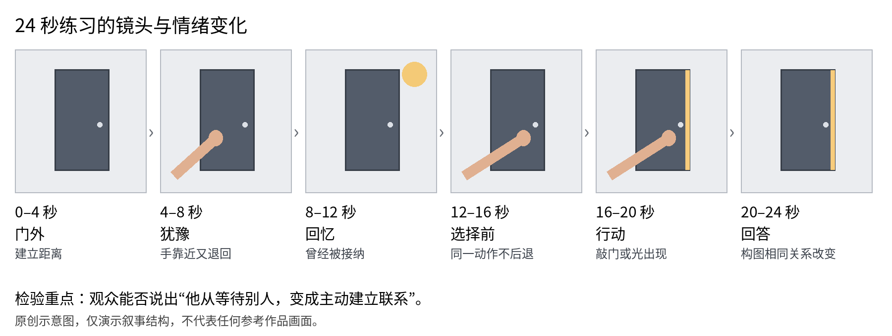

归档日期：2026-10-07  
原文档版本 0  
状态：教程成稿；示例参数并非本次 AE 实测结果

[返回总目录](../../README.md) · [原文件与来源索引](sources.md)

# 静止系 MAD 制作实用教程

从故事构思到完成第一支 24 秒短片

静止系MAD把漫画、插画等静态图像剪成视听作品，用镜头、文字和音乐组织人物的行动。这份教程从一支24秒短片入手，适合尚未确定题材和歌曲的初学者。先完成第9章的六镜练习：一个人站在门外，伸手又收回，最后主动敲门。做完这个小变化，再决定正式作品要讲什么。

操作以After Effects为主，核心练习不需要第三方插件。Blender用于可选的空间镜头，REAPER可用于整理音频。本文不假定读者已安装某个软件版本，菜单需与本机核对。参数均为原创练习起点，既非参考片的原工程参数，也尚未经过本次AE实际运行验证。

可以按这个顺序制作：写故事句，选音乐段落，画静帧分镜，检查素材能否支持动作，再做关键镜头、合成声音，最后导出回看。遇到镜头需要的功能时再学，暂时不必遍历软件里的全部效果。

阅读导航

1 叙事设计与参考片使用　2 音乐结构与剪辑　3 素材整理与分层

4 构图文字和色彩　5 AE 基础镜头　6 缓动与表达式

7 可选 Blender 空间镜头　8 声音导出和质量检查

9 可复现 24 秒练习　10 学习安排与故障排查　11 来源与使用边界

## 1 把人物变化写成可看见的故事

### 一句话故事先于软件

先试着补全一句话：“起初，主角因为\_\_\_\_不敢\_\_\_\_；遇到\_\_\_\_以后，他／她决定\_\_\_\_；最后，\_\_\_\_这个画面让观众看见变化。”填写时同时找画面。“成长”“救赎”等词可用于讨论主题，分镜仍要落到人物做了什么。

例如，主角在门外握着一封未交出的信。回忆中有人曾为他留门；回到现在，他终于敲门，结尾只出现一道门缝里的光。这里要让人看见的是从等候到主动联系的变化。换成运动或演出题材时，也可以先找出相应的动作。

### 用四段整理故事

铺垫交代欲望和距离。宽景、留白或遮挡，可以让观众看见人物想去哪里，又停在何处。

阻力要有具体表现。失败、离开、手停住或避开的视线都可以使用，滤镜只能辅助这些信息。

选择处给出行动或理解上的变化。若插入回忆，它应帮助观众重新理解眼前的动作；不相关的漂亮画面可以留到别处。

结尾可重用开头的物件、构图或短句，让变化容易比较。例如开头背向门，结尾转身面对门；原本遮住人物的文字，也可以逐渐让出空间。

### 检查相邻镜头怎样接起来

把两张相邻分镜放在一起，试着说清前一镜为什么接到后一镜。“因为”“但是”能帮助检查事件关系，但停顿、空间和物件镜头不必硬塞进因果链。只要能说清它补充了什么信息、留给观众什么感受，就有保留的理由。

开始制作前，用一页纸放下一句话故事、起终点情绪、转折动作、重复意象和六张缩略分镜。先看黑白小图能否讲清变化，再决定文字与效果放在哪里。

### 两部参考作品如何用

《金牌得主》MAD《夜晓》和《人鱼之歌》用于讨论局部镜头与叙事，不复刻其工程。下面标明了实际抽看的区间；未观看部分不作结论，也不凭成片画面断定作者用了哪款插件。

拆解时分别记下看见的画面、对其叙事作用的解释，以及自己可尝试的简化做法。这样能区分观察与推测，也方便回看后修正判断。

### 参考片的局部观察与可迁移做法

《夜晓》作者懒白灬，页面标注音乐 BOW AND ARROW。云端浏览器离散抽看至约 1:49 后遇到登录提示，并非连续看完。可见约 0:46 祈流泪，约 0:55 司向坐在地上的她伸手，约 1:04 转到司的特写并出现培养她的承诺；约 1:28 的文字把期待落到两人的共同未来。

在已看片段里，痛苦之后出现回应和承诺，期待便有了具体的人物关系。练习可借用这种衔接：手退回，回想被接纳，再次伸手。以上是对片段的解读，并非作者自述，也不需要复制原画面和文字。

[原视频页面](<https://www.bilibili.com/video/BV1CWGpzEEN3/>)

《人鱼之歌》作者冬生夏阳，页面标注音乐 Sleepwalking。离散抽看至约 0:57：约 0:06 有黑白倒置人物近景与青蓝色眼睛，约 0:24 是祈睁眼的反应，约 0:34 出现明亮笑脸，约 0:49 是大型水族箱前海豚横过，约 0:57 是黑场中的伸手画面。

这段中，人物表现与另一人的反应相互衔接，随后用水族箱转换空间和意象。可以据此尝试“人物动作—另一人的反应—相关空间”的镜头组。水意象在全片中的最终作用尚未核实，这里只讨论抽看的片段。

[原视频页面](<https://www.bilibili.com/video/BV1fh4ezVEAB/>)

两片的全曲节拍、完整高潮和结尾尚未核验，所以没有列出全片分镜表，也没有判断原AE工程的结构。自己继续复看时，可以一次只查一个问题：这一镜增加了什么信息，或改变了哪两个人之间的关系？

## 2 按乐句安排剪辑

### 先听三遍再开画面

先不配画面，听音乐的整体起落。第二遍标记乐句开头、人声进入、配器增加、和声或音区改变、停顿与尾音，第三遍再细标拍点。这样可以先安排镜头组，再把重要动作对齐到具体重音。

导入合法可用的音频后，结合波形加标记。标记名可以直接写用途，如“记忆进入”“决定”“回答”，回头修改时较容易找。波形有助于定位重音，乐句仍需完整听过再判断。

### 三种同步有不同用途

硬同步把切镜、抬眼或文字落下对齐强音，适合突出关键动作。若每个强音都这样处理，重要转折反而不容易被分辨。

软同步让动作提前开始，在重音时到达目标构图。例如提前8帧开始推近，重音出现时让脸落在焦点位置。可与直接在重音上启动的版本比较。

也可以试一次反向安排：音乐变满时画面停住，音乐安静时出现重要动作。先让观众有时间理解人物，再用这种反差；初次练习保留一个关键点即可。

### 镜头长度跟信息量走

镜头时长先按信息量判断。眼睛特写通常比包含两人、对白和环境关系的画面更快读懂。字幕还没读完就切走时，先延长停留或删字。快切段可保留稳定的方向、颜色或物件，帮助观众跟上。

练习时可以用3～4秒镜头铺垫，阻力段缩到1～2秒，把一次明确重音留给选择，再用较长停留收尾。具体时长仍随乐句和画面信息调整。

### 尚未选歌时的筛选办法

写好故事句后，挑三段各20～40秒的候选音乐，分别用纯色卡试剪。重点听铺垫、转折和收尾能否自然放进片段。宁可调整短片长度，也不要为凑整秒数切断乐句；歌词提到相同物件，未必就适合这段故事。

剪歌时优先在乐句边界或相容的和声位置拼接。短交叉淡化可消除接缝声，但不能修复不合理的和声跳变。保留一段原曲未剪版本用于比对。歌词理解不确定时先核对，不把自己的译意写成原作事实。

## 3 让素材具备运动的条件

### 先做素材账本

每张图记下作品与作者、页码或章节、地址、分辨率、用途和许可状态。原图与工作图分开保存，文件名可用S03\_hand\_source、S03\_hand\_cut、S03\_bg\_clean区分。出处用于回查，公开使用前仍要另外确认授权。

素材可分为六个目录：01\_source放原图原音，02\_layers放分层文件，03\_audio放音乐音效，04\_project放工程，05\_preview放预览，06\_export放输出。后续沿用同一套命名，比较版本会容易些。

### 选图时就想好镜头

选图时先看人物朝向、视线、透视、遮挡和裁切余量。镜头向右移动，右侧就要有可用画面或可补绘区域；只截到半张脸的图，大幅拉远容易露出缺口。分辨率不足时，可以减小放大幅度或改成局部拼贴。

### 一张图至少拆成三层

背景清底、人物主体、前景遮挡是最有用的三层。确实要动的手、头发、衣角再拆，避免第一天就做复杂骨骼。完整画布尺寸导出的透明 PNG 最方便保持位置；PSD 可按合成导入并保留图层尺寸，导入后检查锚点。\[A1\]

复制原图，再用路径或选区沿轮廓建立蒙版。衣服硬边保留清楚，头发分区处理。分别放到黑、白和饱和色背景上检查白边、漏底与碎像素。整体羽化过多会削弱漫画线条，应回到问题边缘局部修正。

### 补图只补镜头会露出的区域

隐藏人物后，先沿背景透视补大形和色块，再补纹理、线条。重复纹理要检查复制痕迹，重要物件要核对结构。自动填充可用于起稿，但栏杆、文字、手指和建筑等细节仍需逐项查看。

关节和遮挡处要留重叠区域。手臂绕肩转动时，肩内侧还需要补绘。先做最大幅度测试，找到会露出的缺口，再修细节；若代价过高，可以减小动作，或换用遮挡切换和平面构图。

全部练习都可用自己的照片或简单几何图形完成，无须原作者工程、高清付费资源或破解插件。

## 4 让构图文字和色彩配合镜头

### 每镜先决定观众第一眼看哪里

把画面缩到手机大小，或暂时模糊查看，检查第一眼落在哪里。眼神、亮区和大字若互相争夺注意，可以选一处作为重点：读字时简化背景，看表情时减少文字干扰。

留意相邻镜头的视线与运动方向。上一镜看右，下一镜可把对象放到右侧，或先交代新的空间关系。需要反转方向时，应让观众看得出变化；带字、标志或不对称服装的图尤其要先检查再镜像。

### 把字体当成角色的一部分

第一支片限制为一套主字体、两种字重、两级字号。中文正文以手机上正常距离能读清为准；1080p 练习可从 48～64 px 起试，大标题 90～140 px，最终按字数和背景回看调整。这是起点，不是平台标准。

文字按意义单位出现，例如“我以为／门不会开”。先显现“不会”，再遮掉“不”，会直接改变句意，需要与人物的转折配合。描边、阴影、辉光和抖动可以分别测试，再保留确有作用的处理。

制作文字显现时，用矩形遮罩揭露整词最容易控制；确有逐字需求再用文字动画器与范围选择器。范围选择器的 Start、End 与 Offset 控制受到动画影响的字符范围；先只做不透明度，理解后再叠位置。\[A5\]

### 先做三张关键静帧

先完成起点、转折和结尾三张静帧，暂时不开动画。比较人物比例、遮挡、空白和对比怎样变化，再把其余镜头接进来。这比每一镜单独换一套设计更容易保持连贯。

练习可先限定背景色、主体色和强调色，比如冷灰环境中留少量暖光。色彩的情绪需要靠片中使用方式建立，不能只凭色名决定。黑白漫画则先保住线条层次，再考虑上色。

从一开始选定色彩管理方案并保持一致。输入图像按实际色彩信息解释，输出测试中核对黑位、肤色和渐变。不要到最后才随手切换线性工作空间，这可能改变混合与发光效果。\[A8\]

## 5 AE 核心操作从一个可读镜头开始

### 建工程和时间线

新建 1920×1080、24 fps、24 秒合成，像素长宽比为方形。命名 MAIN\_24s。先放音频和色卡分镜，再分别建 S01、S02 等镜头预合成。每个镜头预留少量前后余量便于改切点。重要版本另存递增号，先保留故事剪辑版本再加细节。

按下 P／S／R／T 分别查看位置、缩放、旋转、不透明度；U 查看已动画属性。不同语言和键盘设置可能影响快捷键，找不到时用属性展开。Mac 的 Option 常对应教程中的 Alt，Command 常对应 Ctrl；不要机械替换所有快捷键。

### 蒙版与轨道遮罩

蒙版画在当前图层上。选中图片层，使用钢笔闭合描出保留区域，调 Mask Feather 与 Expansion 修边；没有选中图层时使用绘图工具，可能创建的是形状层。做矩形揭露时，让蒙版路径移动，或改用独立遮罩层。\[A2\]

轨道遮罩由另一层控制可见范围。新建白色矩形形状层 REVEAL，在图片层的 Track Matte 选择它并使用 Alpha。矩形从画外滑过时，图像只在矩形覆盖区域显现。Alpha 依据透明度；Luma 依据明暗。普通模式与反相模式效果相反。新版可选择非相邻遮罩层；旧版教程可能要求遮罩紧挨被遮罩层上方。\[A3\]

遮罩不对时，依次查看：是否误选Parent，Alpha或Luma是否选对，是否开启反相，两层在当前时间是否都有内容。遮罩层本身通常不用出现在最终画面。

### 父子关系和预合成

新建 Null，命名 GROUP。把人物和随身物件的 Parent 指向 GROUP，再给 GROUP 打位置与缩放关键帧。子层仍能独立移动，但整体跟随控制器。父子关系不继承不透明度；如果要整组淡出，预合成后对预合成 T 打关键帧。\[A4\]

预合成可把人物、修边与局部效果放进同一个组件。先确定哪些内容需要共享时间和坐标，再分组。效果被裁掉时，先看预合成画布范围，避免在根因未解决时继续叠效果。

### 2.5D 摄影机的最小配置

在 Classic 3D 下把背景、人物、前景设为 3D 图层。建立 One-Node 35 mm 摄影机；先保持默认朝向。将三层分别放在 Z＝200、0、−200 附近，再调整缩放恢复起始构图。默认相机从负 Z 看向场景，此时负 Z 层更近；若改变朝向，远近关系也随之改变。

只给摄影机 X 做小幅移动，例如 3 秒内移动 80 px，观察近层移动更明显的视差。先关景深，确认分层不穿帮，再考虑浅景深。One-Node 不使用兴趣点，Two-Node 会朝向兴趣点；初学练习选择前者可减少朝向干扰。\[A6\]

### 进阶时先诊断空间再加景深

如果人物像浮在照片上的纸片，先判断图像里有没有地面。School of Motion 的原作者文字稿示范了把地面设为倾斜平面、校正透视，再用原图的 Difference 比较对齐；前景与地面的接缝和人物边缘也需要处理。它适合完成基础练习后研究，不是说每张漫画都必须重建三维地面。\[G1\]

另一种拆镜头办法来自崔小骏的图文教程：分别分析相机位置与目标点如何变化，再用不同空对象拆分复合运动。拿同一组三层素材各做一次平移、推近与轻微环绕，就比复制一套复杂相机关键帧更容易理解运动来源。\[C9\]

## 6 用关键帧控制动作节奏

### 关键帧应描述意图

同一个动作可以有不同速度安排。微推可在3秒内从100%缩放到104%；犹豫可先让手前进12 px、停半秒，再退4 px；决断则可在停顿后完成一次清楚的位移。先确定动作，再调它的曲线。

选关键帧使用 Easy Ease，再打开 Graph Editor。速度图看变化有多快；数值图看属性本身是多少。若教程曲线形状与你不同，先检查是不是选了不同图表，而非盲目模仿曲线。速度峰位置决定动作先冲后停还是先蓄后冲。\[A7\]

先把位置设为0秒X＝900、0.6秒X＝980。分别比较线性、两帧Easy Ease，以及第二帧入速度为0、影响量约70%的版本。数值只是练习起点，最终要放回音乐中判断动作是否清楚。

### 留出读图窗口

可把一个2秒镜头拆成0.3秒进入、1.3秒停留、0.4秒离开，给观众读图的时间。旋转、缩放或模糊先选一种承担主动作，再看是否需要辅助。开启运动模糊后，停留段仍须读清表情与文字。

### 人物局部运动先保轮廓

角色要眨眼、抬头或随风动时，不要对整张人物图施加同一个大幅形变。先从眼睛、前后发、头部等确实要动的部分拆层，遮挡后面补足；发束根部固定，末端少量位移，左右发束时间略错开。这与ミコンスキー教程的分层方向一致。\[G2\]

先关掉发光和模糊，只看轮廓运动。头被压扁、颈部脱节或眼皮像贴片时，回去调整拆层、补图与锚点。Puppet和头发脚本可留到第二轮，第9章练习不依赖它们。

### 两个可选表达式

在二维图层 Position 的秒表上 Option 单击可输入表达式。轻微漂浮示例：value + \[0, Math.sin(time\*2\*Math.PI\*0.5)\*3\]。它在原位置上增加约 3 px 振幅、每秒半个周期的竖直运动；仅适用于二维位置数组。三维图层应使用三维数组 \[0, …, 0\]。

轻微不规则抖动可用 wiggle(1, 2)，第一参数是频率，第二参数是幅度。应贴在适合的属性上，Position 的幅度单位是像素。它是随机感微动，不会自动识别歌曲鼓点，也不能代替决定性动作的关键帧。\[A9\]

表达式报错时，先关闭它，确认基础关键帧正常；再核对英文标点、数组维度和所选属性。漂浮或抖动只是可选微动，关键行动仍可以直接用关键帧完成。

### 插件的边界

本教程所用的切换、模糊、颜色、遮罩和摄影机均可由基础功能完成。若某类复杂操作反复出现，再评估插件能省下什么工作。相似画面可能有不同实现方式，不能据此确认参考作者用了某款工具。

## 7 何时值得进入 Blender

需要穿行、几何场景、投影或连续空间的机位变化时，再考虑Blender。只有平移、微推和少量分层的镜头，留在AE通常更便于修改节奏。

### 一个图像平面镜头

准备背景、人物、前景三个透明 PNG。较新版本可在 Add 的 Image 类目寻找 Mesh Plane；不同版本入口与材质界面不同，旧教程的 Images as Planes 可能是插件工作流。先确认自己版本，再按对应官方手册操作。\[B1\]

导入后确保材质读取图像 Alpha，并在材质预览或渲染预览中检查透明区域。把各平面摆成朝向相机的卡片，沿观看轴前后分开。用发光或不受光照影响的外观起步，避免原画被额外灯光改暗；需要投影时另行设计材质和光照。

透视相机适合视差。相机横移一小段，确认近层滑动多、远层滑动少。正交相机适合平面图形，但单纯横移不会产生相同的透视深度差，不要期望“分层就一定有视差”。\[B2\]

在首帧和末帧插入位置关键帧，先渲染少数测试帧看穿帮，再做整段。输出 PNG 序列更容易从中断处续渲；需要透明背景时确认 RGBA 和 Film Transparent。回 AE 按相同帧率解释序列，叠字幕、颜色和声音。

### 最常见的取舍

纸片侧面露出时，可减小旋转或横移，或者补齐层后方的内容。渲染采样不会补出图像里不存在的侧面。

图像透明部分变黑：检查图片是否真有 Alpha、节点是否接入 Alpha、材质透明设置及渲染模式。不同版本选项名称不同。

两个软件颜色不一致时，先用同一张参考静帧核对Blender显示变换、输出与AE输入解释，确认后再批量渲染。分别调色后再往返，较难定位差异来自哪一步。

这一章提供可选流程。部分Blender官方页面仅核对到检索摘要，未读到全文，具体操作应按本机版本及对应手册检查。第9章仍可完全在AE基础功能内练习。

## 8 声音导出和质量检查

### 声音先保证清楚再追求冲击

音乐、环境和动作音分轨整理，可用REAPER或其他音频编辑器完成剪切、淡化与音量自动化。已有母带音乐通常无需再大幅压缩。音效优先配合动作的材质和重量，切镜时不必总加同样的whoosh。

试听至少包括耳机和普通扬声器。检查音乐切点、短淡化、尾音是否被砍断、左右声道是否意外不平衡。导出前确保不削波；可把总线真峰值不超过 −1 dBTP 作为保守测试目标，但这不是 B 站强制规范。没有真峰值表时，留出峰值余量并回听编码后的文件，别把峰值表读数误当响度。

### 两个输出角色

检查版：1920×1080，帧率与主合成一致，H.264 MP4，音频 AAC 48 kHz。1080p 练习可从 15～20 Mbps 视频码率测试；线稿、细小颗粒和快速运动应实际观察压缩后效果，必要时提高，不把某个码率当作画质保证。

存档版：条件允许时另留高质量中间格式或无损图像序列及独立 WAV，保留工程和素材出处。只有需要透明通道的中间素材才选择支持 Alpha 的格式；普通 H.264 MP4 不用于保存透明视频。

新版 AE 可直接在 Render Queue 的 Output Module 选择 H.264，进入 Format Options 设置视频和音频；旧版若没有该选项，可用对应版本支持的 Media Encoder 或先输出中间格式。没有安装相关软件时不要假定菜单存在。\[A10\]

### 必须看导出的文件

回看故事：不读简介，能否辨认人物的起点与变化？转折的画面提供了什么，文字又补了什么？重复意象第二次出现时，关系是否已经改变？

画面检查：每个切点前后逐帧看是否有黑帧、透明边、穿帮、错字和一帧闪烁；正常速度看是否过度晃动；手机尺寸看字能否读清。快速闪烁能不用就不用，避免靠高频明暗变化制造刺激。

声音检查：正常音量完整听一遍，确认无爆音、断尾和未授权的额外音轨。字幕、歌词、片尾署名均回查来源。

核对输出的尺寸、帧率与时长，完整播放一遍，特别查看复杂片段的色带和压缩块。导出和发布分开记录，本地文件正常还不代表平台上传已完成。

## 9 第一支 24 秒练习

### 目标和素材

原创命题为“从不敢敲门到主动敲门”。这是叙事练习，不使用两部参考作品素材，也不要求先选正式歌曲。最终成果是一支 24 秒、六镜头、无付费插件的短片。下面时间均为总时间线秒数，24 fps；24 秒等于 576 帧，最后可见帧是 575。

素材清单：一张自己拍摄或有许可的关闭门照片；一张自己的手部照片并抠成 PNG；一张自己拍摄的暖光空房或窗光照片；一句自写文字；一段明确允许使用的 24 秒音乐，或自己制作的节奏；可选一声自录敲门音。不把网上可播放等同于可下载和公开再用。

没有照片时，也可用深灰背景、矩形门、圆形门把手和简单手形练习。先看行动是否讲清，再完善素材。文字自行写作，不需要引用歌词。

无歌曲练法：自行建立 120 BPM、4/4 拍、12 小节的简单节奏，24 秒刚好结束。用每小节第一拍的轻点标记即可；前 4 小节稀疏，中 4 小节增加一层声响，末 4 小节在 16 秒给出转折、随后留出尾音。自行制作或录制，不使用未许可的采样包。

### 时间表

0.00–4.00 秒：门外。宽景，人物可不出现；文字“我在门外”。动作很少，让观众理解空间与距离。

4.00–8.00 秒：犹豫。手接近门，却停住；文字“还要等吗”。观众第一次看到欲望与阻力。

8.00–12.00 秒：回忆。暖光或被留出的空位，呈现“曾有人欢迎我”的线索；不写长篇背景说明。

12.00–16.00 秒：选择前。回到同一只手；重用构图，让手这次不后退。文字可省略，留出静默期待。

16.00–20.00 秒：行动。敲门或门缝出现光；音乐在 16 秒进入新层次。画面只保留一个主要动作。

20.00–24.00 秒：回答。回到第一镜构图，但门缝已亮，文字“这次，我先敲门”。结尾留约 1 秒可读停留，音频自然收尾。

### 第一步做只含色卡的版本

在MAIN\_24s中建立六个4秒纯色层，命名S01至S06，放入对应短句与音乐或节奏，先导出低清预览。若还看不懂人物变化，先修改时间和文字，再开始抠图。换正式歌曲后，镜头长度可随完整乐句调整。

### 第二步做 S01 和 S02

S01 建 4 秒预合成，门照片置于底层；缩放到铺满画面。以当前铺满的缩放值为 B，0 秒设 B，4 秒设 B×1.03，避免直接写 100% 导致不同尺寸图片不满屏。短句在 0.5 秒淡入，用 8 帧从 0% 到 100%，3.5 秒开始用 8 帧淡出。

S02 复制门背景，放手部 PNG。用 Pan Behind 工具把手层锚点放在手腕，位置以“快碰到门”为终点。局部 0 秒设终点 X−80 px，1.5 秒到终点；2 秒保持；2.5 秒退回 12 px，保持到结束。给进出两段 Easy Ease。数值以自己的图像构图为准，重点是“前进—停—退”的可读动作。

手部白边先检查透明度解释和蒙版边缘。门若有透视，手也要沿相应方向接近，不必照搬水平运动。

### 第三步做 S03 和 S04

S03用暖光照片缓慢微推，前8帧从0%淡入到100%即可。比门外略暖、略亮，但避免突兀过曝。需要加强联系时，可在回忆里保留同一封信或同一把椅子，让它与当前选择对应。

S04复制S02，删除退回段。局部0秒手在略远处，2秒到停点，2～4秒保持。重复的构图方便观众发现这次没有后退。总时间12～16秒仍显平时，可测试2%的轻推，再判断是否需要保留。

### 第四步做 S05 的遮罩揭光

建立 4 秒预合成：最下为门照片，其上为暖光照片 LIGHT；创建窄白矩形形状层 MATTE，放在门缝位置。LIGHT 的 Track Matte 指向 MATTE，选 Alpha，确保未反相。矩形初始宽 0，局部 0.25 秒到宽 24 px，1 秒到宽 80 px，之后保持。不要缩放整个矩形导致中心偏移；保持左边缘贴门缝，改矩形路径 Size 与 Position。

把 LIGHT 与 MATTE 预合成为 DOOR\_LIGHT 后可整体微调位置。发光只作为可选处理，先确认不用 Glow 也能看出光从门里来。敲门声放在总时间 16 秒附近，按音乐实际重音微调；如手没有真实碰门动作，声音用门内回应更合理。

### 第五步做 S06 并完成第一次导出

S06 复制 S01 门背景，加入 S05 结束时的光，保持同一视角。取消多余运动，20.5 秒出结尾文字，22.8 秒后保持约 1 秒。音频结尾避免在尾音中间突然截断，必要时把整体音乐起点或结尾重新选到完整乐句。

把六镜放回MAIN，确认入点与出点连续。先关闭额外装饰回看故事，再比较运动模糊开关。快速移动层可按需要开启，文字停留段保持清楚。最后按第8章导出，检查实际文件。

### 完成标准

请没看过分镜的人描述人物一开始和最后的区别。若只注意到门亮了，先检查S02、S04、S05是否让行动和动机足够清楚，再调整顺序与停顿。技术上同时检查黑帧、露底、文字可读性和音频收尾。

第二轮先选一项修改：三层视差、文字遮罩，或更明确的回忆意象。保留前后版本，比较这项变化是否改善了具体镜头，再继续增加复杂度。

## 10 学习安排与故障排查

### 按完成物学习

第一阶段：完成一句话故事和六张静帧。退出条件是没有音乐也能看出大致变化；不要求画得好。

第二阶段：完成 24 秒色卡剪辑。退出条件是乐句、转折和结尾完整，字幕能读完。

第三阶段：完成三层素材与一个 4 秒镜头。退出条件是最大幅度运动也不露底，蒙版无明显白边。

第四阶段：完成六镜与声音。退出条件是单独导出文件看完无技术错误。

第五阶段选最弱的一项，查对应教程并重做一镜。正式题材可先做30～60秒，再决定是否扩成整曲，以便先估计素材、节奏与叙事的工作量。

### 症状与优先检查

画面像幻灯片：先检查相邻镜头的关系、重复意象是否有变化，再为关键画面加入视差或明确方向。静止也可保留，不必让每张图都大幅运动。

卡点明显但转折不突出：检查是否把每个重拍都同样强调。先删去部分次要切点，在转折前留停顿，再比较动作是否更醒目。

运镜令人眩晕：先减少同时进行的旋转、推拉和抖动，每镜保留一种主运动，结束后留稳定构图。关闭运动模糊再看一遍，确认移动路径本身清楚。

像纸片穿帮：相机移动超出补图范围。降低机位幅度、补绘遮挡后区域，或更换适合该角度的素材。景深无法修复几何缺失。

遮罩后全没了：检查选错 Parent、Alpha 与 Luma、反相、遮罩入出点和坐标。先用满屏白色实心矩形做最简单测试。

父级淡出但子层还在：父子关系不传递透明度。预合成整组后淡出，或分别控制透明度。

图表曲线对不上：先区分速度图和数值图。位移路径乱绕则检查空间插值；只要直线时改为空间线性，时间缓动仍可保留。

图像发糊：检查预览分辨率、源图尺寸、放大倍率和图层质量。全分辨率导出测试再判断，不靠预览窗口猜最终质量。

渲染过慢：逐项关闭景深、粒子和高成本模糊来定位瓶颈。复杂镜头可预渲染，剪辑时可用代理；最终输出前确认切回正确源，避免混入低清版本。

### 正式项目开工前的空白模板

题材和人物：\_\_\_\_　观众是否熟悉原作：\_\_\_\_

一句话变化：\_\_\_\_　转折动作：\_\_\_\_　重复意象：\_\_\_\_

候选音乐段落与来源：\_\_\_\_　使用范围与许可：\_\_\_\_

六镜内容和时长：\_\_\_\_　最难的一镜：\_\_\_\_

先做技术测试：\_\_\_\_　不做也不影响故事的效果：\_\_\_\_

## 11 来源与使用边界

叙事安排、镜头参数与24秒练习是本教程的原创教学设计。功能机制依据官方文档核对，其他教程提供继续学习的入口。没有工程或制作记录的参考片，只讨论可见效果与可尝试的实现，不判断作者实际用了哪种方法。

来源条目分别标明已读正文、仅核对标题简介或章节，以及未取得的内容。本次没有逐一完整播放或转录全部教程视频，介绍中的建议也应按这些阅读范围理解。

作品欣赏、个人技术练习、公开发布和商业使用需要分开考虑。署名不能自动替代许可，购买原作或音乐也不等于取得改编和同步使用的全部权利。公开前检查图像、音乐录音、词曲、字体和音效各自的授权范围及平台要求；权利不明的版本先保留为私人练习，商业用途另行确认。

不要复制教程的完整讲稿、搬运作者工程或以原作者名义发布。技术可以学习，构图、时序、人物表演和具有辨识度的完整段落应重新设计。可保留来源与授权记录，并在适当位置说明借鉴对象。

### B 站教程学习顺序

下面8条主要核对了页面文字、作者、简介或选集，未完整观看，也未验证工程下载和全部参数。可按当前镜头的问题选择一条跟做。

C1　如何制作一个静止系MAD 经验分享

initial-IMT 发布，漂泊の途主讲。适合开工前了解创作框架。已核对原发布页检索信息；直接页面受限，不能据简介断言覆盖了全部流程。此条用作方向入口，不用它替代本教程的具体步骤。

[原视频页面](<https://www.bilibili.com/video/BV1va411k7SG/>)

C2　静止系MAD教程 分镜的总体制作思路

KikoT\_FsinAa。页面可读，短案例，适合做完自己的六张分镜后对照学习。页面标签和合集信息可核对，具体分镜论述未取得转录，不能把本教程的四段式归于作者。

[原视频页面](<https://www.bilibili.com/video/BV13r4y1R76G/>)

C3　醉说AE 基础篇01 视频炼成术

柏吃支醉。页面可读并标注自制，适合补 AE 基础概念；作者提醒内容浓缩。旧版教程的界面与现版可能不同，功能机制以官方文档核对。插件要求未核实。

[原视频页面](<https://www.bilibili.com/video/av7425619/>)

C4　MAD基礎教學01 人物摳圖 進場模糊

檸萌紅茶。已读取原页。用来练透明人物素材和基础入场；仅能确认标题涵盖内容，不能称作完整手工补图教程，也不能未经观看断定其采用某种抠图算法。

[原视频页面](<https://www.bilibili.com/video/av6154836/>)

C5　静止系修图教程 去除噪点与简易增强 重绘扩图更新

垌月岚的蟹黄堡秘方。读取到同一视频的 B 站详情，涉及 AI 重绘、扩图与模型来源；适合已经会判断线稿结构之后进阶。模型、显存和版本兼容未实测；它不能替代手工透视与遮挡判断。收藏夹创建者并非作者。

[原视频页面](<https://www.bilibili.com/video/BV19FnKzuEMZ/>)

C6　静止系MAD Ae教程

七日课吧大触乐园。原页标自制，共九个分集，适合挑一个镜头跟做。年代较早，原页没有细知识点目录；本次没有确认某一分集专门讲 2.5D 或某款插件，不能按第三方笔记补造目录。

[原视频页面](<https://www.bilibili.com/video/BV16s411i7Gi/>)

C7　关于静止系MAD增加光感与氛围的一些小技巧

手动冰袋Rl。已核对原页索引，直接页面受限。简介定位新人向，附分镜过程。等基础构图成立后再学，用于给一个关键镜头补氛围；具体效果参数与插件要求未核实。

[原视频页面](<https://www.bilibili.com/video/BV1v3411a7id/>)

C8　静止人物文字遮罩动画效果和色光效果的运用

ShadowEffects。已核对原发布页索引，直接页面受限。用于人物与文字遮罩的效果练习；不能由标题推出它系统讲授字体选择和叙事排版。先做第 9 章，再考虑把其中一镜升级成这种文字关系。

[原视频页面](<https://www.bilibili.com/video/BV1jh411X7Sv/>)

### 中文图文与社区补充

C9　崔小骏 摄像机动画的两仪八卦掌

站酷原创图文，全文已读。适合会关键帧之后学习相机位置、目标点与空对象的关系。核心方法可以手动练习；附带的脚本未下载、未验证，旧界面需自行对照。建议做同素材的三种机位练习，完成第 5 章后再读。

[作者图文教程](<https://www.zcool.com.cn/article/ZNzQ3NTMy.html>)

C10　MAD Center 仿黑盒图文教程

课程首页、前言、目录及第一章正文已读，未逐章读完、未运行工程。原作作者为惜枫醉，教程为 MAD Center 社区整理，二者不要混同。第一章有网格、箭头、文本、图片块与错位运动曲线，适合选 5～10 秒镜头练构成与衔接。

明确环境是 Windows 10、AE 2020，列有 Particular 4.1.5、Horizon 1.1.13、Plexus 3.1.13；Motion 3.27 为可选。它不是本教程的零插件入门路线，也不能保证在你的 Mac 或最新版 AE 直接运行。没有这些插件时只借鉴构图与运动思路，不必先购买配齐。

[来源网页](<https://imitate-black-box.vercel.app/frontmatter/00-preface.html>)

[来源网页](<https://imitate-black-box.vercel.app/mainmatter/01.html>)

C11　馒头先生 AE 实用技巧 100 式

知乎的新片场课堂课程页、简介与完整目录已读；未播放视频，未核实每节当前访问权限。按问题选课：035 动画曲线；038 文字预设；041 手动文字弹性；046～048 蒙版与图形层；075 Mesh Warp；089～090 图钉与眨眼。课程年份不等于软件版本，页面未明确实际 AE 版本。

整套目录还包含多款第三方插件课，因此不能称整套零插件。先做自己的短片，卡在哪里再查对应小节。是否付费、可否观看，以打开页面时显示为准；本次没有购买任何课程。

[来源网页](<https://www.zhihu.com/education/video-course/1517106467144052736?section_id=1517106681104654336>)

C12　ACG Library 静止系MAD教程导航

寻根问底1号／CGexplorer01 整理，页面注明参考 Wuyi无疑的整理。导航全文已读，适合后续按构图、文案、背景、分镜、表情和人物透视找课。它是索引，不是所有外链都已核验的课程包；旧博客、贴吧和网盘资源需逐条检查。

[来源网页](<https://acglibrary.com/tutorial/static.html>)

中文平台资料中，知乎课程目录可核对，一些旧专栏读取超时；小红书公开检索未取得同时有可确认作者、具体内容和稳定直链的条目，站内搜索页也未读到。因此本次不列小红书教程推荐，后续仍可另找来源。

### 英文日文教程与公开社区

英文查找可按具体任务尝试manga animation、manga music video／MMV、motion comic、2.5D parallax或compositing。不同关键词对应不同技术环节，选课前仍要查看它实际覆盖哪一步。

G1　School of Motion 由照片建立 3D 场景

Joey Korenman 的 Create a 3D Scene from a Photo in After Effects。作者官网完整 00:18～40:39 文字稿已读，视频未播放。适合第 5 章之后学习分层、地面透视、相机与边缘融合，所读步骤使用 AE 与 Photoshop 自带功能，无必须付费第三方插件。

作业：一张图拆近景、人物、地面、远景，做 5 秒小幅推进，逐帧检查接缝、露洞与边缘。工程下载需要填写邮箱，本次未提交邮箱、未下载；可以直接读公开文字稿。

[作者图文教程](<https://schoolofmotion.com/blog/3d-photo-after-effects>)

[原视频页面](<https://www.youtube.com/watch?v=3xDI6D5GW_k>)

G2　ミコンスキー 日语静止画 MAD 教程

已读作者站点中日常场景的分层、补绘、导入和头发运动关键段；YouTube 视频仅核对标题，未观看。其重要方法是先决定需要动的部分，再拆后发、前发、头部、眼睛与嘴，并补齐遮挡区域。适合在三层视差之后学角色局部动作。

示范涉及 AFPHairRig、YY Ramp+ 等免费工具，也使用 Deep Glow、Optical Flares、Looks 等付费润色工具，不能称为无插件全流程。旧头发脚本与语言环境、Puppet 模式可能有关，应先做小工程测试。练习先完成眨眼或三束头发微动，不急着复制整套光效。

[作者图文教程](<https://zuariya.com/%E3%80%902023%E6%9C%80%E6%96%B0%E3%80%91%E9%9D%99%E6%AD%A2%E7%94%BBmad%E3%81%AE%E4%BD%9C%E3%82%8A%E6%96%B9%E3%82%92%E5%AE%8C%E5%85%A8%E8%A7%A3%E8%AA%AC%EF%BC%81%E5%88%9D%E5%BF%83%E8%80%85%E3%81%A7/>)

[原视频页面](<https://www.youtube.com/watch?v=efzTU1yzjss>)

G3　ミコンスキー 原作者的分镜与成片解说

《月ノ美兎 vs 謎ノ美兎》的作者文章已读，包含剧情意图和多个镜头的解释。可以研究粗分镜怎样变成成片、循环结尾怎样回到前文、俯瞰构图怎样让观众补完动作。它混合 Blender、MMD、静态合成及部分 AI 素材，不能当成纯 AE 单图工程。

作业：不复制原故事，给自己的六镜练习画一版“开头与结尾构图相同，人物关系改变”的分镜，再对比是否比只放标题更容易理解。

[作者图文教程](<https://zuariya.com/mad%E6%9C%88%E3%83%8E%E7%BE%8E%E5%85%8Evs%E8%AC%8E%E3%83%8E%E7%BE%8E%E5%85%8E%E3%81%AE%E8%A7%A3%E8%AA%AC%E3%82%84%E3%81%A1%E3%82%87%E3%81%A3%E3%81%A8%E3%81%97%E3%81%9F%E8%A3%8F%E8%A9%B1/>)

G4　Anthony Possobon 复杂头发运动

Complex Hair Movement in After Effects。视频标题与作者已核验，作者 Behance 的《Messy》说明已读，确认 Photoshop、AE 和其免费 AFPHairRig 脚本；没有看完整视频。中阶专项，先理解遮挡和根部固定再使用。免费脚本不是 AE 自带功能，旧脚本不能保证现版兼容。

作业：只拆三束头发，根部保持稳定，末端幅度不同，启动时间错开。将结果与“整个人物同时扭动”的版本比较。不要从不明整合包下载脚本。

[原视频页面](<https://www.youtube.com/watch?v=oiEjz_-8wfk>)

[来源网页](<https://www.behance.net/gallery/73411593/Messy?locale=en_US>)

G5　RONIX 漫画合成入门

Complete Manga Composition Tutorial for Beginners。已读原视频简介／章节与原作者工程说明，未播放视频。适合黑白人物融入彩色背景的合成专题；章节标出 0:45 合成概念、1:58 设置、2:59 合成、7:54 使用 Looks 的额外合成。

原工程页明确 Looks 是额外调色，没有时可以删除调整层上的该效果；不能由此推断全部依赖都已核清。工程页标为 $0+，仅学习用、不可转售或重新发布，本次未下载。作业是同一人物配两个不同天气背景，比较光向、明暗与边缘，而不是比哪版滤镜更重。

[原视频页面](<https://www.youtube.com/watch?v=o9mmh5Nch6U>)

[作者工程说明页](<https://ronixanimation.gumroad.com/l/mangacomp>)

G6　Reddit 原作者的作品与教程配对

u/JowTheditor 的 How I make animated manga panels 原帖已读，作者以 Tutorial OC 发布，指向自己 Max Ego edit 的教程与成片。视频播放器抓取失败，内容、插件依赖和目前工程可下载性未核实。作为后续案例线索，不列为必修课。

[原帖与讨论](<https://www.reddit.com/r/AfterEffects/comments/143oo5d/how_i_make_animated_manga_panels/>)

G7　Reddit 作为问题诊断而非技术标准

漫画由正面转俯视的讨论原帖及回复已读；另一条 3D 漫画动画反馈从公开索引读取。实际问题提醒我们：二维图没有画出的侧面不能单靠大幅相机运动产生；头、身体和衣服一起形变，或不同人物完全同步起伏，容易暴露机械的同一效果。

社区讨论可帮助定位问题，但参数仍要放到自己的镜头中测试，功能机制再用官方文档核对。第10章的纸片穿帮和形变排查，可与这些案例一起看。

[原帖与讨论](<https://www.reddit.com/r/MotionDesign/comments/1tfbl3c/ae_trying_to_create_a_facetotopdown_camera/>)

[原帖与讨论](<https://www.reddit.com/r/AfterEffects/comments/1weg337/need_help_with_this_3d_manga_animation/>)

### X 和 Discord 的可访问范围

X／Twitter账号已由ミコンスキー官网反向确认。本次没有取得可充分核查的原帖全文或教程串，因此只把账号保留为作者更新入口，具体学习内容仍参考其官网及已标注的YouTube页面。

[作者公开账号](<https://twitter.com/mikonsukey>)

RONIX Gang的公开介绍涉及AMV／MMV、漫画动画、教程和反馈，RONIX视频简介也提供了社区入口。本次未加入服务器、未读频道历史，也未验证邀请是否仍有效，可在需要反馈时自行进一步查看。

[公开社区介绍](<https://top.gg/discord/servers/782232783873650688>)

本次资料整理未注册账号、加入私人群、发帖、购买课程或下载插件。归纳方法依据能够读取的正文；简介用于确认学习入口，无法取得的内容在各条目中另作说明。

### 官方功能核对

A1　Adobe Preparing and importing still images。已读取正文，核对分层图片导入与 Composition Retain Layer Sizes。适用第 3 章。

[官方文档](<https://helpx.adobe.com/after-effects/desktop/import-files/import-still-images/preparing-importing-still-images.html>)

A2　Adobe Create masks。已读取页面正文，作为蒙版工具与图层操作入口。适用第 5 章。

[官方文档](<https://helpx.adobe.com/after-effects/desktop/drawing-painting-and-paths/work-with-masks/create-masks.html>)

A3　Adobe Track Mattes and Traveling Mattes。已读取具体模式说明，核对 Alpha／Luma、反相与可选择遮罩层。适用第 5 章与第 9 章。

[官方文档](<https://helpx.adobe.com/after-effects/desktop/work-with-transparency-and-compositing/work-with-track-mattes-and-traveling-mattes/track-mattes-and-traveling-mattes.html>)

A4　Adobe Layer properties。已读取父子关系段，确认变换继承而非透明度继承。适用第 5 章和故障排查。

[官方文档](<https://helpx.adobe.com/after-effects/desktop/work-with-layers/layer-properties/layer-properties.html>)

A5　Adobe Animating text。已读取范围选择器属性段，用于区分文字动画器和整层运动。适用第 4 章。

[官方文档](<https://helpx.adobe.com/after-effects/desktop/animating-text/text-animation/animating-text.html>)

A6　Adobe Cameras lights and points of interest。已读取相机类型说明，核对 One-Node 与 Two-Node 的区别。适用第 5 章。

[官方文档](<https://helpx.adobe.com/after-effects/desktop/work-with-layers/camera-layer/cameras-lights-points-interest.html>)

A7　Adobe Speed。已读取速度图、Easy Ease 与关键帧速度段，适用第 6 章。

[官方文档](<https://helpx.adobe.com/my_en/after-effects/desktop/animate-in-after-effects/speed-between-keyframes/speed.html>)

A8　Adobe Color management。已读取工作空间与显示／输出管理段，适用第 4 章和第 8 章。

[官方文档](<https://helpx.adobe.com/after-effects/desktop/adjust-colors/color-management/color-management.html>)

A9　Adobe Expression basics。已读取 wiggle、时间与循环表达式说明。本文的正弦漂浮代码是原创示例，未在本机 AE 执行测试。适用第 6 章。

[官方文档](<https://helpx.adobe.com/after-effects/desktop/work-with-expressions/expression-basics/expression-basics.html>)

A10　Adobe Exporting H264 from the After Effects Render Queue。已读取导出步骤，确认现版可直接导出 H.264；旧版需按实际菜单处理。

[官方文档](<https://helpx.adobe.com/after-effects/desktop/render-and-export/export-h-264-from-the-after-effects/exporting-h264-from-the-after-effects-render-queue.html>)

B1　Blender 4.4 Mesh Plane。本次仅检索摘要可读，全文抓取失败；核对到图像 Alpha 与平面尺寸选项。版本入口需在本机复核。

[官方文档](<https://docs.blender.org/manual/en/4.4/modeling/meshes/import_images_as_planes.html>)

B2　Blender Cameras。本次仅检索摘要可读，全文抓取失败；作为透视／正交相机的官方查阅入口，不冒充现版逐步实测。

[官方文档](<https://docs.blender.org/manual/en/3.0/render/cameras.html>)
