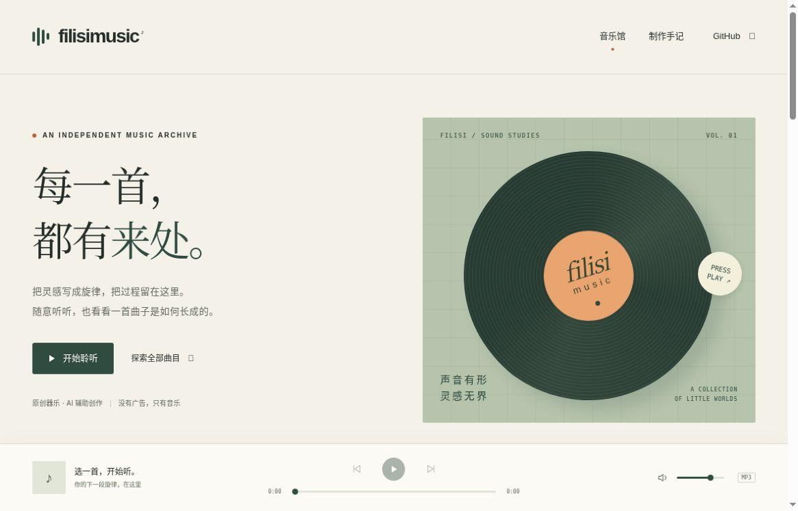

归档日期：2026-10-07  
原文档版本 1  
状态：私有作品档案第一版；所列版本以文中 commit 为准

[返回总目录](../../README.md) · [原文件与来源索引](sources.md)

# 十四行作品档案

私有总档案 第一版

这份第一版档案记录三款网页游戏和一套 AI 辅助器乐作品集，版本范围见文末四个 commit。每项都附体验入口、创作分工、具体改动和待核对之处。后续挑选参赛或合作材料时，可以从这里查回对应版本。

### 代表作品

回声公寓  心理恐怖调查游戏，用空间、记录与谜题推进故事。

[体验与作品入口](<https://thysummer14.github.io/echo-apartment/>)

斩妖 修仙录  水墨修仙增量游戏，兼顾长期成长与主动战斗。

[体验与作品入口](<https://thysummer14.github.io/xiuxianlu/>)

点亮回声  单键节奏游戏，连接原创曲目、谱面与视觉场景。

[体验与作品入口](<https://thysummer14.github.io/pho/>)

filisimusic  50 首原创 AI 辅助器乐作品，以及制作与修订档案。

[体验与作品入口](<https://thysummer14.github.io/filisimusic/>)

### 创作分工

十四行提出创意方向、需求和审美偏好，通过试玩和反馈决定取舍。AI 协助调研、代码实现、程序化美术、作曲与导出，各项目页分别说明。AI 实现的代码不列作个人手写代码，合成音色也不列作真人演奏。

### 如何使用这份档案

先打开作品，再查对应项目页。用于社团、比赛或合作介绍前，需选定展示版本，补上同版本的截图或录像，并核对活动的 AI 使用与署名规则。这份总档案保持私有，文中外链是已有公开作品的入口。

01 / 作品档案

## 回声公寓

ECHO APARTMENT · 浏览器心理恐怖调查游戏

[打开作品](<https://thysummer14.github.io/echo-apartment/>)   ·   [源代码与说明](<https://github.com/ThySummer14/echo-apartment>)

### 想做什么

玩家在公寓里寻找记录、接听电话、查看录音，再用现场线索解谜，逐渐拼回一段被遗忘的往事。故事随着房间和调查路线展开。

### 本版记录的内容

项目说明中的 4.1 社区调查版包含六章调查、28 份记录、物品与谜题推进、两个结局，以及公寓外社区。Three.js、WebGL 与 WebAudio 支撑场景和声音，模型、贴图与声音在运行时生成。

### 创作与协作

十四行决定游戏方向，提出场景和手机体验问题，并用真实试玩反馈推动修订；AI 协助叙事整理、场景与交互代码、程序化资源和回归检查。

### 一个具体改进

手机试玩时，解谜面板不便操作，电话还被冰箱遮挡。修订将翻页与确认按钮分开，给数字谜题增加屏幕键盘，并调整电话位置。玩家需要能看见线索，也能完成输入，才能继续调查。

### 尚待核对

本版所据改动有代码和自动化检查记录，完整浏览器画面、音频及手机真机体验仍待核验；空白区域反馈也尚未核清。减少静态灯具网格不能直接证明手机帧率提高。因此，这一页先保留体验入口和源代码，不放未经核对的实机截图。

### 展示前需补的证据

用选定的同一发布版本录制完整调查路线，检查空白区域、手机解谜和声音。记录问题出现条件、修复前后差异及最终版本号，才能把演示与改动对应起来。

[证据  手机交互修复记录](<https://github.com/ThySummer14/echo-apartment/blob/main/docs/MOBILE-ACCESS-FIXES.md>)

02 / 作品档案

## 斩妖 修仙录

水墨风增量游戏 · 浏览器版本

线上首页实拍，仅展示入口界面，不作为完整玩法或性能验收。

[打开作品](<https://thysummer14.github.io/xiuxianlu/>)   ·   [源代码与说明](<https://github.com/ThySummer14/xiuxianlu>)

### 想做什么与现有成果

打坐积累、境界推进和猎妖战斗组成反复游玩的修行过程。本版记录了温养与闯关、山魈蓄势打断、镜狐分影及配套见闻，也包括存档保险箱和手机短屏布局。

### 创作与协作

十四行提出体验方向、画面偏好并反馈实际游玩问题；AI 协助规则实现、数值对照、界面与美术整合、存档保护和测试。

### 一个具体改进

温养会反复挑战已通关的五层，容易被误认为正在继续闯关。修订后的界面显示循环区间、保留的闯关进度，并提供“返回闯关”入口，方便玩家判断自己处在哪种模式。

### 尚待核对

已有手机布局和行为回归记录，但自动测试、文字测量优化不足以证明 Android 真机帧率。对外展示前，还缺短屏战斗实录，以及新玩家能否区分温养、闯关和归山的观察记录。

[证据  温养与闯关说明](<https://github.com/ThySummer14/xiuxianlu/blob/main/docs/temper-mode.md>)

03 / 作品档案

## 点亮回声

ECHO RUN · 单键网页节奏游戏 · 仓库名 Pho

线上首页实拍，仅展示入口界面，不作为完整玩法或性能验收。

[打开作品](<https://thysummer14.github.io/pho/>)   ·   [源代码与说明](<https://github.com/ThySummer14/pho>)

### 想做什么与现有成果

光点与打击环重合时，玩家按下一个键跟随旋律。本版收录四首曲目及各自的谱面和景观，支持键盘、触屏、16 秒暖身、分段与变速练习，还有暂停后的倒数恢复。

### 创作与协作

十四行选择玩法和视听方向，通过试玩反馈保留喜欢的核心体验；AI 协助判定、音频时钟、谱面、画面实现和回归检查。曲目使用 AI 辅助创作与程序合成音色。

### 一个具体改进

暂停后从本小节重新倒数，玩家可能分不清这次成绩是否计入最佳。修订后的界面标出分段、变速和恢复状态，并说明练习成绩与整曲最佳分别怎样保存。

### 尚待核对

练习、触控和成绩规则已有记录，少见的原生窗口缩放后无响应问题仍待核查。展示前还需在真实手机上检查触控和听感，录制整曲，并记下设备与校准条件。

[证据  玩法与练习状态说明](<https://github.com/ThySummer14/pho/blob/main/README.md>)

04 / 作品档案

## filisimusic

AI 辅助器乐创作与可追溯音乐档案

音乐馆线上首页实拍，不作为逐曲听审或音质评价。

[打开作品](<https://thysummer14.github.io/filisimusic/>)   ·   [源代码与说明](<https://github.com/ThySummer14/filisimusic>)

### 想做什么与现有成果

这套作品集保留不同风格的完整器乐曲及其修订过程。第一版统计首批 50 首不同作品、51 个可听版本，默认版本合计约 2 小时 46 分 31 秒。网页提供聆听、筛选、制作手记和源文件下载。

### 创作与协作

十四行提出风格与完整度要求，反馈“更长、充分展开、不同风格”等方向；AI 协助乐谱、程序合成、结构修订和实际 REAPER 离线导出。乐器名描述配器角色与合成音色，不代表真人演奏。

### 一个具体改进

《雨落楼梯口》保留了三次实际导出。v2 重写长笛回归与低音走向；v3 加入弱起、摇摆和句尾留白。可以对照音频和制作手记，听出各次修改落在哪里。

### 尚待核对

轻量工程包不含现成分轨，使用前要先生成音频素材。逐曲完整人工听审尚未完成，新一批故事音乐也未计入这 50 首。若要挑选代表作，需先完整听审少量候选，再安排试听顺序。

[试听样本  雨落楼梯口 MP3](<https://thysummer14.github.io/filisimusic/audio/jazz_waltz.mp3>)   ·   [曲目与版本目录](<https://github.com/ThySummer14/filisimusic/blob/main/data/catalog.json>)

05 / 版本与证据

## 作品版本与证据范围

### 本版证据范围

本版依据下列版本对应的 README、设计与修复记录、音乐目录，以及三个线上首页的只读实拍。首页截图只证明当时的入口画面。自动化检查、浏览器试玩、手机性能和完整听审各能回答不同的问题，应分别保留记录。

### 版本索引

[回声公寓  ac9baf2](<https://github.com/ThySummer14/echo-apartment/commit/ac9baf2657818372ac85d989e4ce99ea209829b4>)

[斩妖 修仙录  c4e30e0](<https://github.com/ThySummer14/xiuxianlu/commit/c4e30e048074c76d9c332eb323a4969d7d9dd682>)

[点亮回声  4fde533](<https://github.com/ThySummer14/pho/commit/4fde5334baab88fc689ae89966d8c37a289f3367>)

[filisimusic  95dd7da](<https://github.com/ThySummer14/filisimusic/commit/95dd7da680c81f15a00920d4e5f050c22aa1aa9a>)

以上标记限定了本档案的版本范围。作品入口和 main 分支链接可能继续变化，对外展示前需重新核对，不能把本页当作最新状态说明。

### 展示材料还缺什么

回声公寓缺所选版本的实机调查截图和完整路线录像；修仙录缺短屏战斗与模式切换实录；点亮回声缺真实设备整曲体验和缩放问题复现记录；音乐馆缺代表曲人工听审。补材料时，一并记下问题、修改和复核结果。

### 本版未收录的项目

MV、PV 和 EMBERWAKE 未列入本版完成作品。EMBERWAKE 在此记录为 Godot 原型与本地交接方向，不作为已上线网页作品展示。以后是否补收，以可核对的完成版本为准。

### 新增作品时保留什么

新增项目可另起一页，写明名称、想法、当前能做什么、十四行与 AI 的分工，以及一条可核对的改进记录。配上真实截图或演示，注明限制，再链接到作品、源代码或工程，方便读者实际查看。

### 分享前的检查

分享前，核对活动的 AI 使用与署名规则、素材和音乐授权，移除无关的账号、学校及联系方式。截图、演示和说明应对应同一版本。这份私有档案尚不代表任何对外提交已获授权。
