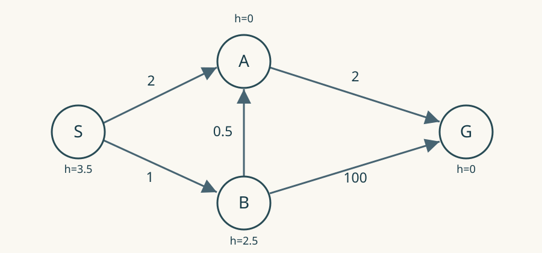

# 估计从不偏高，A星为什么仍会找到较贵的路

一张地图只有四个地点，最便宜的路线花3.5元，程序却返回4元。它没有算错加法，给出的每个“还要花多少钱”的估计也都没有偏高。问题出在另一条看起来很省事的规则：某个地点检查过一次，以后就不再检查。

这不是某个导航软件的事故，而是一道可以拿纸笔走完的反例。把这四个地点看明白，A星最容易混淆的两种保证也就分开了：找到终点时够不够便宜，与第一次检查某个中途地点时是否已经找到了到达它的最便宜办法，是两个问题。

## 搜索桌上摆着什么

A星写作A*，是一种寻找最低成本路线的算法。地点叫节点，允许通行的路叫边；成本可以是米、秒或钱，但一次搜索中必须使用同一尺度。程序不必真的在地图里来回走。它在桌上比较不同的候选路线，最后才交出路线。

对每个候选地点，它记三笔数。

g是从起点到这里，当前已知路线的实际成本。这里的“实际”只表示沿这条路线逐段相加，没有猜测；它不表示这条路线已经是最便宜的。后来发现捷径，g就得改小。

h是从这里到终点的剩余成本估计，通常由一个便宜的计算方法提供。比如只能横竖走的方格图，可以先假装墙都不存在，再数横向与纵向还差几格。这类估计函数叫启发函数。

f=g+h，是这条候选路线的排序分数。程序每次取f最小的候选，查看它能去哪些邻居，再算新的成本。这个查看动作叫“扩展”。装候选的优先队列，也可以想成按f排好的待办卡片。[Berkeley的搜索讲义](https://inst.eecs.berkeley.edu/~cs188/fa22/assets/notes/cs188-fa22-note02.pdf)用这套记号区分只看g的均匀成本搜索、只看h的贪心搜索，以及两者相加的A星。

取走一张卡片，不等于人已经到过那个地方。这个区别很有用：程序稍后重新扩展A，并不是让角色倒退，而是在传播一条新发现的便宜路线。

## 四个地点，逐张翻卡片

图中箭头只能顺着走。除这五条边以外，没有别的路。

S是起点，G是终点。路线S→A→G花2+2=4；S→B→A→G花1+0.5+2=3.5；S→B→G则花101。真正最便宜的是3.5。

给四个地点安排如下估计。最后一列暂时是我们从完整小图算出的标准答案，搜索程序并不知道它。

| 地点 | h：剩余估计 | 到G真正最低成本 |
|---|---:|---:|
| S | 3.5 | 3.5 |
| A | 0 | 2 |
| B | 2.5 | 2.5 |
| G | 0 | 0 |

每个h都不高于真实剩余成本，符合“不高估”。正式名称是可采纳性。本例还约定所有h非负，终点h为0，边成本非负，地图固定且有限。

现在运行一个有缺陷的版本：每次扩展后就把节点永久放进关闭集合，任何后来到达它的路线都丢弃。表中卡片写成“地点（g，h，f）”，队列从左往右按f排序。

| 刚完成的动作 | 剩余队列 | 刚得知的事情 |
|---|---|---|
| 放入起点 | S（0，3.5，3.5） | 尚未检查任何路 |
| 取出并扩展S | A（2，0，2）；B（1，2.5，3.5） | A虽然已经花得更多，总估计却较小 |
| 取出并扩展A | B（1，2.5，3.5）；G（4，0，4） | 经A可以4元到G；关闭A |
| 取出并扩展B | G（4，0，4） | 经B到A只需1.5，但A已关闭，改进被丢弃 |
| 取出G | 空 | 返回成本4的路线 |

错误恰好发生在倒数第二行。B→G的101元路线没什么吸引力；真正重要的发现是，B能把到A的成本从2降到1.5。如果后半段仍接A→G的2元路费，总额就从4降到了3.5。

只有“不高估”为什么没挡住这个错误？因为它约束的是h，不是g。A的h=0很乐观，使A过早获得了较好的排名；当时A的g=2，却仍然比最佳到达成本1.5贵。关闭规则把一个暂时答案当成了最终答案。

## 重新打开A，究竟补了哪一步

保留同一组h，只改变关闭规则：若发现更小的g，就允许节点重新进入待办队列。

前三行完全相同。扩展B后，程序保留新的A（1.5，0，1.5），并把它的前驱改为B。“前驱”就是这条当前最佳路线中，进到该节点之前的地点，用来最后倒着拼回整条路线。

接下来的队列是A（1.5，0，1.5）；G（4，0，4）。再次扩展A时，它让G的g从4变成1.5+2=3.5。于是取出的是G（3.5，0，3.5），沿前驱回溯得到G←A←B←S。

有些优先队列不便直接删掉旧卡片，程序会同时留下G的旧4元卡片和新3.5元卡片。可以先把新卡片放进去，等旧卡片出队时发现它比记录中的最佳g更贵，就跳过它。这叫丢弃过时队列项，和禁止更好的路线重新扩展，是相反的两件事。

重开并非后来为A星打的特殊补丁。[Hart、Nilsson和Raphael的1968年原论文](https://www.cs.auckland.ac.nz/courses/compsci709s2c/resources/Mike.d/astarNilsson.pdf)在算法第4步就包含重新开放先前关闭节点的处理。现代讲解若为了省事删掉这一步，就必须补上足以支持删除的条件。

还有一种独立的错误：扩展A、第一次发现G时就停止。那会更早返回4，连B的卡片都没看。此时B的f=3.5，表示仍有一条值得检查、可能更便宜的方向。目标应在按规则成为最优先候选时接受，而不是一被邻居“看见”就接受。

## 一致性比“不高估”多检查了一段路

从B出发，估计还需2.5；花0.5走到A，估计却突然变成0。只付出0.5，估计剩余成本就掉了2.5。这种局部跳变就是本例的问题。

一致性要求每条边u→v都满足：

h(u) ≤ 边成本(u,v) + h(v)。

它的意思是：对u剩余成本的估计，不能比“先付钱到邻居v，再用v的估计”还高。本例B→A要求2.5≤0.5+0，明显失败。h依然处处不高估，却不一致。

在一条实际候选路线里，走到v后的排序分数为g(u)+边成本+h(v)。一致性保证它不小于g(u)+h(u)。也就是说，沿同一路线往前延伸，f不会突然下降。[Poole与Mackworth的教材](https://artint.info/3e/html/ArtInt3e.Ch3.S7.html)把这与多路径剪枝放在一起讨论：丢弃同一地点的后来路线，需要证明先留下的路线已经足够好。

为什么一致性允许永久关闭？假设A第一次出队时仍走贵了，那么更便宜的到A路线尚未完全检查，其中一定有一张前沿卡片。沿那条更便宜路线逐段使用一致性，可知这张卡片的f不超过“到A的更低成本+h(A)”，严格小于当前A的f。它本应先被取出，和“A已经最优先”矛盾。因此，满足这些条件时第一次扩展A，它的g已经最低。

可采纳启发式配合重开的证明走另一条路：沿着某条最优完整路线，保留并继续传播最便宜的前缀，待办队列中就总能留下一个f不高于最优总成本的候选。一个更贵的目标，其h=0，f就等于那笔更贵的实际总成本，无法抢先出队。永久关闭恰好可能破坏“保留这个前缀”的前提。

这也解释了两种保证为何不同：一致性足以让中途节点的首次扩展可靠；可采纳性可以保证最终目标可靠，但实现必须允许修正中途判断。

## 同一张图，换两组估计

最保守的选择是所有h都设为0。此时f=g，程序先检查B（1），随后把A从2改成1.5，再检查A，最后得到G的3.5。A还没关闭就已被修正，因此无须重开。它少了一份方向提示，但保住了正确性。

另一组选择是h(S)=1.5、h(B)=0.5、h(A)=0、h(G)=0。逐边检查：S→B满足1.5≤1+0.5；B→A满足0.5≤0.5+0；S→A也满足1.5≤2+0。其余两条显然满足。这是一致启发式，仍先取B，再取A，得到3.5。

注意，不能只把原来B的h从2.5降到0.5，却保留S的3.5，然后宣布整个函数已一致。那时S→B要求3.5≤1.5，又坏了。检查对象是每条边两端的关系，不是某个单独数字看起来是否顺眼。

本例的三个正确运行都返回3.5，但展开顺序不同。[随文脚本](assets/recompute_astar.py)分别复算了永久关闭、允许重开、零启发和一致启发四种情况；这只是确定性正确性测试，四个点不足以评价大地图速度。不一致也不等于性能差。[Felner等人的研究](https://tzin.bgu.ac.il/~felner/2011/sdarticle.pdf)讨论了不一致启发式的重展开成本与实际收益；它们能否节省工作，要看问题结构与具体算法。

## 怎样自己造一个可检查的h

先从很小的移动规则出发：角色在方格上只能上下左右走，每走一格花1。当前位置是（1，1），目标是（4，3）。即使没有一堵墙，横向也必须补3格，纵向补2格，所以h=3+2=5。加入墙，只会迫使路线绕远，不会凭空减少必需的横纵移动。

再检查一致性。走一步以后，横纵差的总和至多减少1，而这一步恰好花1；于是旧h不大于“1+新h”。不必穷举每条完整路线，只核实允许的每种动作，这个h就有了局部保证。这是从放宽后的问题构造启发式：删去障碍，把较容易问题的最优成本当作原问题的下界。

现在允许斜着走，且斜一步也只花1。从（1，1）到（4，3），可以斜走两次，再横走一次，共3。原来的h=5立刻高估了，毛病并不在A星队列，而在估计使用了过期的动作规则。对于这个新规则，可以改用横纵差中较大的一个，即3；每次横、纵或斜移动都至多把这个最大值减少1，因此仍能逐步检查一致性。

若地图另外增加一条只花0.2的传送边，几何估计又可能失效。无需猜测“直线距离通常够安全”，只要把传送边的两个端点代进一致性不等式就能发现问题。有时暂时把h设为0是更好的调试选择：若这时路径恢复正确，就优先查启发式与移动规则是否匹配；若仍错误，再查边成本、队列更新和终止位置。

同样的思路也能帮助设计单元测试。四节点反例测重开，斜走例子测成本下界，刚生成终点就结束的例子测终止时机。三个测试各自只改变一个关键条件，失败时比一张复杂地图更容易定位原因。

## 写到程序里时，再看两个细节

[NetworkX 3.4.2的固定版本源码](https://github.com/networkx/networkx/blob/networkx-3.4.2/networkx/algorithms/shortest_paths/astar.py)会把更低成本的候选重新入队，也跳过较差的旧队列项。它还缓存每个节点第一次算出的h。因此，h若偷偷依赖不断变化的时间或外部状态，就不再符合这套实现的用法。这里核对的是该版本的代码，不能由此担保任何名字带A星的库。

成本单位则应在写启发函数之前想清楚。[Godot 4.4的AStar2D接口](https://docs.godotengine.org/en/4.4/classes/class_astar2d.html)把边成本计算与目标成本估计分开，还会把到达节点的权重乘进边成本。如果g记录秒，h直接填地图上的米，g+h就没有共同含义。知道最高速度为每秒5米时，100米直线距离可以给出20秒下界，但前提是没有更快的传送、捷径或不同移动规则。

现在可以自己改一次小图：删去B→A，只剩S→A→G与S→B→G，还会出现原来的4元错误吗？不会，4已经是真正最便宜的路线。反例依赖的是“后来能找到更便宜的到达方式，却不让它继续传播”。因此，测试A星时，与其只挑一张路径好看的地图，不如专门保留这条会把A从2改成1.5的边。
