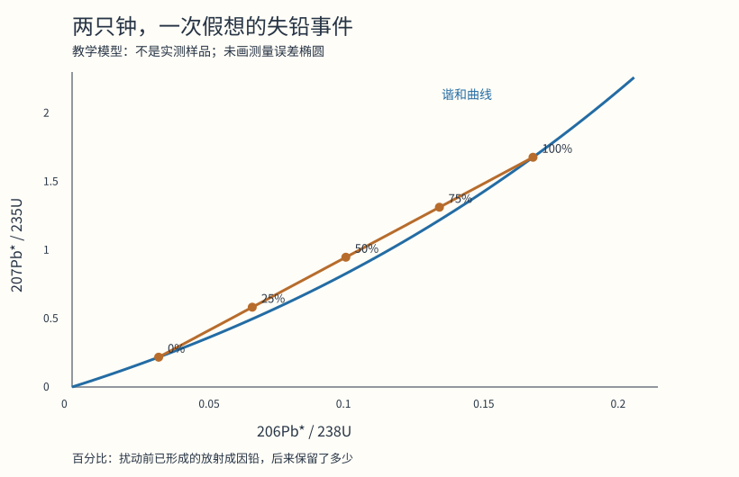

# 一粒锆石报出两个年龄，地质学家怎样找出它经历过什么

假设一粒锆石形成于十亿年前，后来漏掉了一部分铅。今天测它，一只同位素钟读出6.12亿年，另一只读出6.77亿年。把两者平均，得到约6.45亿年，看起来折中了分歧，却没有对应我们设定中的任何一次地质事件。

这组数来自下面可以复算的模型。它要说明的不是测年“有误差”，而是一个更有用的判断：两个计时系统不一致，可能保存着材料被扰动的证据；先查物质怎么进出，再决定哪个年龄有意义。

## 钟不在石头表面，在原子数量的比例里

同一种元素可以有中子数不同的原子，叫同位素。铀238和铀235都是铀，却以不同速度发生放射性衰变，经过各自的一串中间产物，最终分别形成稳定的铅206和铅207。

锆石是一种硅酸锆矿物。结晶时，它的晶格能容纳一些铀，却通常很少容纳铅。这使后来在其中积累的铅有机会作为衰变产物被识别。但“起初铅少”不等于“所有测到的铅都由本晶体的铀生出”，高精度工作仍须处理初始铅与污染。[UCL同位素地质学教材第5章](https://www.homepages.ucl.ac.uk/~ucfbpve/geotopes/indexch5.html)

先把复杂处暂时隔开：设起初没有子体铅，之后铀和铅都未进出，衰变链的中间产物满足所用简化年龄式的条件。若开始有100个母体铀，过一个半衰期剩50个，另50个最终成为相应铅；子体/母体比例是50/50=1。再过一个半衰期，铀剩25个，铅累计75个，比值为3。

“半衰期”不是某一个原子活到这个年纪一定衰变，而是大量同类原子剩下一半所需的时间。对于整批原子，平均衰变规律可写成N=N₀e^(−λt)。N₀是起初的数量，N是剩余数量，λ是衰变常数；半衰期T与它的关系为λ=ln2/T。式中的e是自然指数函数的底数，ln是自然对数，两者用于正向从时间算剩余数量、反向从数量比例求时间。不熟悉这两个运算，也可以先用下面的数表跟随推理，不必手算指数。

从数量守恒出发，积累的放射成因铅为N₀−N。除以当前铀N，得到铅/铀=e^(λt)−1；反过来，t=ln(1+铅/铀)/λ。我们不用知道最初到底有多少铀，只需要测正确的子体/母体比值，再选择对应的衰变常数。

这里说的放射成因铅常带星号Pb*，用来与初始就存在、或后来带入的铅区分。省掉这个星号背后的校正，会把外来的铅误算成钟已经走过的时间。

## 两只钟并非把同一次测量抄两遍

铀238的半衰期约44.68亿年，铀235约7.038亿年。一个慢，一个快。若一粒锆石封闭保存了十亿年，对照两套公式，206Pb*/238U约为0.167817，207Pb*/235U约为1.677447。将它们分别反算，答案都应为十亿年。

两种铅/铀比值并不会彼此相等。要相等的是经过各自速度换算后的时间。这像两把刻度不同的尺，同一长度可以给出不同数字，前提是转换后相符。

将一系列可能年龄代入两套公式，每个年龄得到一对比值，把这些点画出来就是谐和曲线。图上的横轴取206Pb*/238U，纵轴取207Pb*/235U；这是同一配对关系的一种轴向选择。曲线上的点意味着两套简化计时给出同一日期，曲线外的点称为不谐和。[Schoene的测年综述，谐和图与开放体系部分](https://timslab.princeton.edu/sites/g/files/toruqf2276/files/schoene-treatisegeochemistry-2014.pdf)

图不是测得的某块岩石，也没有测量误差椭圆。它把一个规定了全部条件的假想历史画成可检验结果。

## 让它在两亿年前漏一次铅

仍设锆石在十亿年前形成。到两亿年前时，一次短促扰动带走当时一半的两种放射成因铅；铀不流失，铅同位素按相同比例流失。扰动结束后，体系重新封闭，一直到今天。

要算今天的读数，必须把铅分成两笔：扰动之前产生、后来只剩一半的旧铅；扰动之后由剩余铀继续产生、完整留下的新铅。若直接把今天本应有的铅总量减半，就会错删扰动之后才产生的那部分。

用十亿年作时间单位，形成时刻距今为1，失铅距今为0.2，旧铅保留率为f。相对于今天的铀，旧阶段原本贡献e^λ−e^(0.2λ)，新阶段贡献e^(0.2λ)−1。因此今日总比值为：

R=f×[e^λ−e^(0.2λ)]+[e^(0.2λ)−1]。

f=0.5时，对两只钟分别代入λ，得到下面一行。其余行只改变保留率，形成和扰动时刻都不动。

| 扰动前旧铅保留比例 | 206Pb*/238U | 207Pb*/235U | 238U钟表观年龄 | 235U钟表观年龄 |
|---|---:|---:|---:|---:|
| 100% | 0.167817 | 1.677447 | 10.00亿年 | 10.00亿年 |
| 75% | 0.133741 | 1.312513 | 8.09亿年 | 8.51亿年 |
| 50% | 0.099665 | 0.947579 | 6.12亿年 | 6.77亿年 |
| 25% | 0.065589 | 0.582645 | 4.09亿年 | 4.66亿年 |
| 0% | 0.031514 | 0.217711 | 2.00亿年 | 2.00亿年 |

最后一行还提供一个反直觉的提醒：两只钟完全一致，也可能记录的是彻底重置的时间，而非晶体最早形成的时间。若把一粒古老锆石搬运进年轻砂层，它还可能保存源岩结晶年龄。测量回答“这个同位素体系记录多久”，地质解释再回答“这段时间属于哪个事件”。只有后一步成立，数字才能接到岩石的历史上。

中间三行的“年龄”只是把开放过的体系硬塞进封闭体系公式，得到的表观日期。它们不等于形成或受扰动的时刻。两端倒有清楚含义：一点铅都没失去，仍读十亿年；旧铅全部清空，钟从两亿年前重新积累，两只又对上了。

为什么中间点会排成直线？把上式重排为R=f×(e^λ−1)+(1−f)×[e^(0.2λ)−1]。它是“十亿年端点”与“两亿年端点”按相同比例混合，两只钟都用同一个f。所以一组具有相同两次事件、失铅程度不同的测点，落在连接两个端点的弦上，称为不谐和线。弦与曲线的两个交点，才对应模型中的两次事件。

[计算脚本](assets/recompute_concordia.py)用上述近似半衰期独立生成表和图，并检查两端反算年龄。它没有拟合真实数据，也不应把教学数字的小数位当作实际实验精度。

## 一条漂亮直线，仍可能有两种来历

问题随即出现：混合也能画出直线。若一次测量同时取到十亿年老核和两亿年新长的外缘，两部分的铀、铅一起进入仪器，也能产生类似的中间比值。图本身不能独立判定这是老晶体漏铅，还是新老材料被一起测了。

区分它们要回到颗粒。先成像，看晶体有没有核、外缘、裂纹、包裹体和生长分带；再选小束斑测核与外缘，或者比较不同部位。若老核和新边各自给出谐和年龄，整体混合解释便有了直接支持。若偏离集中在受损区，物质流失解释更值得检验。显微结构不是配图，而是给同位素模型添加了空间约束。

同理，若铅一直缓慢流失，或发生过多次扰动，就不能强行用一次瞬时失铅的两个交点讲完历史。直线拟合误差很小，也只说明点排得整齐；地质解释还要符合独立的岩石结构和事件证据。

## 能不能把容易失铅的部分先去掉

化学磨蚀测年会先加热退火，再选择性溶去一部分晶体，最后测剩下的材料。目标是减少曾经受损、容易发生开放体系行为的部位。这里的“磨蚀”不是拿砂纸打磨，也不是看到年龄不顺眼便删数据。

2023年McKanna等人用四组损伤程度不同的锆石，比较酸处理前后的微米级X射线三维图像，并结合表面电子显微图和拉曼光谱。拉曼谱带的宽化可以提供晶体损伤信息；三维图像则追踪哪些内部区域消失。研究发现，溶解能沿裂隙和损伤带进入内部，并非只从表面均匀削掉一层。[原论文方法与成像结果](https://gchron.copernicus.org/articles/5/127/2023/)

这个对照解决的是“处理到底去掉哪里”。它不单凭一张处理后的空洞照片，推断空洞以前就是全部失铅区。处理前后同一颗粒的位置对应，以及不同成像方法，才使这种解释更有约束。论文还记录了分辨率、转移时破碎以及部分包裹体仍保留等限制。

同一研究线在2024年又逐步收集溶出的部分与最终残余，分别测同位素与化学组成。三个样品中，210℃步骤处理总体比180℃产生更一致的结果；但早期溶液、后期溶液与残余不必拥有同一日期。作者特别指出，分三次加热的处理不等于连续加热同样名义时长，因为容器升温需要时间。[逐步溶解试验的方法与讨论](https://gchron.copernicus.org/articles/6/1/2024/)

这两篇是相互衔接的研究，不能当作两个独立团队完成的复现。对初学者最有用的地方，是两种检验连起来了：先观察去掉的空间，再测去掉的物质，最后判断残余是否更适合那个封闭体系模型。这里涉及专业实验室强腐蚀性试剂，不是家庭处理矿物的方法。

## 曲线附近的点，怎样才算“对上”

实际读数不会精确落在数学线上。测量有不确定度，而且两个坐标的误差可能相关。不能只看屏幕上点离线几像素；坐标缩放一下，肉眼距离就变了。

若只保留两只钟相差不足某个百分比的颗粒，规则还可能不成比例地剔除某些年龄段。Vermeesch在2021年比较多种不谐和筛选，展示相同数据经过不同规则后，年龄分布可以改变。被删掉的点不只是“坏数据”，其年龄、精度与偏离机制会影响筛选后留下什么。[筛选比较研究，图8与结论](https://gchron.copernicus.org/articles/3/247/2021/)

实验室校准是另一层检查。质量谱仪按质量与电荷分辨离子，但测到的信号还会受不同元素电离效率等影响。同位素稀释法加入组成和用量已知的示踪剂，通过混合后的同位素比例反推样品含量。Condon等人的EARTHTIME研究把示踪剂校准追溯到称量和参考物质，并区分校准、衰变常数等不确定度。[2015年计量研究](https://timslab.princeton.edu/sites/g/files/toruqf2276/files/condon-2015-geoetcosacta.pdf)

多测几次可以减少某些随机波动，却不能自动消除所有试件共用的校准偏差。两只钟给出相近数字，是重要内部检查；矿物选错了生长阶段，或者把碎屑晶体的结晶年龄当成沉积时间，数字再整齐也可能回答了另一个问题。

开头那粒假想锆石若只交出6.12亿年和6.77亿年，最合理的下一步不是挑一个顺眼的数字，而是寻找同一事件形成、受扰动程度不同的部位或颗粒，检查它们是否支持同一条不谐和线，再用成像分辨失铅与混合。两只钟的分歧，把下一次取样该找什么说清楚了。
