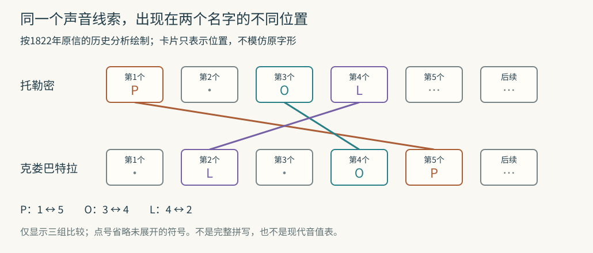

# 罗塞塔石碑给了译文，为什么还要花二十多年才读懂

假如有一张告示，上面两段意思大致相同，一段会读，另一段满是鸟、蛇、圆圈与线条，最自然的办法是挨个对照。可第一行该从哪边读？哪几个图形组成一个词？一只鸟代表鸟，还是鸟名里的某个音？一处对应看着合理，换到另一块石碑还成立吗？

石碑于1799年被发现；商博良在1822年公开关键破译成果，中间隔了23年，后续语法研究仍在继续。[发现与突破的时间](https://www.lmu.de/en/about-lmu/structure/central-university-administration/media-relations-and-communications/press-room/press-release/how-the-hieroglyph-puzzle-was-solved-09b54754.html)

罗塞塔石碑提供了珍贵的对照，却没有把这些问题预先解决。破译的关键进展，是让一个读法产生可以在其他名字、其他文物上检查的预测。托勒密与克娄巴特拉的王名圈，恰好能把这种工作展示得很具体。

## 石头上并排的是三种文字形式

罗塞塔石碑记载公元前196年的一份祭司法令，涉及托勒密五世。上部是圣书体象形文字，中间是世俗体，下面是古希腊文。前两种记录埃及语，因此通常说它有两种语言、三种文字形式。把三种字形叫成三个互不相干的语言，会漏掉早期研究中很有用的一条线索：这些埃及文字之间也可以相互比较。[大英博物馆的馆藏说明](https://www.britishmuseum.org/collection/object/Y_EA24)

“同一份法令”也不等于字对字的替换表。不同书写传统可以采用不同措辞，字数、分词和语序不会自动齐整；石碑还有断损。会读希腊文，首先帮助确认文本谈什么、出现哪些人名与头衔，再据此寻找可能对应的重复符号群。

例如，若希腊段多次出现国王名，而另一段也反复出现某个被椭圆圈住的符号群，可以提出“这个圈里写王名”的假设。椭圆框后来常称王名圈，或cartouche。它像给搜索划定范围，仍没有告诉人其中每个符号的读音。

## 托马斯·杨先把哪些关系整理出来

托马斯·杨在1823年的回顾中，描述自己比较罗塞塔石碑不同段落、辨识重复群组，再把纸草和其他碑铭带进来的过程。他尤其注意不同书体中，一些较写实的图形如何变成简略线条；同类段落与配图又能帮助判断纸草上的哪些部分相对应。[杨的《象形文字文献若干新发现》，第二、三章](https://www.gutenberg.org/cache/epub/74347/pg74347-images.html)

这相当于同时做两张表：一张记录“哪些群组可能说相同的话”，另一张记录“同一个书写成分可能有哪些字形”。没有第二张表，同一个符号写得潦草一点，就可能被误当成全新符号。

杨把托勒密名字中的一些符号联系到声音，也知道科普特语可以提供线索。但他的回顾还保留着不确定：外来人名可以按声音写，普通埃及词是否同样广泛使用这种方式？他没有因为找到几个名字就解决整套文字系统。

读这种回顾要记住作者身份。1823年的杨正在说明自己的贡献，也与商博良争取优先权。他的“我首先证明了什么”是待与书信、出版物和其他记录比较的历史主张，不能直接当作中立裁决。原文能告诉我们他当时如何论证，比后来一句“谁赢了比赛”有用得多。

## 一个名字太容易硬配，两个名字才会互相约束

商博良在1822年的《致达西耶先生书》中明确提出，最好能拿到两个预先知道的希腊王室名字，其中有共同字母，再检查对应象形符号是否也重复。罗塞塔石碑残存的圣书体部分主要提供托勒密；另一个有用名字来自菲莱方尖碑相关材料。[原信的比较段落](https://fr.wikisource.org/wiki/Lettre_%C3%A0_M._Dacier_relative_%C3%A0_l%E2%80%99alphabet_des_hi%C3%A9roglyphes_phon%C3%A9tiques)

这点常被故事压缩错：克娄巴特拉不是从罗塞塔石碑同一个王名圈里凭空读出来的。商博良把菲莱方尖碑及其相关希腊铭文放进论证，借托勒密和克娄巴特拉的已知名字，比较两串符号。

看三个具体对应就够。以下按1822年原信的历史分析复述，用现代拉丁字母帮助辨认希腊字母；它不是一张可直接拿来学习所有古埃及语的现代音值表。

| 原信描述的符号 | 托勒密名字中的位置 | 克娄巴特拉名字中的位置 | 商博良当时对应的音 |
|---|---:|---:|---|
| 长方形符号 | 第1 | 第5 | P |
| 带弯曲茎状部分的符号 | 第3 | 第4 | O |
| 躺卧的狮子 | 第4 | 第2 | L |

一只狮子若总解释成“威猛国王”，可以给很多铭文编出顺口故事，却不容易解释它为什么恰好在两个人名需要L的位置重复。P与O又在各自预期位置重复，使“这些符号可以按声音使用”的解释同时承受多个约束。

还应检查没有出现的对应。克娄巴特拉名字开头的K，在托勒密里没有；原信就指出，开头那个候选符号也确实没有出现在托勒密圈里。支持假设的证据不只是“找到了相同”，还包括在预期不同的位置看到差异。

这不是单凭一个图形长得像什么定音。图像形状帮助区分符号身份，已知人名与多处位置对应才帮助推断它承担的声音。

## 遇到不一致，怎样避免每次都另编规则

两个名字并非完美的一字一音密码。原信发现，托勒密中的T和克娄巴特拉中的T用了不同形状。商博良提出同音符号的解释，即不同符号可以承担相近音值。后续又比较更多王名与拼写变体，检查这种解释能否重复工作。

“同音符号”是必要的可能性，也可能成为逃避反例的借口。区分两者，要看新增规则是否在其他材料中继续成立。若每遇到一个难读符号，就给它临时安排一个恰好能凑出预期王名的音值，任何名字都可能被“读出”。若同一组值在未参与最初猜测的新名字中，仍正确预告重复、顺序和差异，解释才变得更强。

可以做一道与古埃及无关的练习。假设未知书写中，符号甲乙丙表示P-A-L，另一串丙丁甲表示L-O-P。我们由两个已知词推得甲=P、乙=A、丙=L、丁=O。现在第三串甲丁丙出现，规则预测它读P-O-L；若独立译文给出的却是P-A-L，就必须检查最初识别、方向、抄写或“一符一音”假设。不能一边用第三词当验证，一边为了它把丁随时改成A。

这道练习比真实埃及文简单得多。它展示的是验证结构：先固定候选关系，再带到新材料。真实破译还需允许同音异形、多音值和不发音符号，并且分别找到依据。

## 科普特语让声音有机会接回埃及词

从希腊统治者的人名读出一些音值，仍可能只证明“埃及书吏能拼外来名字”。要跨过这道门槛，需要在更早、本土的埃及名字和词里检验语音成分。

科普特语是埃及语较晚的历史阶段，采用以希腊字母为基础、增加若干符号的书写系统。它保存了可读的词汇传统。它并不等于几千年前原封不动的发音录音，却能提供词义和历史声音线索。

一个常被用来说明这一步的案例是拉美西斯王名：太阳圆盘与科普特语中太阳的名称联系，尾部符号已有S的读法，中间部分再与已知王名及其他材料比较。图像、声音、历史名字在这里相互约束。LMU埃及学家Friedhelm Hoffmann的访谈用这个例子说明，商博良如何将外来名字中的线索推进到更早埃及王名。[LMU访谈](https://www.lmu.de/en/about-lmu/structure/central-university-administration/media-relations-and-communications/press-room/press-release/how-the-hieroglyph-puzzle-was-solved-09b54754.html)

这段历史不能改写成“太阳画作圆，所以所有圆都读Ra”。同一图形的功能随词和位置改变；早期破译者对中间符号的切分也还不等于后来的成熟分析。正确方向可以先出现，细节再靠更多文本修正。

## 读不出来的符号，可能根本不需要发音

成熟的圣书体知识让我们能看见，当初纯字母表假设会卡在哪里。有的符号代表单个辅音，有的代表两个或三个辅音；有的表示整个词；还有些放在词后，提示这个词属于人、地点、行动等语义范围，却不读出来，叫限定符。

大都会艺术博物馆的教学资料举出，表示妻子的词后可以出现坐着的女性图形，它承担类别提示，不能再机械添一个音节。单音符号有时还补写一个多辅音符号的部分读音，叫语音补符；读时不是把同一个声音重复两遍。[《古埃及艺术》书写部分，第47至48页](https://www.metmuseum.org/-/media/files/learn/for-educators/publications-for-educators/the-art-of-ancient-egypt.pdf)

这也能解释为什么一个希腊词，未必对应一个埃及图形。设某词的辅音由一个双辅音符号表达，后面再附最后一个辅音的补符，加一个不发音的类别符号，纸面上就有三个图形，口头上却不是三个独立音节。先认定每个图形都是一个完整概念，或每个图形都必须是一个字母，都会误分单位。

UCL的限定符例表把房屋、城镇、人物、葬礼等类别并列，适合拿来检查“这个字形正在提供什么信息”。[限定符示例](https://www.ucl.ac.uk/museums-static/digitalegypt/writing/determinatives.html) 图像仍然有意义，只是意义不必总是通过发音加入句子。

读音、词义与书写习惯因此必须一起建立。破译不是把几十个字符列成表就结束，而是让相同规则持续解释头衔、名字、句法关系和不同书体中的对应。

## 一本1822年的信，为什么不是全部终点

《致达西耶先生书》的题目与主要内容集中在语音字符、希腊罗马统治者的名字和头衔。它记录了关键突破，同时也保留当时尚待调整的分类。不能把后来几十年的埃及语知识都倒装进这个年份，让作者在一瞬间拥有完整语法。

法国国家图书馆保存的商博良工作材料有读书摘记、草稿、描图、剪贴和抄本。馆方研究者在介绍这些材料时，强调他不断收集不同时代、地点和类型的铭文，在博物馆和后来赴埃及的工作中检验读法；《埃及语语法》则在他去世后出版。[BnF展览资料中的出版过程](https://www.bnf.fr/sites/default/files/2022-02/dp_aventure_Champollion.pdf)[BnF对工作档案的介绍](https://www.bnf.fr/fr/dans-les-pas-de-champollion)

这些材料说明，“读得通”需要积累可以互相挑战的文本。某个字形抄错、某段残损、同名统治者年代不同，都可能让漂亮解释走偏。保留原文物出处、抄本和读法版本，才能回头判断，是字符识别错误，还是语言规则需要修订。

罗塞塔石碑的作用由此很清楚：它提供一处强有力的已知内容对照，让假设有落脚点；王名圈缩小了未知范围；其他碑铭提供交叉检验；科普特语帮助把声音接回埃及语言传统。真正值得复述的，不是某个人突然“全看懂了”，而是狮子为何在两个人名不同的位置，仍必须交出同一个可检验的声音线索。
