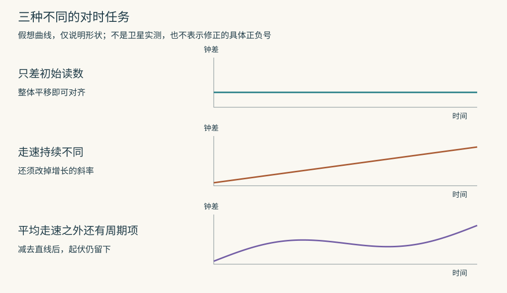

# GPS卫星钟为什么不能只在发射前对准一次

2010年，NIST的研究者把一张放着原子钟的光学平台抬高了33厘米，然后重新比较两只钟。没有把钟送上火箭，也没有让它跑完一次环球旅行。抬高以后，它的走速变了。

原论文报告的相对频率变化为（4.1±1.6）×10⁻¹⁷，与重力理论对这次高度变化的预测相容。这里的10⁻¹⁷表示小数点后先写16个零，再写1，±1.6表示报告的不确定度为1.6×10⁻¹⁷。这个数非常小：它表达走速之差，不是平台抬起时钟面突然跳了一格。GPS要处理的是同一类问题，只不过钟被送到离地面约两万公里、每秒运动数公里的地方。发射前显示相同时间，并不意味着以后仍会显示相同时间。[Chou等人的实验，图3与对应方法](https://tsapps.nist.gov/publication/get_pdf.cfm?pub_id=905055)

## 先分清指针差了一格，还是每天多走一格

两只钟在正午都显示12:00，其中一只每天多走一秒。一周后，把它拨慢七秒，可以让读数重新对齐，却没有消除走速问题；第二天又会快一秒。

钟的读数差叫钟偏，走速之差叫频率偏差。频率就是一秒内某种周期重复多少次。原子钟利用原子或离子的特定跃迁作频率参考，反复比较和控制本地振荡器。它不是把误差彻底消灭的“绝对时间瓶子”：温度、磁场、器件状态会影响实际仪器；即使理想仪器没有这些问题，不同运动与引力条件下，积累的时间也可以不同。

各地的钟沿自己的运动轨迹实际积累的时间，称为固有时。为了给一张跨越地面与卫星的导航网记账，还要约定共同的时间坐标。GPS系统时间承担后一种工作。把每只钟的原始读数换算到这个共同尺度，才有办法比较“哪一刻发射，哪一刻收到”。

这没有要求某一只地面钟成为宇宙的标准答案。[Ashby的GPS相对论说明](https://doi.org/10.12942/lrr-2003-1)从地心参考系、地球引力场与地面参考时间的关系出发，分别计算需要换算的项。真正需要一致的是模型与坐标的约定。

## 手机缺的那个未知数

理想情况下，信号传播时间乘真空光速，就给出传播距离。光速约每秒三亿米，所以1微秒对应约300米，1纳秒对应约30厘米。微秒是百万分之一秒，纳秒是十亿分之一秒。

可手机自己的钟通常没有与卫星完美同步。用手机钟读到的接收时刻，减去卫星钟报告的发射时刻，结果既含传播时间，也含两只钟的偏差。乘光速得到的量因此叫伪距：外形像距离，里面还夹着计时误差。

把大气延迟等暂时放到一边，可以写成：

伪距 = 真正几何距离 + 光速×接收机钟偏 − 光速×卫星钟偏。

卫星钟若快报了1微秒，发射时刻看起来更晚，接收机就把传播时间少算1微秒。负号由这个具体动作决定，无须硬背。

三维位置有x、y、z三个未知数，加上接收机钟偏，共四个。因此，常见的基本解算需要至少四颗几何分布合适的卫星提供约束，接收机把自身钟偏与位置一起求出来；有四颗并不自动保证观测质量好。[NIST技术说明第3节及附录C](https://tf.nist.gov/general/pdf/1274.pdf)明确把这四个未知量放进同一组传播方程。

真实信号也不是一秒发一次孤零零的报时脉冲。接收机把收到的编码图样与本地生成的已知图样对齐，由对齐所需的时间位移估计伪距。上面的时间账，说明的是这项观测背后的关系。

## 高处的收益，与运动的损失

在地球附近的弱引力场、远低于光速的运动条件下，可以把主要钟速差近似拆成两项。位置较高、引力势较高，使钟相对地面参考走快；卫星相对选定地心参考系高速运动，使它走慢。比较时必须使用同一参考系，不能一项对地面、一项对另一颗卫星，随意拼起来。

下面做一个球形、不自转地球的教学计算。地面半径取6378.137公里，卫星圆轨道半径取26560公里。后者从地心算起，不是离地高度。用地球引力参数GM=3.986004418×10¹⁴米³/秒²，可得圆轨道速度约3874米/秒。

GM把万有引力常数与地球质量合在一起；R是地面到地心距离，r是卫星到地心距离，c是光速，v是前面算出的卫星速度。重力造成的相对走速差约为GM×(1/R−1/r)/c²，运动造成的相对走速差约为−v²/(2c²)。两项都是没有单位的比例；乘一天的86400秒，才变成一天积累的时间差。

| 这套教学模型中的贡献 | 一天的时间差 |
|---|---:|
| 卫星位置较高的重力项 | 约快45.65微秒 |
| 卫星运动的速度项 | 约慢7.21微秒 |
| 合计 | 约快38.44微秒 |

这张表可用[随文脚本](assets/recompute_gps.py)复算。它刻意省略地球自转、扁率与实际轨道变化，不是GPS接收机的完整模型，也不能把38.44当成每颗星每天实测的固定数。

Ashby列出的经典GPS基准预偏置是−4.4647×10⁻¹⁰，相当于把走速预先调低到每天约38.575微秒的量级。1兆赫表示每秒一百万次周期。若目标基准频率是10.23兆赫，对应预调值约10.22999999543兆赫。两者只差一点，却会持续积累。精确模型与上面球形教学模型略有不同，来源就在那些暂时省去的参考面与引力项。[经典预偏置的推导与实现讨论](https://doi.org/10.12942/lrr-2003-1)

原说明也提到，不同钟型的实际调节可能受发射期间不可预测的频率跳变影响。因此，工程系统仍要测量钟的真实表现、更新参数，不能把一项理论预置当成终身校准证。

## 椭圆轨道使误差在一圈里来回变化

如果轨道不是正圆，卫星与地心的距离会变，速度也会变。接近近地点时位置更低、运动更快，两个效应都影响那一段的计时。将整圈的平均走速调好，仍会剩下随轨道位置起伏的部分。

GPS接口规范把普通钟差的多项式项与相对论周期项分别列出。前者描述某个参考时刻的钟偏、漂移及其变化，后者由广播的轨道参数计算。IS-GPS-200N（2022版）第20.3.3.3.3.1节要求接收机将这些项合起来，修正卫星报告的发射时间。[规范印刷页97至99](https://www.gps.gov/sites/default/files/2025-07/IS-GPS-200N.pdf)

周期项可写成Δtᵣ=F×e×√a×sinE。a是轨道半长轴，代入时用米；√表示平方根，例如√100=10。e是表示椭圆偏离圆有多远的偏心率，E是根据轨道位置求得的角度参数；规范给出F≈−4.442807633×10⁻¹⁰秒/√米。初学时只需先抓住一件事：它不是常数，sinE会在−1到1之间变化。

仍取a=26560公里，但把e设为0.01，算得周期修正的峰值约22.90纳秒，乘光速相当于约6.86米的伪距量级。这个数随假设参数变化；它不是手机在所有地点都产生6.86米位置错误的保证。

把初始指针拨一次，只能改变起点；把频率调一次，只能改变平均斜率；一条上下起伏的曲线，二者都不能完全消掉。这里已经有三个不同的修正任务，不能统称成“发射前对一下表”。

## 300米的测距量，为什么未必成为300米的位置误差

先用一维模型把问题算清楚。两座不动的发射台在一条直线两端，相距20000公里；接收机位于距左端8000公里处。忽略空气、地球曲率与发射台移动，只隔离钟差这一个因素。

把接收机钟偏乘光速后的量记成b，单位是米。若两台钟都准确，左、右伪距分别是x+b与L−x+b，其中x是接收机位置，L是两台间距。两式相减，b抵消，位置为“左伪距−右伪距+L”的一半。

现在保持接收机不动，也保持它自己的钟准确，只改变发射台钟：

| 发射台报时误差 | 求得的位置变化 | 求得的接收机钟偏 |
|---|---:|---:|
| 两台都准确 | 0 | 0 |
| 两台都快1微秒 | 0 | 被估成慢1微秒 |
| 只有左台快1微秒 | 向左约149.90米 | 被估成慢0.5微秒 |

第二行的两条伪距都缩短约299.79米，差值却没有改变。相同的那部分误差进入了接收机钟偏参数。这种各路一起变的部分叫共模。第三行只改一路，差值也跟着变，才把位置拉走。

因此，拿“38微秒×光速”直接宣布“每天位置必错一万多米”，跳过了解算模型。这个乘法给的是时间偏差对应的距离量，不是普遍的位置误差公式。

这也不说明真实系统可以省掉修正。卫星的误差并不完全相同，轨道周期项的相位各异；发射时刻还用来求当时的卫星位置；授时用户本身就关心系统时间，不能把共同误差随意藏进自己的钟里。一维反例只是迫使我们问清，哪个量在变、接收机又把它分配到了哪个未知数。

## 怎样确认那些起伏确实来自计时规律

2014年，两颗伽利略导航卫星意外进入偏心较大的轨道。这个发射失误提供了一种检验机会：卫星反复升高、降低，预期的相对论钟差也周期变化。伽利略不是GPS，但可以检验两者使用的同一类弱场计时关系。

Delva等人分析了2015年1月至2017年12月间，两星合计1008个有效观测日的数据，分别为359天与649天。研究者使用轨道解与钟差解，拟合每天的偏置和线性漂移，再检查剩下的周期变化是否符合预测。最难的干扰之一是轨道位置误差：若把卫星算得离地面更远，就会把一部分传播延迟错认成钟差。独立的激光测距残差被用来约束这项系统误差，另考虑温度与磁场的影响。[原论文的数据流程、拟合与系统误差分析](https://arxiv.org/pdf/1812.03711)

Herrmann等人的另一项分析处理同一对异常轨道卫星，检查了不同在用原子钟的数据，并把地球非球形引力场加入更精细的计时计算。轨道误差仍须与钟差同时审查。[原论文的Data Processing与Systematic Uncertainties](https://arxiv.org/pdf/1812.09161) 两篇论文有共同卫星、共同数据基础及部分共同作者，不能包装成两个毫无关联的独立实验。

开头的33厘米实验则在实验室中控制高度。研究者先比较原位置，再抬高平台，分别积累约10万秒与4万秒数据；用75米光纤连接两钟。运动效应的另一组操作还交替采用相反方向的探测光，检查普通多普勒偏移是否混入。测得的走速变化由具体比较与控制支撑，而非只因公式写在教科书上。

接收机最终需要的，正是这样一套可检查的时间账：初始差多少，接着每天差多少，一圈之内又怎样起伏。下一条广播钟参数到来时，更新的不是“这只钟是否坏了”的标签，而是把它的读数换算成共同发射时刻所需的数字。
