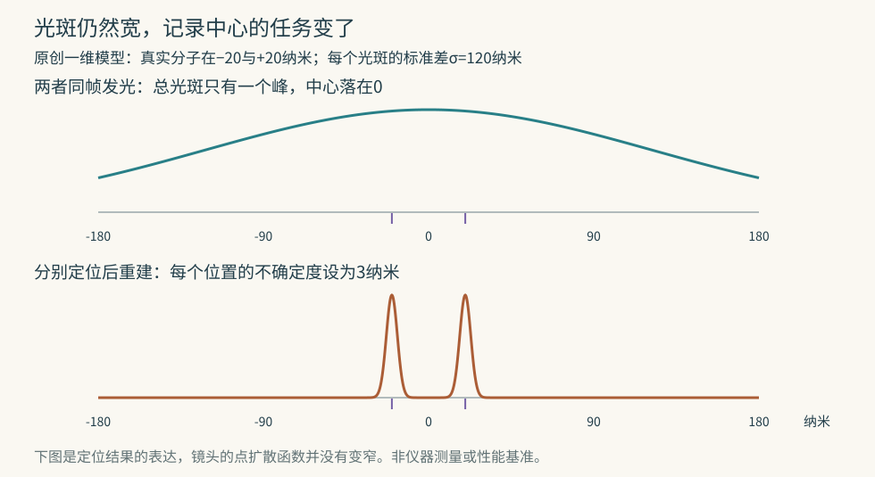

# 显微镜看不清挤在一起的分子，为什么让它们轮流发光就有用

同一摞显微照片，可以有两种处理结果。把所有照片直接叠加，得到一片模糊的亮光；先在每帧里找出少数发光分子的中心，再把中心画到新图上，却能显出原来混在一起的细节。

2006年Betzig等人的PALM论文把这两种结果并排展示。改变的不只是图片处理方式：拍摄时就让不同分子分批发光，使相邻分子的信号尽量不在同一帧里重叠。时间上的分开，为空间上的分开提供了额外信息。[原论文图1及对应方法](https://www.janelia.org/sites/default/files/Library/Betzig%20PALM%20Science%202006.pdf)

读懂它，需要把三个问题分开：一个亮点的中心能定多准；两个相邻对象能否分开；描述整片结构的点是不是足够多。这三个答案可以相差很大。

## 分子是一个点，照片为什么是一团

荧光标记吸收合适的光后，会发出可被探测的光子。一个小到远低于显微镜分辨尺度的发光分子，在照片上仍不是无面积的点。光的衍射、镜头与探测器把它变成一个有宽度的亮斑，通常称为点扩散函数，缩写PSF。

把PSF理解成“一个点会被仪器画成什么形状”，就够开始计算了。把已有照片放大或插值成更多像素，不会补回未记录的细节。拍摄时更细的像素能减轻采样不足，但不会使镜头的衍射光斑本身变窄，也不是越小越好。

现在只放一个发光分子。它的亮斑虽宽，中心仍有规律。来自同一分子的光子在中心附近多，远处少；收集足够多的光，就能估计这团分布的中心。定位问的是这个中心在哪里，分辨则问一片光里究竟有几个相邻对象。两者并非同一道题。

可以用一个理想模型算出差别。设一维光子落点服从以分子位置为中心的钟形分布，单个落点的标准差为120纳米。标准差描述散布宽度；1纳米是十亿分之一米。若N个落点互相独立，平均位置的不确定度为120/√N纳米。√N表示N的平方根，例如√100=10；图中的σ是标准差的符号。

| 收到的光子数N | 理想模型的定位标准差 |
|---:|---:|
| 100 | 12纳米 |
| 400 | 6纳米 |
| 1600 | 3纳米 |

光子数增加四倍，随机定位误差才约减半。亮斑本身的宽度仍是原来的120纳米，没有被光子“磨尖”。Thompson等人的研究分析了光子散粒噪声、背景与像素大小怎样限制定位；其中逆平方根关系属于信号光子噪声主导的情形。[研究摘要与论文入口](https://pmc.ncbi.nlm.nih.gov/articles/PMC1302065/)

真实图像还有背景光、相机噪声、像素化与模型不准确，不能拿这张理想表替一台仪器报性能。随文脚本用固定种子的随机模拟重复估计中心，检验上述关系；没有使用真实显微图像。[教学复算](assets/recompute_localization.py)

## 很精确地找到一个错误位置

在同一个模型里，放两颗同样亮的分子，位置分别为−20与+20纳米。两团宽光斑叠在一起，形成一个中心在0附近的宽峰。若硬把它当作一颗分子来求中心，更多光子会让“0”越来越稳定。

可0处根本没有那两颗分子中的任何一颗。

这区分了精密与正确：重复测量挤成很小一团，说明随机波动小，却不保证模型认对了对象数量。同样，若整套坐标都错开20纳米，收集更多光子也不会自动把这项系统偏差平均掉。

有些多发射体模型可以在条件合适时直接拟合重叠亮斑，经典分辨准则也不是禁止一切参数推断的铁墙。PALM与相关方法采用的是一条更容易逐个定位的路：先在拍摄时把同时亮着的分子变少，减少“这一团究竟是谁”的混合。

## 不是拿一支针依次点名

PALM是光激活定位显微术。研究者给目标蛋白接上可被光激活的荧光标记。许多标记起初不在可观测的亮态；每次只激活其中一小部分，拍摄它们，再让这批信号消退或漂白，然后换另一批。

这里的漂白是荧光分子失去继续发光的能力，不是把细胞洗白。激活也通常不是精确指定“第173颗现在开灯”，而是控制大量分子随机进入亮态的概率。只要同一片局部区域同时亮着的足够少，就能分别估计中心。

原始PALM工作用固定细胞及薄切片，反复经历激活、读取和漂白。每个被分离出的亮斑通过拟合得到坐标及位置不确定度，再把这些结果放到一张新图中。新图上的窄点表达“我们估计它在这里”，不是相机曾直接拍到一个那么窄的光斑。

同年Hess等人的FPALM研究，用玻璃上的可激活绿色荧光蛋白展示了相同类型的分离：逐帧定位中可见的细小分布，在原始帧直接求和后丢失了。其速率模型还明确区分激活、关闭与漂白；控制的是一个时刻有多少分子处于可见状态，而不只是总共照了几次。[原论文模型与图6、7](https://pmc.ncbi.nlm.nih.gov/articles/PMC1635685/)

这给出了一个实质性的取舍。一次开得太多，亮斑相互重叠；开得太少，每帧浪费大片可记录区域，要花很久才能凑够整幅结构。合适的激活密度与样品分布、分子的亮度和消退速度有关，不是一个对所有标记都通用的旋钮刻度。

## 用一条标好距离的DNA，检查是不是只把图画漂亮了

Rust、Bates与Zhuang的STORM研究采用可反复开关的染料对。研究者先把单个染料开关固定在短DNA上，让它反复亮灭，比较20轮中算出的中心。修正样品漂移后，单轮定位的散布平均约8纳米。它先测的是同一个对象重复定位有多稳。

然后换一道题：把两个开关接在同一段DNA上，相隔135个碱基对。一个碱基对是DNA双链中的一对配对单元；135个碱基对对应沿DNA轮廓约46纳米。重建后出现两群位置，群中心的平均距离约41纳米，与考虑DNA弯曲后的理论均值约40纳米相符。DNA会弯，端点直线距离并不必然等于沿链长46纳米。[原论文图2、3与标准样品设计](https://rustlab.uchicago.edu/pdfs/rust2006.pdf)

这两步不能互相代替。第一步能查定位波动与漂移，第二步检验相邻对象是否真能分开。再复杂的细胞图，如果没有这种尺度、对照与重建过程，仅凭线条比原图细，很难判断增加了多少可信信息。

样品漂移也不会因“固定细胞”四个字消失。固定说的是处理后的细胞结构，平台、载玻片与光路仍可能缓慢移动。Gould等人的方法论文专门用固定微珠追踪位置随时间的变化，以辨别这种误差来源。[方法中的漂移表征](https://pmc.ncbi.nlm.nih.gov/articles/PMC2908010/)

## 坐标很准，仍可能把结构采漏

假设一条细丝每隔100纳米才有一个可见标签，每个标签却能定位到3纳米。两相邻标签之间究竟连续、弯折，还是有一个20纳米的缺口？仅凭两点的高精度坐标，回答不了。把它们用一条平滑线连接，只是画图时补上的假设。

采样密度描述我们在结构上取得了多少独立的位置线索。定位精度再好，也不能填补未标记、未激活或未被识别的部分。相反，点虽然密，如果每个位置都散得很宽，相邻结构仍会混在一起。

所谓分辨率，还依赖要分辨的结构形状与采用的判据。一对直线、零散小团与复杂分支，对数据的要求不同。因此不能简单把“单分子定位3纳米”改写成“整张细胞图分辨率3纳米”。标签本身与目标的连接方式，也决定记录的发光中心离目标结构有多远。

2013年Nieuwenhuizen等人用实验图像与模型比较这两种限制。他们把重建所用的位置记录分成两份，分别成图，再比较不同空间尺度上两图还能否重现相同的结构。这个方法称为傅里叶环相关，FRC；粗略说，它问的是“大轮廓能重复到哪一步，更细的条纹何时只剩各自噪声”。[原论文的分辨率定义与密度实验](https://home.imphys.tudelft.nl/~brieger/publications/Nieuwenhuizen2013.pdf)

拆成两份也有陷阱。同一个染料若反复亮灭，产生多个位置记录，再被随机分到两半，它们会带来虚假的额外相关。研究者先从数据估计重复定位造成的额外相关并校正，再用双颜色图像的交叉比较检验这项校正。数到了许多定位事件，不一定就测到了同样多颗不同分子。

## 凑够一帧要多久，活细胞就多了一道限制

固定样品可以慢慢积累；活细胞正在变。若拍摄过程中一条细丝移动，最后汇成的图可能把多个时刻的形状叠在一起。每颗分子的瞬时位置都算得对，合成的结构却未必在任何单一时刻真实存在。

Shroff等人在2008年的活细胞PALM研究中，连续记录7500张、每张40毫秒的原始帧，共300秒。1毫秒是千分之一秒。每750张合成一张定位图，就得到10张各覆盖30秒的图；若把同样数据改分成5组，每图覆盖60秒，位置线索更多，却更容易被运动抹开。改分20组则每图15秒，时间更细，但每图的标签更稀。[原论文图2、数据分组与时空取舍](https://www.janelia.org/sites/default/files/Library/Shroff%20live%20cell%20Nat%20Meth%202008.pdf)

这组比较保持了原始数据不变，只改变怎样分配时间，因而清楚展示了“看得细”与“跟得快”的冲突。论文研究的是特定细胞、标记与光照条件，不能把30秒当作今天所有定位显微镜的速度上限，也不能把某种细胞在观察期内耐受光照，推广成所有活样品都不受影响。

一幅可信的重建图，最终应让这些账目对得上：多少光支撑每个坐标，多少独立标签支撑一段结构，这些标签又分布在多长的时间里。轮流发光解决了重叠问题；这三笔账决定了我们真正看清了什么。
