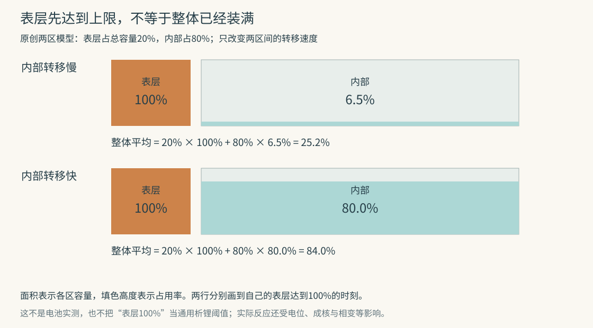

# 石墨电极平均还没充满，为什么局部已经析出金属锂

把一块石墨负极的平均充电程度读成“还没满”，并不能保证每个颗粒的表面都还有同样多的余地。锂到达不同位置的速度不同，进入颗粒内部的速度也有限。快充时，一部分区域可能已经很富锂，另一部分却还远没有充分利用。

这不是仅凭想象画出的不均匀。研究者已经把同一片电极在不同时间的显微照片对齐，看见金属锂更容易从那些最先变成富锂状态的颗粒附近长出来。要理解它，先分清充进去的锂有两种去处。

## 进入石墨，与长成金属，是两条反应路线

锂离子电池充电时，锂离子通过电解液向负极移动，电子则通过外部电路到达负极。电解液是能传导离子的介质；电子与离子走的不是同一条道路。

石墨由许多碳原子层组成。正常储锂时，锂进入层间，形成锂与石墨的嵌入化合物，这叫**嵌锂**。常见充分嵌锂状态的化学式为LiC₆，意思是平均每六个碳原子对应一个锂；它不是在石墨外面镀了一层金属锂。

另一条路线是：锂离子在表面得到电子，形成金属锂并沉积下来。这叫**析锂**或镀锂。充电电流可能同时分给嵌锂、析锂以及其他副反应。因此，电流积分得到的“充入电量”，也不自动等于石墨内部成功存下的锂量。

两条路线为什么会争夺同一批电流，不能只用“有空位就一定进去”解释。离子需要先穿过电极孔隙中的电解液，经过颗粒表面的界面层，完成反应，再在固体中重新分布。任何一步跟不上，局部所处的浓度和电位条件就会偏离缓慢充电时的状态。

## 把两张照片对齐，看金属从哪里开始长

Chen等在2021年的研究中，使用能从上方观察电极的实验电池，一边记录石墨电位，一边拍摄颗粒表面。装置还加了一支参比电极，用来区分石墨本身的电位变化与另一电极、电解液中的影响。研究者用模型检查了这套观察几何的电流分布，避免仅仅因为观察窗的结构，把电流挤到某个边角。[原论文Visualization Approach与图1](https://www.osti.gov/servlets/purl/1924793)

石墨的颜色能提供嵌锂状态的线索：随着形成不同的嵌锂相，可出现灰、蓝、红、金等颜色。**相**在这里指原子排列和锂含量具有某种特征的一类状态。金色与富锂的LiC₆相有关，不能把“金色”误看成“已经长出金属锂”。同一种金色也能覆盖一定的含锂范围，不是精确到每个颗粒的电量读数。

在论文的一组快速充电观察中，63秒时，同一视野里已经并存蓝、红、金色区域。到126秒，部分位置出现了可见的金属锂沉积。作者把后一个时刻的沉积轮廓，叠回63秒时的照片：沉积更偏爱那些较早变金的颗粒，而不是在整个视野中均匀冒出。并非所有先变金的地方都析锂，论文给的是空间上的明显偏好。

这组比较有用，是因为它跟踪了**同一位置的先后变化**。只在充电结束后看到灰白沉积，很难知道它是在哪里、经过什么过程长起来的。慢速观察组中较均匀的颜色变化，也为快速组的不均匀提供了对照。[同篇图2–4及相应结果](https://www.osti.gov/servlets/purl/1924793)

这些时间属于那套特定电极与实验电池，不能拿去设定手机或电动车的安全充电时长。

## 不均匀有两种尺度

第一种发生在整层电极里。负极不是一整块实心石墨，而是颗粒、导电材料、黏结材料和孔隙组成的多孔层。锂离子从隔膜一侧进入孔隙；隔膜把正负电极隔开，同时允许离子通过。接近入口的颗粒和靠近集流体深处的颗粒，经历的运输路径不同。集流体负责传递电子，不等于它能让锂离子瞬间遍布整层。

Finegan等在2020年用细束X射线，反复扫描石墨电极从隔膜到集流体的深度。不同嵌锂相产生不同的衍射峰，研究者由峰的位置和强度估计各处相组成，而不是仅依赖表面颜色。在该样品的快速充电阶段，靠近隔膜的区域已经明显嵌锂时，较深处仍然落后。实验把一个平均电量拆成了“深度—时间”的分布。[原论文的深度扫描、图2及实验方法](https://hal.science/hal-03725760v1/file/En_Env_Sc_13_2570.pdf)

第二种发生在单个颗粒里：表面接到锂，不代表它立刻进入颗粒中心。还可能同时存在富锂区域与贫锂区域，中间有相界。把它想成一杯染料总会平滑扩散成均匀颜色，有时会漏掉石墨本身偏好某些相组成的特点。

Lu等2023年把光学观察与相场模型结合。**相场模型**把各位置处于什么组成、相界怎样移动一起计算，允许富锂与贫锂区域共存。他们观察到颗粒的大小、形状、取向与表面状态都会影响嵌锂过程。需要分清的是，其光学实验为了看清前沿，使用了以侧面进离子为主的长条观察几何；论文另以不同几何的实验和模型比较，不能把图上的毫米级横向前沿直接叫作普通电极的厚度。[原论文图1–3与模型说明](https://www.nature.com/articles/s41467-023-40574-6)

## 一个只算运输的小模型

可以暂时去掉电化学细节，检验“整体没满，表层能否先满”这个更小的问题。

设两区总容量为100份，表层占20份，内部占80份。外部输入先到表层，表层再向内部转移。规定转移速度与两区占用率之差成正比：差越大，转移越快；比例系数则表示内部转移有多容易。

具体参数也给出来：两区起初都为空。模型自定一个时间单位，不对应实际的秒或分钟；每单位时间输入50份。慢模型的转移量为每单位时间20乘两区占用率之差，快模型则为200乘这个差；占用率按0到1记，例如50%写成0.5。这些都是数学设定，不是电池充电参数。

每一小段时间都守住两条账：表层增加量等于外部输入减去转出量；内部增加量恰好等于表层转出的量。这样总量不会凭空增加或减少。保持输入速度不变，只把区间转移能力提高十倍，分别算到表层刚达到模型上限时：

| 教学模型 | 表层占用率 | 内部占用率 | 整体平均占用率 |
|---|---:|---:|---:|
| 内部转移较慢 | 100% | 约6.51% | 约25.20% |
| 内部转移较快 | 100% | 约80.00% | 约84.00% |

第一行的平均数是20%×100%＋80%×6.51%，约25.20%。总容量明明只利用四分之一左右，表层在这个模型里却已经没有剩余空间。

[复算代码](assets/recompute_transport.py)同时用解析关系与逐小步更新检查质量守恒。时间和输入量采用任意单位，没有换算成实际充电档位。

这个模型证明的是：**运输不均匀足以让局部先达到容量上限**。它没有计算电位、成核、界面层或石墨相变，因而不能把表中的25.20%称为某种电池的析锂起点。“局部先满”是一条重要路径，但实际是否转而沉积金属，仍是反应条件的问题。

## 为什么“电位低于零”也不能当成万能报警线

电位不是储量，而是与带电粒子转移所涉及的能量有关的量。研究石墨时，常把它的电位相对于锂金属/锂离子参照来报告。这个参照的零伏，与手机显示的电池两端电压不是同一个量。

嵌锂越深，石墨电位通常越接近金属锂沉积相关的低电位区域。为了推动较大的电流，界面反应与运输还需要额外的电位偏离，称为**过电位**。这使“整体还有容量”的电极，也可能在某些位置进入有利于沉积的状态。

但平衡刻度不等于可见金属出现的精确时刻。开始生成一个新的金属小核，可能需要额外克服成核障碍。Chen等的快速实验中，石墨记录电位先低于零，随后继续下降；直到电位谷底后的第一张图，才观察到金属形貌。不能把“越过零”与“已经检测到沉积”写成同一个事件。

反过来，Wang等2021年的原位电子顺磁共振研究，在记录的电极电位仍为正时，也分辨出归属于金属锂的信号。**电子顺磁共振**利用电子在磁场中的响应区分材料状态；该研究通过谱形分解，把石墨嵌锂信号与金属信号分开，并校正导电性变化对测量强度的影响。作者讨论了局部电位不均匀、界面状态及异质沉积等解释，没有把所有局部条件都直接测出来。[原论文结果、图5与讨论](https://d-nb.info/1238988296/34)

两项结果共同提醒我们：电池端电压、整片电极的参比读数、微小位置的反应条件，以及仪器开始看得见沉积的时刻，需要分开。

## 停下来后看不到了，能否说没有析过锂

不能只凭一张事后照片作答。已沉积的锂有几种去处：一部分重新进入石墨；一部分在放电时转回锂离子；一部分失去有效电接触，成为难以再次参与循环的“死锂”；还有一部分与电解液反应，变成界面层中的含锂化合物。

因此，“曾经析出多少”“现在还剩多少金属”“损失了多少可循环锂”，也是不同的量。

McShane等2020年用化学定量与质谱测量，研究快充后电极残留的非活性锂，并与充放电损失比较。其信号可能同时来自孤立金属锂和失去电接触的嵌锂石墨。作者专门做了只经历初始形成过程的基线样品：即使不归因为快充析锂，仍能测到一小部分残留。这个对照阻止了“检测到信号，所以全部都是新析出的金属锂”的偷换。[原论文方法、图1与基线解释](https://www.osti.gov/servlets/purl/1660095)

有了这种独立检查，才能评价更方便的在线信号。Brown等2021年记录充电中的阻抗，也就是电极对小幅变化电流的响应。他们把与界面层有关的阻抗、与电荷转移有关的阻抗分开，再和残留锂定量比较。某些条件下，电荷转移阻抗已经增加，残留锂却没有显著高于基线；因此，不能把任意阻抗上升都叫析锂报警。其结论建立在特定信号、对照和检测限上。[原论文图4–6与交叉验证](https://www.osti.gov/servlets/purl/1899125)

“平均没满”回答的是整片电极的总量问题。析锂问的是某个位置此刻还能否顺利嵌锂、另一条反应是否有利，以及有没有证据表明它已经发生。把平均值展开成位置、过程和可区分的测量，那个看似矛盾的现象就不再矛盾。

### 书目与阅读范围

1. Chen等（2021），Operando video microscopy of Li plating and re-intercalation on graphite anodes during fast charging。核读三电极观察几何、颜色标定、图2–4位置对照、电流分配及静置后的变化；使用公开作者稿，未声称观看全部补充视频。
2. Finegan等（2020），Spatial dynamics of lithiation and lithium plating during high-rate operation of graphite electrodes。核读深度扫描、图2–4及相组成估算方法；相分数解释有衍射峰重叠和检测限，不是每个原子的位置实测。
3. Lu等（2023），Multiscale dynamics of charging and plating in graphite electrodes coupling operando microscopy and phase-field modelling。核读光学侧向几何、相分离观察及宏观/颗粒模型；将观察结果与模型解释分开，未运行作者模型。
4. Wang等（2021），Resolution of Lithium Deposition versus Intercalation of Graphite Anodes in Lithium Ion Batteries: An In Situ Electron Paramagnetic Resonance Study。核读参比、谱形分解、强度校准、正电位沉积信号及解释范围。
5. McShane等（2020），Quantification of Inactive Lithium and Solid–Electrolyte Interphase Species on Graphite Electrodes after Fast Charging。核读残留锂定义、定量信号、形成过程基线及结果；不把所有信号都归为金属锂。
6. Brown等（2021），Detecting onset of lithium plating during fast charging of Li-ion batteries using operando electrochemical impedance spectroscopy。核读阻抗分量、图4–6、化学定量交叉验证及其检测限。

本文解释研究机理与证据，不提供拆解电池、改动充电器或实施相关化学实验的方法。教学模型不是电池管理系统或充电安全预测器。
