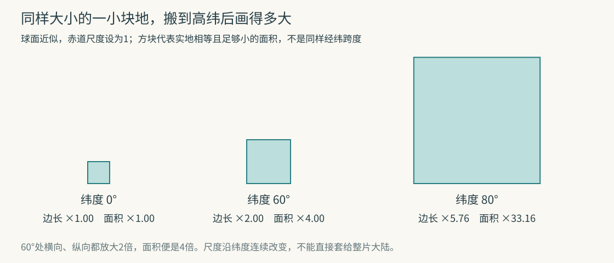
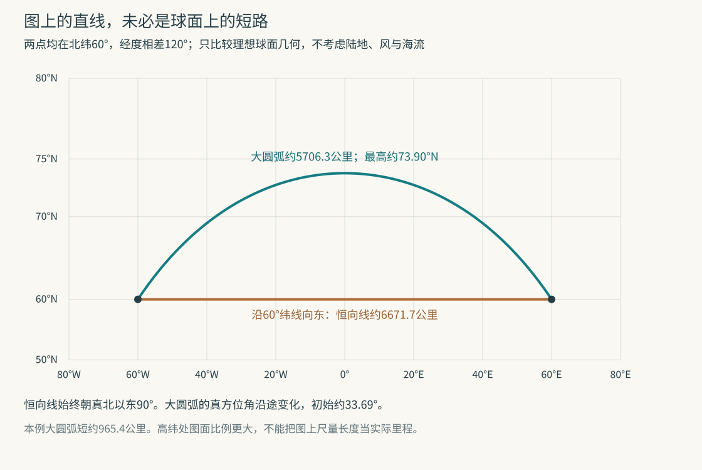

# 墨卡托地图为什么把高纬地区放大，却能把恒向航线画直

在一种常见的墨卡托地图上，同样大小的一小块地，如果位于北纬60°附近，画出的边长会是赤道附近的两倍，面积则是四倍。这里先把地球当作球体，并把赤道处的比例作为基准。四倍说的是很小区域的局部放大，不是把整个高纬国家的面积统一乘四。

这个变化并非为了让北方看起来重要。即使把所有国界和地名擦掉，只剩经纬线，只要坚持这套画法，放大仍会出现。更有意思的是，它与墨卡托的另一项本领直接相连：沿途保持相同真方位角的路线，可以画成直线。

本文讨论经线竖直排列的正轴墨卡托；恒向线画直的结论不能原封不动套到横轴墨卡托或UTM地图。两件事为何绑在一起？先别看世界地图，拿北纬60°附近的一小块地算一次就行。

## 经线明明越靠越近，纸上却没有靠近

经线是从南极通到北极的线，纬线则绕地球成圈。赤道是最大的纬圈；向北或向南走，纬圈越来越小。到了北纬60°，这个纬圈的半径只有赤道的一半。

所以，相差同样的1°经度，在赤道附近对应约111公里，沿北纬60°纬线走，却只对应约56公里。这些是半径约6371公里的球面近似值。它们比较的是沿纬线的距离，不是随意两点间的最短距离。

现在规定：把经线画成等间距的竖线。无论哪个纬度，相差1°经度，纸上的横向间距都一样。赤道的约111公里与60°纬线的约56公里，被画成了同样长。后者在东西方向就被放大到两倍。

写成一般关系，纬度为φ时，纬圈半径为R cosφ。R是球半径；cos叫余弦，它给出这个纬圈相对赤道缩小的比例。cos0°=1，cos60°=1/2。只要经线在纸上保持等间距，东西方向相对于赤道的局部放大率就是1/cosφ。

问题还没结束：南北方向要不要跟着放大？

## 只横着拉，两条线的夹角就错了

假设当地有一条很短的路线，向东与向北的位移一样大，所以朝真北以东45°，也就是东北方向。真北指沿当地经线朝北极的方向。

如果画图时只把东西方向放大两倍，南北方向不动，这条路线的两个分量就从“东1、北1”变成“东2、北1”。纸上量到的方向会变成真北以东约63.43°，已经不是45°了。

要让当地角度保持正确，南北方向也得放大两倍。两个分量都变成2，角度才回到45°。这便是**保角**的关键：同一个地点，所有方向按相同倍率伸缩。保角也叫等角或保形，但“保形”容易让人误会。它保的是足够小范围内的形状与夹角，不保证整个大陆的轮廓只是原样放大。[Snyder对局部保角与面积的定义，节选第5页](https://www.oc.nps.edu/oc2902w/maps/synder.pdf)

墨卡托选择了这条路。纬度越高，横向因经线等距而放大得越多，纵向就必须同步增加。于是，相同的纬度增量在纸上占据越来越长的距离，纬线越靠近极区，间隔越大。[《美国实用航海术》2019版第405–406节](https://thenauticalalmanac.com/2019_Bowditch-_American_Practical_Navigator/Volume-_1/03-%20Part%201-%20Fundamentals/Chapter%204-%20Nautical%20Charts.pdf)

边长扩大两倍，面积为什么是四倍？一个正方形的面积由长乘宽得到，两边都乘2，结果便乘2×2。相应地，球面墨卡托的局部面积放大率是1/cos²φ。

在30°纬度，长度倍率约1.15、面积倍率约1.33；在80°纬度，长度倍率约5.76，面积倍率已达33.16。同一张地图上的一平方厘米，因纬度不同，可能代表完全不同的实地面积。若用涂色区域在纸上占了多大来比较国家面积，问题就出在这里。

这些倍率沿纬度连续改变。算一整个大岛的图面面积，应把不同纬度上的小块分别计算再相加，不能找一个“平均纬度”，就认为整岛恰好放大了那个倍率。

## 那条越来越疏的纬线刻度，怎样确定

我们已经知道每一小段南北距离要放大多少。接下来只要从赤道开始，把这些小段累加起来，就能决定每条纬线放在哪个高度。

球面墨卡托常写成：

x = Rλ

y = R ln tan（π/4 + φ/2）

x、y是图面横纵坐标；λ是相对中央经线的经度，φ是纬度，两者在公式中都用弧度。弧度用圆弧长度除以半径来量角，一整圈为2π弧度，180°等于π弧度。ln是自然对数，tan是正切。

初学时不必先熟练操作这些函数。公式中的y，就是把前面“每一小段都按1/cosφ伸长”不断累加后的结果；x则表示经线间距固定。随文代码既使用公式，也以很小的纬度变化检查纵向倍率，算得60°附近约为2，与横向倍率相同。[PROJ的球面公式与比例参数](https://proj.org/en/stable/operations/projections/merc.html)

这也说明一种常见示意图为什么不够准确：在球心放一盏灯，把大陆影子照到圆筒上，再把圆筒摊开，并不会直接得到墨卡托投影。“圆柱投影”描述一类经纬网格关系；墨卡托纬线的位置必须满足上面的数学条件。Snyder明确区分了几何透视投影与为了满足性质而计算出的投影。

到90°时，cosφ变成零，局部放大率不再有限；公式中的y也没有有限值。因此，普通墨卡托不能把南北极画在有限高的一张纸上。它不是把北极画成一个很宽的点，而是根本到不了那个点。

## 恒向航线为什么因此变直

**恒向线**也叫等角航线。它在每个经过的地点，都与当地经线保持同一个夹角。这里的方向以真北为基准；真实磁罗盘还涉及磁偏角，不能把“恒向”直接理解成任何地方都不用修正的磁罗盘读数。

在球面上，经线向极点汇聚；一条始终与经线成同样夹角的线，通常会弯曲。在墨卡托图上，经线变成彼此平行的竖线，而投影又保留局部夹角。于是，这条路线在每一处都与竖线成同样角度，也就是斜率始终不变。它自然是一条直线。

这是一条完整的因果链：经线等距，带来横向放大；为保角而匹配纵向放大；平行经线加上保角，使恒向线变直。高纬面积失真和航线绘制方便，来自同一组几何要求。

但“图上的直线最短”，只适用于同一平面里按统一尺度计算的长度。墨卡托地图恰好不具备统一的地面尺度。

## 让图上的弯线与直线，实际比赛一次

选两个理想端点：都在北纬60°，经度分别为西经60°与东经60°。不考虑中间有没有陆地，也不考虑风、海流和航行安全，只比较半径6371公里的球面几何。

路线甲始终向正东，沿60°纬线走。这是一条恒向线，在墨卡托图上是水平直线。两个端点相差120°经度，占一圈的三分之一；60°纬圈的半径又是球半径的一半，所以长度为：

2π × 6371 × 1/2 × 1/3，约6671.7公里。

路线乙沿经过两端点的大圆的较短圆弧。**大圆**是通过球心的平面与球面相交得到的圆，赤道就是一个例子。球面上，两点间的最短路线是大圆的较短弧；在更精确的椭球模型中，要计算相应的测地线，不能简单套同一个球半径。[Karney对测地线及正反求解问题的说明](https://arxiv.org/pdf/1109.4448)

这两个端点对应的大圆弧长约5706.3公里，比恒向线短约965.4公里，约14.5%。它中途达到约北纬73.90°，在墨卡托图上向上拱起。最初方向约为真北以东33.69°，随后不断变化，直到终点。它省路程，但没有保持同一个真方位角。

上图两条线使用同一套投影坐标。你若拿尺量图上的线，会觉得弯线更长；换回各处实际比例后，结果才是5706.3与6671.7。这正是“地图长度”和“地面距离”不可混用的一个可复算反例。[两条路线、局部倍率及图形生成代码](assets/recompute_mercator.py)

大圆较短弧与恒向线也不是永远不同。沿经线走，或沿赤道走，两者可以重合。前面的差别来自选定的非赤道东西路线，不是一条关于所有航线的全称断言。

## 手机里的方形世界，还多做了一次选择

网络地图常见的Web Mercator，把一整圈经度对应的宽度固定下来，再选一个有限纬度范围，使图面成为正方形。因为南北极需要无穷高度，方形图必须在到达极点之前截断。

在球面公式里，让最北边的y等于πR，恰好得到纬度约85.05113°。这不是地理学上突然出现的新边界，而是“把地图装进这个正方形”的结果。OGC的WebMercatorQuad定义明确列出约±85.0511287798°的纬度边界，以及从一个方块逐级细分的网格。[OGC 17-083r4，附录D.1](https://docs.ogc.org/is/17-083r4/17-083r4.pdf)

Web Mercator也不能与精确的椭球墨卡托完全等同。它把椭球的地理坐标放进球面形式的计算，并采用椭球长半轴作为半径；PROJ文档明确指出，这样做在真实椭球上并不严格保角。[Web Mercator定义](https://proj.org/en/stable/operations/projections/webmerc.html) 本文的2倍、4倍以及航线算例，都已经限定在球面教学模型内。

最后可以换一个目标试试：假如坚持面积正确，会怎样？仍保持经线等距，在60°处横向不得不放大2倍。要让长乘宽不变，纵向就应缩到一半，而不是跟着放大2倍。面积保住了，角度却被改变了。

地图选择的因此不只是画面风格。拿它比较面积、量距离，还是画恒向航线，会提出不同要求。先认清要读的那个量，才能知道这张地图的方便之处，是否正是另一处失真的来源。

### 书目与阅读范围

1. Snyder（1987），Map Projections—A Working Manual。实际读取美国海军研究生院2003年制作的24页节选，重点为局部保角、等积、比例与数学柱面投影；并未将节选说成全书。
2. NGA（2019），American Practical Navigator，第4章Nautical Charts。核读公开镜像的第405–407节，涉及墨卡托扩张、纬线刻度、大圆与恒向线、横轴墨卡托的区别；不作为实时航海信息。
3. PROJ，Mercator。核读球面和椭球公式、标准纬线及比例参数。本文采用标准纬线为赤道的球面情形。
4. Karney，Algorithms for geodesics，2012修订预印本，对应2013年期刊论文。核读引言、测地线正反问题与基本球面/椭球关系；未重写其完整椭球算法。
5. OGC，Two Dimensional Tile Matrix Set and Tile Set Metadata，17-083r4。核读附录D.1的网格范围、尺度注释及用途限制；不将图面米数直接视为各纬度地面距离。
6. PROJ，Web Mercator / Pseudo Mercator。核读该变体的定义、坐标输入与非严格椭球保角说明。

本文所有方块、航线及数值均为原创球面教学计算，没有使用真实国界数据，也不提供实际航路规划。
