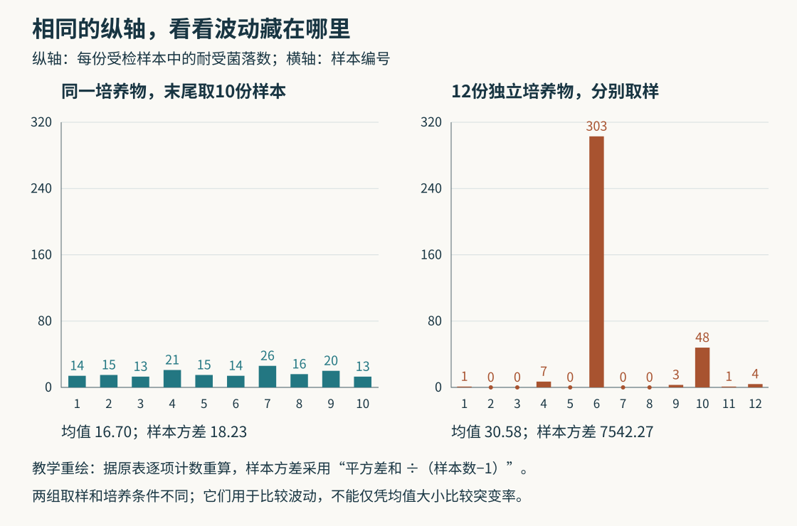

# 不同培养瓶的巨大波动，怎样揭示突变发生在筛选之前

一群细菌遇到噬菌体，也就是感染细菌的病毒，大多数被杀死，少数仍能繁殖。只看最后这些幸存者，有两种解释：它们在遇到病毒以前已经有了可遗传的耐受性；或者病毒到来时，才有少数细胞发生改变，并把新性状传给后代。

两种解释都能产生“少数幸存、后代也耐受”的结果。1943年，萨尔瓦多·卢里亚和马克斯·德尔布吕克抓住了另一个差别：如果变化早已发生，它就有时间生出一整个家族。不同培养瓶里究竟有多少耐受细胞，应该保留这段家族史。[1]

## 一次变化，末尾可能看见256个后代

先画一棵纯数学的家谱。一开始只有一个细胞，每一代都一分为二，十代后共有1024个。暂时假定所有细胞同速生长，没有死亡；一个细胞一旦改变，其后代都继承改变。

假如第二代结束时，四个细胞中有一个刚发生变化，它还可以再繁殖八代，最后留下2的八次方，即256个改变的后代。假如同样的一次变化直到第九代末才出现，最后就只留下两个。

两边都只发生了一次变化，末尾的变体数量却相差128倍。这里的“突变”是一次可遗传的改变；“突变体”是携带改变的个体。把256个后代当作256次独立突变，会把事件数和家族人数混在一起。[4]

在真实的许多平行培养物里，早期突变不必经常发生。它只要偶尔发生，就能造成少数特别大的家族；其他培养物可能只有晚期的小家族，甚至一个也没有。这是波动试验要找的形状：许多小数，夹着少数极大的数。

为了检查这个解释，本文做了两个可复算的模型。第一个沿上述家谱生长：每个尚未改变的亲本分裂时，以1/1023的概率产生一个改变的女儿细胞，各次抽签彼此独立。第二个一直没有改变，等1024个细胞都出现后，才让各细胞独立改变；把这个末尾概率特意设成与第一个模型具有相同的平均变体数。

这两个概率都是教学参数，不是某种细菌的实际突变率。计算得到：

| 最终结果的统计量 | 生长途中改变并遗传 | 末尾各自独立改变 |
| --- | ---: | ---: |
| 平均变体数 | 4.994 | 4.994 |
| 变体数的方差 | 507.264 | 4.970 |
| 一个变体也没有的概率 | 36.77% | 0.67% |

方差衡量结果有多分散：把结果与平均值的距离平方，再按各结果的概率求平均。两种模型每群平均都约五个变体，第一个却有更多零，也有更大的极端家族。平均数把这个区别藏起来了。附带脚本由逐代的概率关系直接算出表中数值，并用较小家谱的全部概率分布另作校验，没有挑一组特别戏剧化的随机运行来画图。

## 原实验先排除了“计数过程自己很不稳定”

理论预测再漂亮，也可能输给一个简单的问题：如果取样、筛查和计数本身就忽多忽少，不同瓶的差别未必来自细菌家谱。

卢里亚和德尔布吕克先从同一份培养物取多份样本，再分别检查耐受菌落。菌落是一个可见的细胞群；在这里，研究者用它的出现来计数受检样本中能够继续繁殖的耐受细胞。大家共享同一段培养历史，只在最后取样时分开，所以这组对照主要显示抽样和检测的波动。[1，第503页]

原表1的实验10a，十份样本记录为：14、15、13、21、15、14、26、16、20、13。它们并非完全相等，但都落在13到26之间。

另一组从一开始就分别生长。原表2的实验17，十二份受检样本记录为：1、0、0、7、0、303、0、0、3、48、1、4。这里同时出现五个零和一个303。那份303不是应该随手删掉的异常值；早期改变留下大批后代，恰好预言了这种结果。

图1｜数据取自1943年原文表1实验10a与表2实验17。纵轴相同，均表示每份受检样本的耐受菌落数。两组培养与取样条件不同，不能把均值差直接解释成突变率差。图中的均值和样本方差由所列计数重新计算；原表另有汇总统计，表2还注明抽样校正，不与这里未经该校正的计数方差混用。[矢量图](assets/fluctuation-counts.svg)

按同一种算法，把各数与组平均数之差平方后相加，再除以“样本数减一”，两组的样本方差分别约18.23和7542.27；平均值分别为16.70和30.58。方差与均值之比约1.09和246.61。第二组的均值较大，远不足以解释它为何如此分散。

如果每个细胞都在遭遇病毒时，才以同一个很小的概率独立获得耐受性，那么在细胞总数接近的各组里，计数可近似服从泊松分布。这是一类稀少、独立事件的计数分布，其方差与均值相等。大群体的遗传家族却会破坏“每个幸存者都是一次独立事件”的条件，产生长得多的尾部。[1][3]

不过，独立培养也可能带来独立的环境差异。如果各瓶生理状态不同，临时产生耐受性的概率也随瓶而变，同样可能比单一泊松分布更分散。Armitage在1953年的原始统计讨论中，就明确记录了针对这组对照充分性的争论。因此，波动数据要与具体模型比较，不能把“方差很大”当作排除任何其他机制的口令。[3]

## 找到一条从未接触病毒的祖先路线

1952年，埃丝特·莱德伯格与乔舒亚·莱德伯格从位置关系获得了另一种证据。他们保留原始培养平面上的空间排列，制作多个副本，让副本面对噬菌体。若不同副本上耐受菌落反复出现在对应位置，说明这些位置在复制前就已经有共同的耐受家族；若每个副本上的细胞只在接触病毒之后各自偶然改变，就不应如此稳定地对应。[2]

原文图2并没有画出三个完全相同的点阵。有些编号在多个副本上重复，有些并不齐全。复制和检测会漏掉细胞，证据在于超出随机散布预期的位置对应，而不是要求每个点无误复印。

更强的一步是沿副本的位置，回到尚未接触噬菌体的原始材料中寻找对应家族。负责延续的祖先路线始终不接触这个选择因子，受检的分支则用来判断位置。论文报告了两次独立完成的噬菌体耐受间接选择，并检查原培养物中是否混入噬菌体，以免“其实早就接触过病毒”成为隐藏解释。[2，第401—403页]

这项证据把“先有变化、后被筛出”变得可追踪：用于延续家族的那些细胞，没有靠接触噬菌体才获得耐受性。它补上了只比较瓶间方差时不容易直接看见的祖先关系。

## 为什么“一个也没有”反而能提供信息

一瓶里看见303个耐受菌落，难以立即知道发生过几次突变。可能是一个早期家族，也可能混着几个不同家族。但在没有死亡、没有漏检、突变会表现出来等条件下，一瓶完全没有这类变体，就意味着没有发生这类突变事件。

若每瓶的突变事件数近似服从泊松分布，记平均事件数为m，完全没有事件的概率p₀便是e的负m次方。反过来，m＝−ln(p₀)。e是约2.718的常数，ln把e的幂运算倒过来求指数。不必手算也能理解：平均一次事件时，约37%的瓶子没有事件；平均两次时，约14%没有。

1943年原文另一个完整受检的实验23，共87份培养物，其中29份没有检测到耐受菌。29/87正好是三分之一，代入便得到m约1.10。这个数是每份培养过程中发生的平均事件数，不是每个细胞的突变概率，也不是每份培养物平均只有1.10个耐受细胞。[1，第507页；4]

这些条件会具体改变答案。若变化已经发生，但性状要隔几代才表现出来，晚期出现的小家族可能看不见；若只检查一部分细胞，也可能刚好没取到那个家族。两种情况都会增加观察到的零，让上述简单换算低估事件数。Foster的作者方法综述把这些因素分别列出，而不是把它们当成同一种抽样误差。[4]

## 数出家族之后，仍要问它经历了多少次复制

即使知道事件数，也不能总用最终活细胞数作分母。设一个纯教学群体从100个变成200个：没有死亡时，100次一分为二就够；如果期间死了50个，则需要150次分裂。相同的终点，经历了不同数量的复制机会。

Frenoy与Bonhoeffer在2018年的原研究中，用包含死亡的种群模拟与忽略死亡的估计模型对照，说明隐藏的细胞周转可以使按每次分裂计的突变率被高估。分母漏掉的复制机会，会被误算成每次复制更容易发生变化。[6]

复制的节奏也会影响家族大小。Ycart在2013年的研究里改变单个细胞等待分裂的时间分布，再检查旧模型能否找回参数。在所测条件下，平均突变事件数的估计相对稳健，两类细胞相对增长速度的估计却更容易偏。模型的某个假设不准确，不等于所有结论一起失效；要检查受影响的究竟是哪一个量。[5]

这几项研究围绕着同一个计数难题：最后看见的个体，是独立发生的变化，还是少数变化繁殖出的后代？波动试验用瓶间分布寻找家族史，位置复制用未受选择的祖先材料作另一条核查。它们支持特定体系中变化先于选择出现；并没有要求所有环境下的突变率都恒定，更没有把生物面对环境的全部反应归成同一种过程。

[复算脚本](assets/recompute_mutation_timing.py)与[结果文件](assets/mutation-timing-results.json)包含原表逐项重算、两种相同均值模型、零类换算及出生死亡算例。全部只用标准库，不涉及实验操作。

## 公开书目与阅读范围

1. Luria与Delbrück（1943），[Mutations of Bacteria from Virus Sensitivity to Virus Resistance](https://people.sissa.it/~marco/papers/luria-delbruck.pdf)，Genetics 28，491—511。核读导言491—493、实验503—508页相关正文，实际渲染查看503—504页表1、2；零类数据来自实验23。本文重新计算原始计数，不照抄原表不同口径的汇总统计，不采用其每细胞突变率换算。
2. J. Lederberg与E. M. Lederberg（1952），[Replica Plating and Indirect Selection of Bacterial Mutants](https://pmc.ncbi.nlm.nih.gov/articles/PMC169282/)，Journal of Bacteriology 63，399—406。核读399页导言，实际查看公开扫描401—405页的结果、图2及讨论；正文只解释历史证据结构，不提供操作程序。
3. Armitage（1953），[Statistical Concepts in the Theory of Bacterial Mutation](https://www.cambridge.org/core/services/aop-cambridge-core/content/view/8C89CCA22D210C87D4A6080777C81FD3/S0022172400015606a.pdf/statistical_concepts_in_the_theory_of_bacterial_mutation.pdf)。核读162—166页增长与概率含义、170—172页波动试验争论和模型条件；未逐项验证全文估计量推导。
4. Foster（2006），[Methods for Determining Spontaneous Mutation Rates](https://pmc.ncbi.nlm.nih.gov/articles/PMC2041832/)，作者稿[公开PDF副本](https://scispace.com/pdf/methods-for-determining-spontaneous-mutation-rates-3qfwmvdfb6.pdf)。核对作者与出版信息，核读稿件第1—2页术语/模型假设、第5页零类方法、第11—12页模型偏离讨论；没有将实验参数改写为操作建议。
5. Ycart（2013），[Fluctuation Analysis: Can Estimates Be Trusted?](https://arxiv.org/pdf/1305.3075)，作者稿v3；期刊DOI [10.1371/journal.pone.0080958](https://doi.org/10.1371/journal.pone.0080958)。核读第1—6页模型、模拟结果与讨论，限定比较的是事件数与相对增长速度两种估计；未复现全篇模拟。
6. Frenoy与Bonhoeffer（2018），[Death and Population Dynamics Affect Mutation Rate Estimates and Evolvability under Stress in Bacteria](https://journals.plos.org/plosbiology/article?id=10.1371/journal.pbio.2005056)。核读原出版商正文中死亡导致分裂次数低估的推理、图1—2说明，以及考虑死亡的计算方法段落。本文只使用这一数学机制，没有复跑研究的实验数据或软件。
