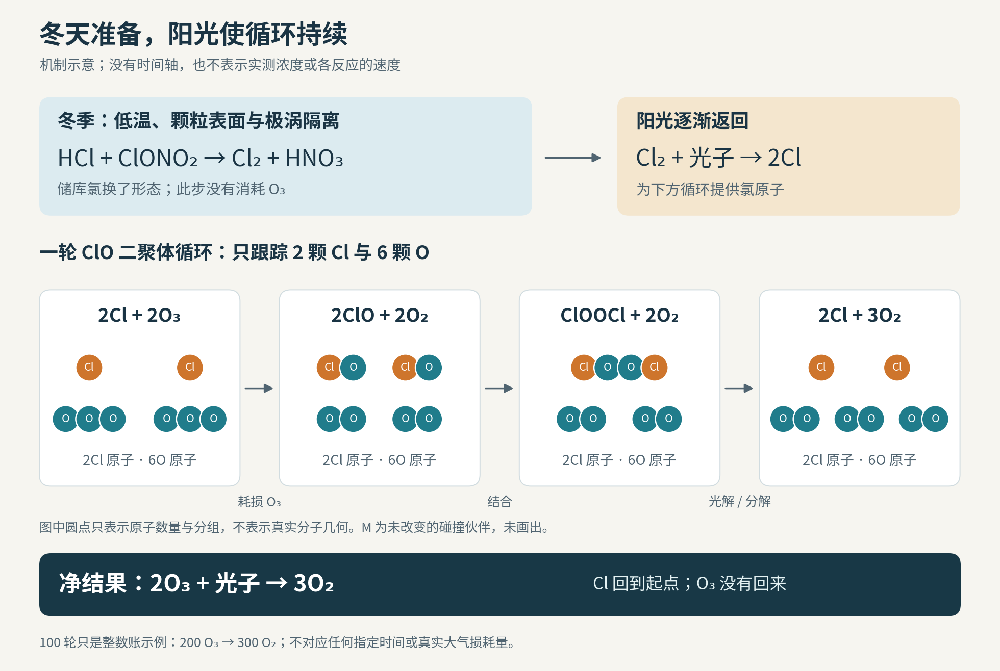

# 为什么南极臭氧在春天骤减，关键条件却形成于冬天

1987年8月23日，ER-2研究飞机飞进南极上空约18公里高的平流层。机载仪器测到大量一氧化氯，化学式ClO；当时臭氧还没有出现随后几周那样剧烈的损失。9月16日，飞机再次穿过化学成分突变的边界：向极地一侧走，ClO陡增，臭氧却明显降低。

这两个时刻放在一起，问题才变得尖锐：破坏臭氧的氯早已在场，为什么臭氧没有立刻大幅减少？[Anderson的同期研究报告，第61—64页、图7-3和7-4](https://ntrs.nasa.gov/api/citations/19900002785/downloads/19900002785.pdf#page=75)记录了这段变化。答案涉及两种不同的工作：冬天改变氯的化学形态，逐渐回归的阳光让耗损循环运转。南极的春天是南半球的春天，主要在9—11月；日照并不会在某一天同时照遍整个极涡。

## 飞机看到的，究竟能证明什么

先认清两个量。ClO是含一个氯原子、一个氧原子的活泼分子；O₃是含三个氧原子的臭氧。仪器报告的“混合比”，是某种气体分子占空气分子的比例。研究论文摘要报告，8月的异常区域内ClO约为800 pptv，即每一万亿个空气分子中约有800个ClO分子。不能把它读成臭氧的浓度，也不能读成空气里所有氯的总量。[1989年原论文摘要](https://doi.org/10.1029/JD094iD09p11465)

一张“ClO高、O₃低”的图还不够。假如两团空气原来就有不同成分，飞机从一团飞进另一团，也能画出负相关。臭氧减少还可能是低臭氧空气被运进来，或原有空气发生升降。观测地点相同，不保证空气来历相同。

研究者因此比较多次飞行，并把数据放到相近的位温面上。位温可以理解为：把空气在不与外界交换热量的假设下，压到同一参考气压后，它会有的温度；这个假设叫绝热。按它分层，可以减少空气升降造成的假变化；却不能自动消除混合、加热冷却或采样差异。飞机反复切入旋转的极涡，采到的是可比较的一类空气，并非给同一团空气挂上标签、一路跟拍。

更有力的检验是算速度。Anderson的报告说明，他们用实测ClO、实验室反应速率和一天中光照的变化，累加预计损失的臭氧，再与观测序列比较。其图7-4在固定420 K位温面上给出两者对照。K是开尔文温度单位；这里的420 K是换算后的位温，并非飞机所在处的实测气温。它不是一条毫无偏差的重合曲线，但把“能发生这种反应”推进到了“速度是否足以解释损失”的检验。

输运的竞争解释也要检查。任务团队测了一氧化二氮N₂O和CFC-11等较长寿命气体；这些气体可帮助辨认空气来自哪里。在飞机覆盖的范围内，它们没有呈现持续大规模上涌应有的普遍增加。不过，团队同时记录了局地总臭氧的快速变化，认为气象输运确实参与其中。[AAOE初步报告，第4、6—8问](https://espo.nasa.gov/aaoe/content/AAOE_Early_Findings)保留着这些限制。化学损耗的证据来自时间顺序、反应速率、示踪气体与实验室结果的相互约束，不能压缩成“负相关证明一切”。

## 冬天改变的是氯的去向

南极冬季，平流层缺少太阳加热而冷却，环绕极地的强风形成极涡，使内部空气与外界的交换受到限制。这个边界有渗漏，也会变形；它的作用是让低温和异常化学组成能维持很久。

氯也不是都以Cl或ClO的形式存在。长寿命氯氟烃等源气体进入平流层后，受紫外光等作用逐步释放氯。这项供给过程与冬季储库转换是两件事。许多氯原子随后进入氯化氢HCl、硝酸氯ClONO₂等“储库”：它们不会像Cl那样直接迅速消耗臭氧，但能重新变成参与循环的形态。

这里要分三本账。总氯按氯原子计数，包括源气体、储库和其他含氯物种；活性氯描述可参与快速耗损化学的那部分，具体包含哪些物种须看定义；ClO只是其中一种。Cl₂是容易被光解的活化前体，Cl₂O₂则能在夜间存放循环中的氯。因此，ClO升高可能主要意味着氯换了形态，不表示当地凭空增加了同样多的总氯。化学反应守恒氯原子，输运仍能改变一个地区的氯总量。[WMO《二十问》Q7—Q9](https://csl.noaa.gov/assessments/ozone/2022/twentyquestions/)

足够冷时，极地平流层云出现。它们包括含水和酸的液滴、硝酸水合物颗粒以及更低温下的冰，不是一概由纯冰组成。颗粒提供了气体单独混合时缺少的反应环境。代表性反应是：

HCl + ClONO₂ → Cl₂ + HNO₃。

反应发生在颗粒表面或凝聚相内，把两个储库中的氯转入Cl₂。它没有生成额外的氯，也尚未靠这一步消耗臭氧。

## 如何知道云表面真能完成这一步

Molina在1989年的研究者报告中回顾了两类互补证据。他们比较冰样的红外吸收谱，检验含HCl的冰接触ClONO₂后是否出现硝酸；另用带冰表面的流动装置检测气相产物，测到了Cl₂。前者辨认留在凝聚相里的产物，后者辨认进入气相的产物。这比只观察某种反应物减少更有解释力：减少也可能仅仅是被表面吸附。[报告第48—55页，尤其第51—53页](https://ntrs.nasa.gov/api/citations/19900002785/downloads/19900002785.pdf#page=62)

后来的一项原实验把“冰的表面状态”也纳入比较。McNeill等人在2006年用椭偏法观察反射光偏振的变化，推断冰表面的光学性质；另以冰面流动实验配合质谱测量反应物和Cl₂，把两类结果对照。在相同气相反应物供给条件下，196 K属于光学测量支持存在表面无序层的条件，此时Cl₂生成更强；218 K时没有相同的表面变化，Cl₂信号较弱且随时间下降。

经气体扩散修正后，作者给出的反应摄取系数γ在218 K为0.014±0.005，在196 K大于0.1。这里的γ指ClONO₂撞上冰面后发生反应摄取的比例，±标记作者报告的不确定度。后一个数是下限：气体向表面的输送限制，使装置无法精确分辨更高效率。不能把它画成恰好0.1，也不能从这两次比较推出“温度越低，一切反应越快”。证据针对的是特定冰面及其表面状态。[原论文图5、讨论和Methods](https://www.loerting.at/publications/mcneill06-pnas.pdf)

真实云粒子还有不同成分、面积和寿命。冰面实验建立了可行的化学路径；要知道整片大气处理了多少氯，还得结合颗粒观测和输运。冷的液态气溶胶也可提供反应表面，不能把全部氯活化都归给肉眼可见的冰云。[硝酸氯综述，第5.3和6.2节](https://doi.org/10.5194/acp-18-15363-2018)

## 阳光回来后，怎样把臭氧变成氧气

Cl₂吸收光子后，可裂成两个Cl原子。每个Cl都能消耗一个O₃，生成ClO和O₂。问题随即变成：怎样把ClO里的氯再拿回来？

在南极下平流层，自由氧原子较少，常见的“ClO与氧原子反应、再生Cl”途径不够有效。ClO二聚体循环绕过了这项限制。二聚体就是两个ClO结合形成的分子，这里关键的结构写作ClOOCl，也写作Cl₂O₂：

1. 两次发生：Cl + O₃ → ClO + O₂
2. 两个ClO结合：ClO + ClO + M → ClOOCl + M
3. 吸收光子：ClOOCl + hν → Cl + ClOO
4. 中间体分解：ClOO + M → Cl + O₂ + M

M是帮助交换能量的第三个空气分子，hν表示一个光子的能量。将四步相加，Cl、ClO和中间体在两边抵消，净结果为：

**2 O₃ + 光子 → 3 O₂。**

两颗氯原子回到了起点，六颗氧原子从两个臭氧分子重新组成三个氧气分子。氯没有被净消耗，所以能继续参与下一轮；臭氧却已经失去两个。这就是催化。[反应式逐步依据：第6.1节R16—R20](https://doi.org/10.5194/acp-18-15363-2018)

图：原创机制示意，无时间轴、无实测浓度比例。下半部分只跟踪两颗氯原子和六颗氧原子；各阶段的原子数相同。附带程序检查每步守恒，以及100轮理想循环净消耗200个O₃、生成300个O₂的整数账。这不是实际大气反应次数或速率的估计。

阳光在这里既启动Cl₂裂解，也维持二聚体循环。缺少光照，后面的再生过程便不能照此持续。春季低太阳高度角下，足以驱动这些光化学步骤的光已能到达，但从O₂制造新臭氧所需的更短波紫外光受限，补充赶不上损耗。

## 再生的氯为什么不会永远反应

催化循环只说明走完所列步骤后，氯可以回来；它没有保证每颗氯每次都走这条路。Cl可与甲烷反应生成HCl，ClO可与二氧化氮NO₂结合形成ClONO₂。臭氧越少、各类气体比例越变，竞争路径也随之改变。

冬季颗粒沉降还可能带走硝酸，这叫脱硝，会减少后来能重新提供NO₂的物质，使氯较难回到ClONO₂储库。升温、颗粒消失和外界空气混入，则改变活化与失活之间的竞争。在南极严重缺臭氧的条件下，回到HCl也是重要终点。[Wohltmann等人的反应通量研究，第4.3节](https://doi.org/10.5194/acp-17-10535-2017)

二聚体循环也不是全部损失的唯一来源。ClO与一氧化溴BrO耦合的循环同样重要，各途径的份额随条件而变。该研究用化学输运模型逐项记账，并与卫星观测比较；作者也报告了HCl和ClO的模型偏差。因此，某年、某气压层的计算比例不宜当成所有臭氧洞的固定配方。

解释“为什么偏偏在春天”，需要保留这个时间重叠：冬季低温提供表面，极涡使被处理的空气维持较久；日照恢复时，这些条件还没有全部消退，氯的催化循环便能迅速消耗臭氧。缺了前面的准备，只有阳光不够；没有后续光照，储库发生转换也不等于完整的耗损循环已经运转。

## 公开来源与阅读范围

以下资料核读于2026年10月7日。书中两个章节来自不同研究者，但属于同一本会议论文集，并非两个独立大气观测。

1. J. G. Anderson（1989），Free Radicals in the Earth's Atmosphere: Measurement and Interpretation，载《Ozone Depletion, Greenhouse Gases, and Climate Change》，第56—65页。[NASA公开全文](https://ntrs.nasa.gov/api/citations/19900002785/downloads/19900002785.pdf#page=70)。核读第56—64页相关文字，重点第61—64页；实际查看图7-3、7-4。本文的观测比较与动力学方法主要依据此研究者报告。
2. J. G. Anderson、W. H. Brune、M. H. Proffitt（1989），Ozone destruction by chlorine radicals within the Antarctic vortex…，JGR 94，11465—11479。[DOI](https://doi.org/10.1029/JD094iD09p11465)。本次只能核读出版社摘要，未获得期刊全文；仅用其明确列出的日期、高度和初始ClO混合比，不声称复核了该文全部方法。
3. NASA AAOE团队（1987），[AAOE Early Findings](https://espo.nasa.gov/aaoe/content/AAOE_Early_Findings)。核读全文，重点仪器、示踪气体与第4、6—8问。它是明确标注的初步结果，用于说明当时怎样检验输运解释及有哪些未决项，不把其暂定反应参数当成现今定论。
4. M. J. Molina（1989），Heterogeneous Chemical Processes in Ozone Depletion，同论文集第48—55页。[NASA公开全文](https://ntrs.nasa.gov/api/citations/19900002785/downloads/19900002785.pdf#page=62)。核读全章，重点红外产物判别与气相Cl₂检测。该报告不是1987年Science原论文的全文；本次未获得后者完整公开稿。
5. V. F. McNeill等（2006），Hydrogen chloride-induced surface disordering on ice，PNAS 103，9422—9427，DOI：10.1073/pnas.0603494103。[作者公开PDF](https://www.loerting.at/publications/mcneill06-pnas.pdf)。核读全文，包括Results、Discussion、Methods，实际查看图3—5。
6. T. von Clarmann、S. Johansson（2018），Chlorine nitrate in the atmosphere，ACP 18，15363—15386。[开放论文](https://doi.org/10.5194/acp-18-15363-2018)。重点核读第5.3、6.1、6.2节及反应式R10—R25；用于核对储库、表面路径和二聚体循环，不称为原始发现实验。
7. I. Wohltmann、R. Lehmann、M. Rex（2017），A quantitative analysis of the reactions involved in stratospheric ozone depletion in the polar vortex core，ACP 17，10535—10563。[开放论文](https://doi.org/10.5194/acp-17-10535-2017)。核读第2节模型方法、第4.3、4.5节及第6—7节验证与限制；未重新运行作者的大气模型，未核读补充材料。
8. R. J. Salawitch等（2023），Twenty Questions and Answers About the Ozone Layer: 2022 Update，WMO臭氧评估组成部分。[NOAA全文](https://csl.noaa.gov/assessments/ozone/2022/twentyquestions/)。核读Q7—Q9正文与图注，用于总氯口径、季节条件、云粒类型和光照要求。

[原子账复算程序](assets/recompute_atoms.py) · [复算结果](assets/atom-balance-results.json) · [矢量图](assets/chlorine-season-cycle.svg)
