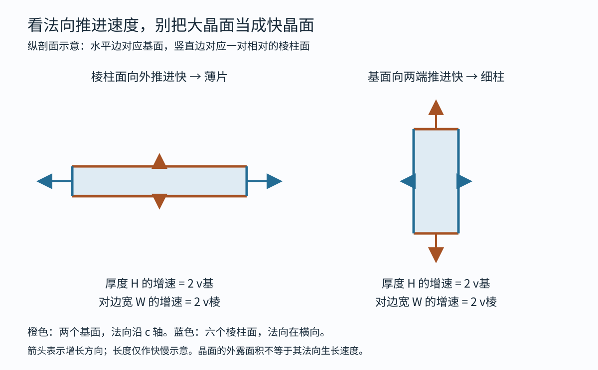
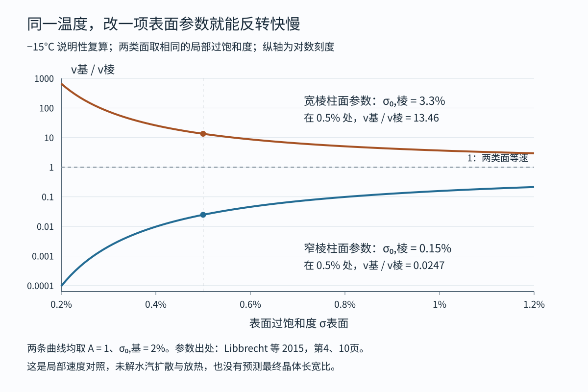

# 同是六角冰晶 为什么有时长成薄片 有时长成细柱

把温度稳在−15°C，也未必只能长出一种雪晶。Libbrecht等人在冰针尖端培养新晶体时，调节水汽供应，依次见到块状晶体、厚片和薄片。六角结构没有更换，变的是不同晶面向外推进的速度。理解板、柱之分，要先把“一个面变大”与“这个面向外长得快”分开。[实验原文](https://arxiv.org/pdf/1512.03389)

这里讨论水汽沉积到单个冰晶上的生长。几片雪晶粘成一团，或者云滴撞上冰晶后冻住，会增加另一层形状变化，暂不包括在内。

## 薄片的大平面 恰恰长得慢

常见六角冰晶可以先想成一支六棱铅笔。两端的六边形叫基面，周围六个侧面叫棱柱面。连接两端、穿过中心的方向叫c轴。冰晶成为薄片时，相当于把这支铅笔压得很短；成为细柱时，则把它沿c轴拉长。两种外形都容得下同一种六角晶格。[几何与术语见2005年综述第862—864页](https://www.its.caltech.edu/~atomic/publist/rpp5_4_R03.pdf)

“晶面的生长速度”通常指垂直于该面的推进速度，称为法向速度。基面向两端推进，增加厚度；棱柱面向四周推进，增加横向宽度。所以，薄片需要棱柱面推进得快、基面推进得慢。细柱的情况相反。

这一点看图最容易记住：薄片上、下两个大平面的面积不断增加，是因为侧边在往外跑；若往上、下加层很快，它就会变厚。大平面显眼，不表示它的法向生长快。

图1为原创纵剖面示意，并非晶体照片。H表示厚度，W表示一对相对棱柱面之间的宽度；v基、v棱分别表示两类面的法向速度。若两端对称，厚度每秒增加2v基，宽度每秒增加2v棱。速度不变时，经过t秒：H＝初始厚度＋2v基t，W＝初始宽度＋2v棱t。当新增尺寸远大于初始尺寸时，H/W会趋近v基/v棱；一般不能把任意时刻的外形比例直接当成速度比。

## 水分子到了表面 还得找到加入的位置

水汽生长有连续的两段过程。分子先穿过空气到达晶体，再被纳入晶格。前一段涉及扩散，后一段涉及表面附着。平坦晶面上开启新的一层，需要先形成一个能继续扩大的小岛；有了台阶边缘，后来分子便有更容易加入的位置。新层小岛的边缘有能量代价，因此水汽稍多一点，开启新层的频率就可能改变很多。已有螺旋台阶等缺陷时，生长也可能绕过反复开启新层的困难。[Nelson与Knight的机制讨论，第1454—1455页](https://www.redmondphysicalsciences.com/nelson-knight1998LayerNucl.pdf)

“水汽多”需要一个参照。同温度下，与平坦冰面保持平衡的水汽密度叫饱和值。实际密度比它高出的比例，叫相对于冰的过饱和度，用σ表示。例如σ＝0.005，就是比饱和值高0.5%，相对于冰的相对湿度为100.5%。这里的参照是冰，不能直接拿通常相对于液态水报告的湿度来替代。

还必须说明在哪儿测。晶体持续吸收水汽，紧贴表面的过饱和度通常比远处低。用σ表面表示前者，σ远处表示后者。把远处的读数直接塞进表面附着公式，会把“分子还没运到”误认为“晶面不肯接收”。扩散也改变各处的供应，边缘、尖端和凹陷不处于同一环境；在一定条件下，突出的部分会取得更多水汽，使分枝发展。[扩散与附着的区别见综述第864—870页](https://www.its.caltech.edu/~atomic/publist/rpp5_4_R03.pdf)

这也是测量晶面本领为什么要费力。Libbrecht与Rickerby把小冰晶放在蓝宝石基底上，气压降到通常低于30毫巴（1毫巴是千分之一巴，1巴＝100000帕，约为地面大气压），测量不接触基底的上表面，并修正剩余扩散影响。降低气压使水汽更容易穿行，有助于把附着过程从运输限制中辨认出来。他们还记录到接触基底的面可能长得更快，不能混作自由晶面的数据。[2012年作者稿，第3—7页](https://arxiv.org/pdf/1208.5982)

## 一根细毛细管 怎样测出板柱转变的线索

Nelson与Knight在1998年的实验中，让一颗冰晶长在细毛细管末端，放进常压下约2立方厘米的小室。水汽由氯化锂水溶液提供，通过溶液浓度和温度调节，避免一群冰晶争抢水汽；同一次培养中，温度和过饱和度不能独立改变。毛细管仍会影响接触它的面，研究者因此观察未接触的晶面，在很慢的生长中寻找开始可见推进的过饱和度。[方法与结果，第1456—1457页](https://www.redmondphysicalsciences.com/nelson-knight1998LayerNucl.pdf)

他们的“开始长”有操作定义：约3小时推进3微米，1微米是百万分之一米。基面数据来自25颗晶体，棱柱面数据来自18颗晶体；不能把这两个数相加当成互不重叠的样本。在−16至−0.4°C的测量范围内，棱柱面的临界值大致为0.4%，基面则随温度明显变化，在约−3至−9°C之间更低。两类面的门槛次序换了，便为这一温区容易长柱、两侧温区容易长片提供了实验线索。

这项实验让人能复述一个具体机制：提高水汽，较低门槛的面先能持续加层；若它是基面，晶体便更快沿c轴加长。这里的门槛受观察时间和检测限影响，不是低于它便严格没有一个分子加入。实验也没有直接拍到小岛内每个分子的排列。

## 一个会算出错误习性的模型 为何仍然有用

常用的表面速度关系是v＝αv动σ表面。其中v动是由温度决定的速度尺度；α是附着系数，把表面纳入分子的难易程度压缩成一个参数。对层成核控制的洁净平坦晶面，一种实验上有用的拟合是：

α＝A×exp（−σ₀/σ表面）。

exp(x)表示e的x次方，e约为2.718，可用计算器计算；A是前面的系数，σ₀表示成核障碍对应的过饱和度尺度。σ₀不是上一节“3小时看见3微米”的临界读数。障碍越大，α越小；同样的障碍，在更高过饱和度下影响会减弱。2012年作者稿报告，经过扩散修正与异常晶体筛选，这一形式能描述两类主要晶面的一组生长测量。[参数化与数据选择，第9—13页](https://arxiv.org/pdf/1208.5982)

现在做一次明确标注的说明性复算。取−15°C，v动＝208微米/秒，两类面都设A＝1、σ表面＝0.5%，基面的σ₀取2%。棱柱面比较两组参数：宽晶面取3.3%，窄边缘取0.15%。这些数字来自2015年论文引用的宽面测量与薄片拟合；把它们置于同一局部水汽条件下，是本文的对照安排，并非又做了一次实验。

| 棱柱面参数 | 基面α | 棱柱面α | v基/v棱 | 局部增长倾向 |
| --- | ---: | ---: | ---: | --- |
| 宽面 σ₀＝3.3% | 0.0183 | 0.00136 | 13.46 | 沿c轴加长更快 |
| 窄边 σ₀＝0.15% | 0.0183 | 0.7408 | 0.0247 | 横向展开更快 |

第一行的速度比可以直接复算：exp［（3.3%−2%）/0.5%］＝exp（2.6）≈13.46。第二行同理得到exp（−3.7）≈0.0247。基面速度两次都约为0.0190微米/秒，棱柱面则从约0.00141变到0.770微米/秒。百分数要同时换成小数，或在比值里始终保持同一单位。

图2是原创参数复算，曲线由随附标准库脚本生成。纵轴采用对数刻度，相邻主刻度相差十倍。它只比较局部速度，未求解三维扩散、放热、边缘宽度变化或最终形状。尤其不能把0.5%的表面条件读成培养室的环境条件。

最有意思的是第一行：宽平面的测量竟会在−15°C给出偏向柱状的速度次序，而这个温度又能长出很薄的雪片。简单地查温度表，或者把宽晶面的α原样用于薄片边缘，都跳过了需要解释的地方。

## 冰晶变薄 还会反过来改变生长

2015年的冰针实验把温度控制在−15±0.1°C，在约1巴空气中比较针尖的新生结构。培养室中心估算过饱和度约4.6%时长出块状结构，7.0%时为厚片，11.3%时为薄片。它们的差别不能全归于边缘附近水汽变多：作者的扩散模型反推出，块状结构与薄片的棱柱面边缘，局部过饱和度分别约0.47±0.07%和0.50±0.05%，却需要明显不同的附着系数才能匹配增长。[第10—15页，误差为论文模型推断的范围](https://arxiv.org/pdf/1512.03389)

由此提出的解释是“结构依赖的附着动力学”：表面台阶区域变窄时，开启新层的障碍降低，边缘长得更快；边缘越向外伸展，越可能维持尖薄形态，形成正反馈。这说明形状既是生长结果，也可能继续改变生长条件。实验支持把晶面宽度纳入模型；至于窄台阶怎样逐分子降低障碍，这篇研究明确没有给出详细分子模型。

温度还会改变表层的有序程度，包括接近熔点时出现的预融化结构。但不能把所有转变都简化成“表面有一层水”。2020年针对−2°C的分析，对宽棱柱面采用A约0.25、σ₀约0.03%的模型；更快、更窄的生长另用一支曲线。作者把两支曲线之间的过渡与微观解释列为未充分约束的问题。因此，−15°C的参数不能整套搬到−2°C。[2020年作者稿，第2—6页](https://arxiv.org/pdf/2004.06212)

## 习性图告诉我们哪里常见什么 还没有替代实验条件

把“−5°C常见柱，−15°C常见片”当作入门路标很方便。越过熟悉的温区后，这种口诀尤其容易出错。Bailey与Hallett在静态扩散室中研究−20至−70°C，调节到接近相应高空气压的条件；其2002年会议报告指出，−20至−40°C总体偏板状，且大量是多晶组合，明显柱状倾向主要在更冷条件下出现。低过饱和度时又可能有不同分布。[原始会议报告，第1—5页](https://ams.confex.com/ams/pdfpapers/42237.pdf)

另一个独立例子来自环境扫描电镜。Cascajo-Castresana等人在低压纯水汽、氧化硅基底上，于−20至−10°C观察到六角片与柱；其中−18.7°C、127.1帕的一个晶体，棱柱面法向速度约100纳米/秒，1纳米是十亿分之一米。压力、基底、供汽方式都与云中生长不同，不能拿它验证一张只按温度分类的图。[2021年论文，第18630—18632页](https://acp.copernicus.org/articles/21/18629/2021/)

看到一片雪晶时，六角结构说明它有哪些彼此相当的方向；板还是柱，则留下了不同方向累积生长速度的差别。下一步若要从形状倒推环境，至少还要知道它经历了怎样的水汽供应、气压和生长历史。仅凭一张薄片照片，既算不出唯一温度，也看不见决定附着速度的那层分子结构。

## 来源与实际阅读范围

1. [Libbrecht，The physics of snow crystals，2005](https://www.its.caltech.edu/~atomic/publist/rpp5_4_R03.pdf)。取得41页全文；重点核读印刷第862—870页的晶面定义、局部速度、扩散与热输运。未把其中旧版低温习性图当作现行唯一分类。
2. [Nelson与Knight，Snow Crystal Habit Changes Explained by Layer Nucleation，1998](https://www.redmondphysicalsciences.com/nelson-knight1998LayerNucl.pdf)。取得14页全文；核读第1452—1463页的方法、结果、扩散分析与解释边界，并查看第1457页图5、6。未重新提取原始显微图的逐帧数据。
3. [Libbrecht与Rickerby，Crystal Growth in the Presence of Surface Melting: Novel Behavior of the Principal Facets of Ice，2012作者稿](https://arxiv.org/pdf/1208.5982)。取得15页全文；重点核读第2—7、9—13页，查看第11页图7。相关2013年期刊论文[馆藏记录](https://authors.library.caltech.edu/records/hr3fx-fn777)只取得元数据，未冒充核读期刊版，两者不重复计数。
4. [Libbrecht等，Toward a Comprehensive Model of Snow Crystal Growth: 4. Measurements of Diffusion-limited Growth at −15 C，2015，v2](https://arxiv.org/pdf/1512.03389)。取得21页全文；核读第1—17页相关正文，重点为实验条件、三组针尖结构与第4.4—6节模型推断；查看第13页图9。没有重跑论文的元胞自动机。
5. [Libbrecht，同系列第7篇 Ice Attachment Kinetics near −2 C，2020](https://arxiv.org/pdf/2004.06212)。取得全文；重点核读第1—7页模型定义、两套低压装置比较与作者对旧数据的修正。引用其半经验参数，不把推测当成已观测的分子机制。
6. [Bailey与Hallett，Growth Characteristics of Laboratory Grown Ice Crystals between −20°C and −70°C，2002](https://ams.confex.com/ams/pdfpapers/42237.pdf)。取得10页会议报告；核读第1—5页装置、成核与习性结果，第8—10页现场比较与结论。2004年期刊扩展版未取得全文，不另列实读来源。
7. [Cascajo-Castresana、Morin与Bittner，The ice–vapour interface during growth and sublimation，2021](https://acp.copernicus.org/articles/21/18629/2021/)。取得12页全文；核读第18630—18632页装置、控温控压限制、基底与早期生长。未读取补充视频，不据此评价全部云中晶形。

数值与原创图可用[recompute_snow.py](assets/recompute_snow.py)复算；输出包括[参数与结果](assets/snow-results.json)和[曲线采样数据](assets/snow-rates.csv)。脚本只使用Python标准库。两张PNG由对应原创SVG渲染；论文原图未收进交付资源。
