归档日期：2026-10-07  
原文档版本 1  
状态：研究成稿；计算、文献结论与创作推断分开记录

[返回总目录](../../README.md) · [原文件与来源索引](sources.md)

# 一夜探索笔记

从声音与形状，到行动、记忆和故事

这份笔记从两组合成音开始：基频同为220 Hz，改变分音间距后，计算得到的粗糙度谷底移动了。只比较基频，解释不了这项变化。沿着这个问题，后面的章节继续考察不同描述保留了什么，又遗漏了什么。

内容包括音色与调律、几何褶皱、集体节奏、视觉材质、环境痕迹、逆问题、路网均衡、微型游泳、分时信息和叙述顺序。每章先讲清一个例子，再交代核对过程、适用条件和可以继续尝试的步骤。

记录于北京时间 2026 年 10 月 6 日。实际计算保留参数；尚未进行的试听、手工实验和观众测试仅列为建议。文献结论、数值结果与创作推断分开注明，不把比喻当证据。

### 可以从哪里开始读

想先听见一个变化：从第一章的音色、调律与慢拍动开始。它把模型谷底和真实喜好放在一起比较。

想看见或摸到规则：读第二章的钩针与褶皱、第四章的高光，以及第五章的环境痕迹。每章都留了可亲手尝试的观察。

想拆解一个系统：第三章看集体节奏，第六章看怎样选择传感器，第七章看捷径与拥堵，第八章看微型游泳，第九章看提示到来的时间。

想写一个故事：直接读第十章，把同一组事件排成两种讲法，观察读者的问题怎样改变。

可以先读各章的问题与解释，第二遍再看计算、复查和技术核对。末尾的小实验均标明是否已经做过。跨章节的联系用于提出新问题，各领域的结论仍按自己的模型和证据判断。

## 一 音色能把协和的位置移走

常见乐器上的五度容易让人感到稳定，于是接近3比2的基频关系常被用来解释这种感受。但乐器声音还包含许多分音。改变它们的间距，两个音之间较平滑的位置也可能移动。这让原创音源的调律多了一项可调整的条件。

### 先理解两个频率为什么会互相影响

相近频率的纯音叠加会形成拍动，粗糙感还与频率差相对于听觉临界带宽的位置有关。Plomp与Levelt的经典实验考察了纯音对的判断与临界带宽的联系，其结果不能直接用作所有音乐的喜好公式。

[文献：Plomp 与 Levelt（1965）](<https://www.mpi.nl/world/materials/publications/levelt/Plomp_Levelt_Tonal_1965.pdf>)

一个有七个分音的声音可以画成七条频率线；两个这样的音同时响起，就有十四条线需要比较。某些音程使多条线重合，另一些则把它们放在容易产生粗糙感的间距。基频比只描述其中一部分关系。

Sethares的方法把各对分音的贡献相加，沿音程扫描，寻找粗糙度曲线的局部谷底。这些位置可作为调律候选。作者公开了公式、参数和程序，下面的计算据此进行。

[文献：Sethares（1993）](<https://sethares.engr.wisc.edu/comprog.html>)

### 本次计算把五度附近的谷底推移了约九十七音分

我设置了两种合成音色，都以 220 Hz 为基频，保留七个分音，振幅按分音序号的倒数递减。第一种分音频率是基频的 1、2、3、4 等整数倍。第二种把第 n 个分音改成 n 的 1.13750 次方倍，因此第二分音从 440 Hz 变成 484 Hz，第三分音从 660 Hz 变成约 767.63 Hz。

然后把同一音色的另一枚音从同度向上移动，以频率比 0.00025 为步长扫描到 2.4 倍。所有分音对都进入计算；使用作者程序的较小振幅加权及其公开参数。下图是我实际运行的结果，不是论文的实验数据。

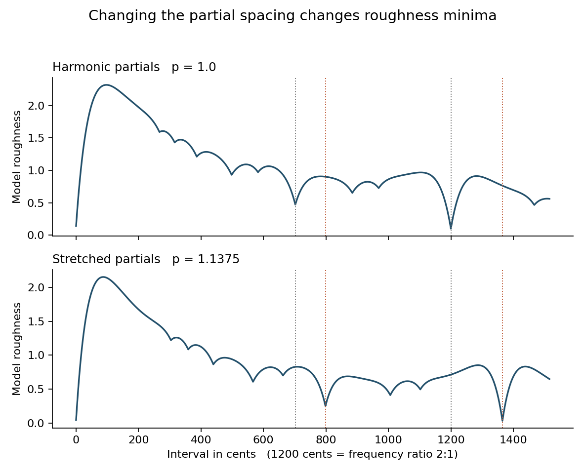

图 1a 上图是整数分音，下图是拉伸分音。横轴为音分，纵轴为模型粗糙度，单位只在本模型内有意义。灰色虚线标出 3 比 2 和 2 比 1，橙色虚线标出拉伸后对应的位置。

整数分音的五度附近谷底落在频率比 1.50000，即约 701.96 音分；拉伸音色的对应谷底落在 1.58600，即约 798.47 音分。后者的模型分值约 0.249，而强行放在普通五度时约为 0.827。这里的分值不能翻译成“好听了多少倍”。它只说明同一套计算里的局部关系确实改变了。

为什么恰好移到这里？因为第二枚音的第 2 分音与第一枚音的第 3 分音重合，需要的基频比变成了约 767.63 除以 484，也就是 1.586。这给计算结果一个可追查的原因。拉伸后的“八度对应点”同理出现在 2.2 倍，即约 1365.00 音分。

复查：把基频改为 55、110、220、440、880 Hz，把分音数改为 3、7、12，把振幅衰减指数改为 0.5、1、2，共 45 组设置。在这套模型与这族幂律音色中，对应谷底都留在目标位置的一音分以内，拉伸五度的分值也都低于普通五度。这是参数敏感性检查，不是 45 次独立的人类听觉实验，也没有检验瞬态与噪声。

### 模型粗糙度 听感与喜好要分开

Marjieh等人的研究包含23个行为实验与235440次判断。参与者可以跨实验重复参加，因此判断次数和各实验人数之和都不能当作独立个体数。结果支持音色会系统性地改变协和判断，但单独的干涉模型或谐波性模型仍不能解释全部操纵。参与者多数来自西方；韩国样本提供了有限的跨文化检验，尚不足以代表全世界。

[文献：Marjieh 等（2024）](<https://www.nature.com/articles/s41467-024-45812-z>)

同一研究在八度附近给出了一个有用的反例：强泛音音色的平均喜好峰略偏离纯八度，删除泛音后，这种偏好不再可靠。作者据此提出，慢拍动可能带来听众喜欢的丰富感。若目标是提高喜好，便不能预先把所有拍动都列为需要消除的误差。

本次数据复查：我读取作者公开的八度评分 CSV，独立重做参与者内标准化与 0.035 半音带宽的高斯平滑。所得平均曲线与同站点处理结果一致到数值舍入范围；强泛音曲线的两个局部峰约在纯八度下方 6.23 音分、上方 8.33 音分。这里只复核这份公开数据版本，没有新招募听众，也没有重做论文整套峰值置信检验。

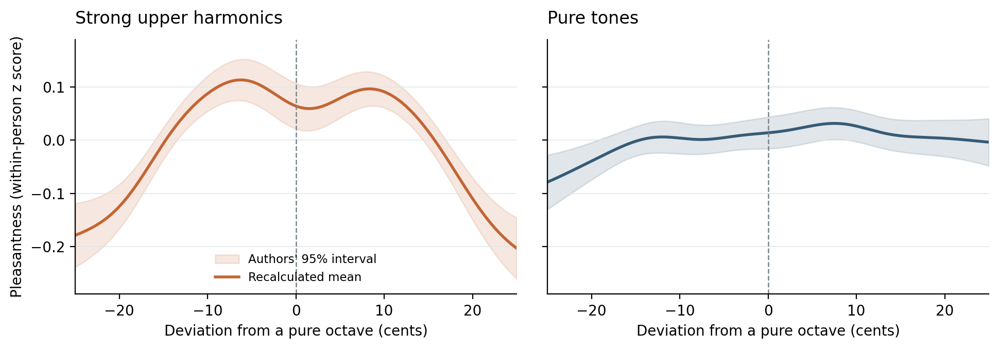

图 1b 实线由公开评分重算，阴影为作者的 95% 区间。两组分别在参与者内标准化，不能比较绝对喜好；局部起伏不等于可靠偏好。左图采用 10 个分音、3 dB/oct 衰减，与图 1a 不同。

一个可核算的声音细节：若低音基频为 220 Hz，把上方八度升高 7 音分，上音基频与低音第二分音相差约 1.78 Hz。这一对分音会产生缓慢拍动；更高的重合分音对还有其他拍速。这说明偏离为何可能带来变化，却不能单靠频差算出你会不会喜欢。

重要反例：McDermott 等人对 Tsimane’ 听众的研究发现，他们可以分辨相关的声学差异，也对粗糙声有反应，却没有呈现西方听众那样的协和和弦偏好。因此“能听出不同”“感觉更平滑”“更喜欢”必须分开问。这项研究也不能单独证明所有音乐偏好都由文化决定。

[文献：McDermott 等（2016）](<https://mcdermottlab.mit.edu/papers/McDermott_etal_2016_consonance.pdf>)

### 一个适合原创音源的小实验

可试做：用加法合成器准备四个两音组合。A 是整数分音配普通五度，B 是整数分音配 798.47 音分，C 是拉伸分音配普通五度，D 是拉伸分音配 798.47 音分。先匹配响度和包络，使用平滑的起止包络并避免削波；再打乱播放顺序，多轮记录平滑、融合、喜欢三个评分。等均方根振幅并不保证等响度。把播放音量从低处开始，不需要用大声来确认差异。

若D比C平滑，却没有更讨你喜欢，可以分别记录这两个结果。随后把四种组合放进同一小段旋律，再看孤立和弦的判断是否保留。这个试验不预设哪一版应当胜出。

用于创作时，可以先寻找这种音色自身的稳定落点，再安排向紧张处的移动。至于短时计算得到的谷底，经过旋律、节奏、学习和上下文后还能解释多少听感，需要继续试听和比较。

## 二 褶皱可能是长度关系的必然后果

从短链或已有的一圈开始，逐排保持固定比例加针。每加一排，纵向只增加一排宽度，横向长度却增长得越来越快。织物因而可能抬起、弯曲、起褶，难以平铺在桌面上。这些形变与内部长度关系有关。

### 钩针可以让非欧几何变成手里的东西

Henderson与Taimiņa用恒定的加针比例制作双曲平面的实物近似，局部增长规则在各处保持一致。毛线有厚度和弹性，针距也有误差，因此成品是可触摸的近似模型，不能当作无限光滑的精确曲面；它没有违反完整双曲平面光滑嵌入所受的限制。

[文献：Henderson 与 Taimiņa（2001）](<https://pi.math.cornell.edu/~dtaimina/crochet/hplane.htm>)

先区分外形弯曲与内在曲率。纸卷成圆筒后，纸面距离未变，局部仍能摊回平面。双曲曲面的内在距离关系不同，无法只靠不拉伸的摊平操作把它铺成普通平面。

数学核对：平面上，圆周长随半径线性增长。曲率为负一的双曲平面上，内在半径为 r 的圆周长是 2π 乘以 sinh(r)。把曲率尺度记作 R，一般形式为 2πR 乘以 sinh(r/R)。这里的半径沿曲面量，不能拿画面里的投影半径来代替。

[文献：Cornell 双曲几何课程材料](<https://pi.math.cornell.edu/~mec/Winter2009/Mihai/section7.html>)

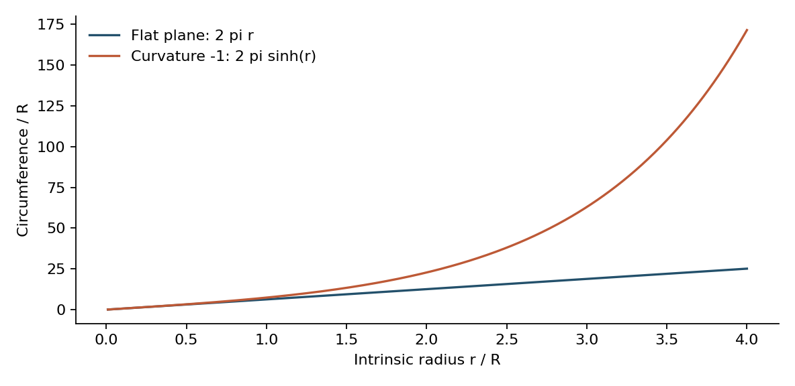

图 2 我按标准圆周公式作图。横轴为内在半径与曲率尺度之比。远离中心后，负曲率曲面容纳的圆周长远大于同半径的平面圆。它不是毛线制品的精确物理仿真。

本次简单核算：若一排起始有 20 针，之后理想地每排增加 20%，经过 10 轮增长约为 124 针，20 轮约为 767 针，30 轮约为 4748 针。整数加针会带来舍入，但不会消除增长速度的差异。真正昂贵的是持续保持那个看似温和的比例。这是单独的离散增长示意，不是从圆心出发的双曲圆周的精确采样；后者在圆心附近并不按固定比例增长。

### 材料并不只服从几何

Klein等人制作过横向收缩不均的薄凝胶片。局部收缩改变各处倾向保持的长度，薄片随后形成三维形状。这个实验支持从材料变化到整体形变的机制，但不能解释每片叶子的每一道褶皱。

[文献：Klein Efrati 与 Sharon（2007）](<https://doi.org/10.1126/science.1135994>)

机制边界：非欧薄板理论同时计算拉伸与弯曲的代价。在相同应变和曲率量级的比较下，拉伸项随厚度的一次方缩放，弯曲项随厚度的三次方缩放，所以变薄会让弯曲相对更便宜。实际最后选哪种褶皱，还受到材料、边界、厚度和初始扰动影响；给定一套长度关系不一定唯一确定外形。

[文献：Efrati Sharon 与 Kupferman（2009）](<https://arxiv.org/abs/0810.2411>)

### 两个无需实验室的观察

可试做一：取一张普通纸，先卷成圆筒，再松开。对比“看起来弯了”和“纸面距离改变了”。再试把平纸平整包住一个球面，你必须容许皱褶、剪口或拉伸中的至少一种。它们不是同一操作，但能帮助你分清外观曲率与内在几何。

可试做二：若会钩针，用不太易拉伸的线，从短链开始，保持每五个旧针位多增加一针的规则。先做少量几排，记录每排针数和边缘形状。另一块保持较低的恒定加针比例作对照。不要把不同加针比混在同一块上，却仍称其为同一恒定曲率模型。

设计虚构植物或服装时，可以先规定各方向怎样生长、哪些部位不易拉长、边界固定在哪里，再推敲外形。几何与力学能够为细节提供生成依据；最后选择哪种视觉效果，仍是创作判断。

## 三 相同振荡器也能出现不同节奏

一圈振荡器的固有频率相同，相互作用也遵守同样的规则，仍可能一部分整齐转动，另一部分不断滑移。这类有序与无序并存的现象称为奇美拉态。下面先看模型怎样允许它出现，再检查一次模拟能支持多强的结论。

### 共同规则没有保证唯一结局

文献事实：Abrams 与 Strogatz 分析了一个非局部耦合的相位振荡器环。每个振荡器受周围相位的加权影响，距离权重随位置差的余弦变化；相互作用还有相位滞后。在一定参数与初始条件下，锁相和漂移可以并存，完全同步也可以是稳定状态。

[文献：Abrams 与 Strogatz（2004）](<https://arxiv.org/abs/nlin/0407045>)

机制上的关键是周围形成的局部相位场也有强弱。在该场稳定转动的近似下，群体提供的最大纠偏作用若小于需要补偿的频率差，就无法固定相对相位；强度足够时才可能出现固定相位。相同个体因所处的局部场不同而产生不同表现。有限系统的场会波动，不能逐帧机械套用这个定常判据。

这里要区分规则相同与初始相位相同。若全部振荡器从完全相同的状态开始，确定性的对称规则会保留这种对称性。模型中的差异有其初始条件，不能把它理解成计算凭空创造了差异。

### 第一次运行没有出现我想看的图

本次计算：我使用 256 个振荡器，耦合参数 A 为 0.995，相位参数 β 为 0.18，步长 0.025，采用四阶 Runge Kutta 方法。最初按照论文给出的窄高斯随机初相形式设置，随机种子为 20261006。结果很快走向全同步，在模型时间 5000 时，各振荡器的平均角速度差约在一万亿分之一的量级以内。

第一次运行保留下来了：它走向全同步，但这不与“奇美拉态可以存在”矛盾。更换两次同形式的随机种子仍同步，改变初相扰动宽度后才得到并存图案。寻找这类状态时，初始条件与暂态持续多久都需要检查。

后续对照一共保留五组：窄高斯两组、较宽高斯两组、全环随机一组。到模型时间 1000，五组中的三组已经同步，两组仍保持空间上的不一致。我将后两组继续积分到时间 5000，并用最后 1000 个时间单位估计平均角速度。两组使用原论文的初相表达式，幅度参数为 6，宽度参数 b 分别为 1 和 0，随机种子均为 20261006，使用 NumPy 的 PCG64 随机发生器。环上位置从负 π 到正 π 均匀取点，不重复端点。模型时间没有被解释为现实的秒。

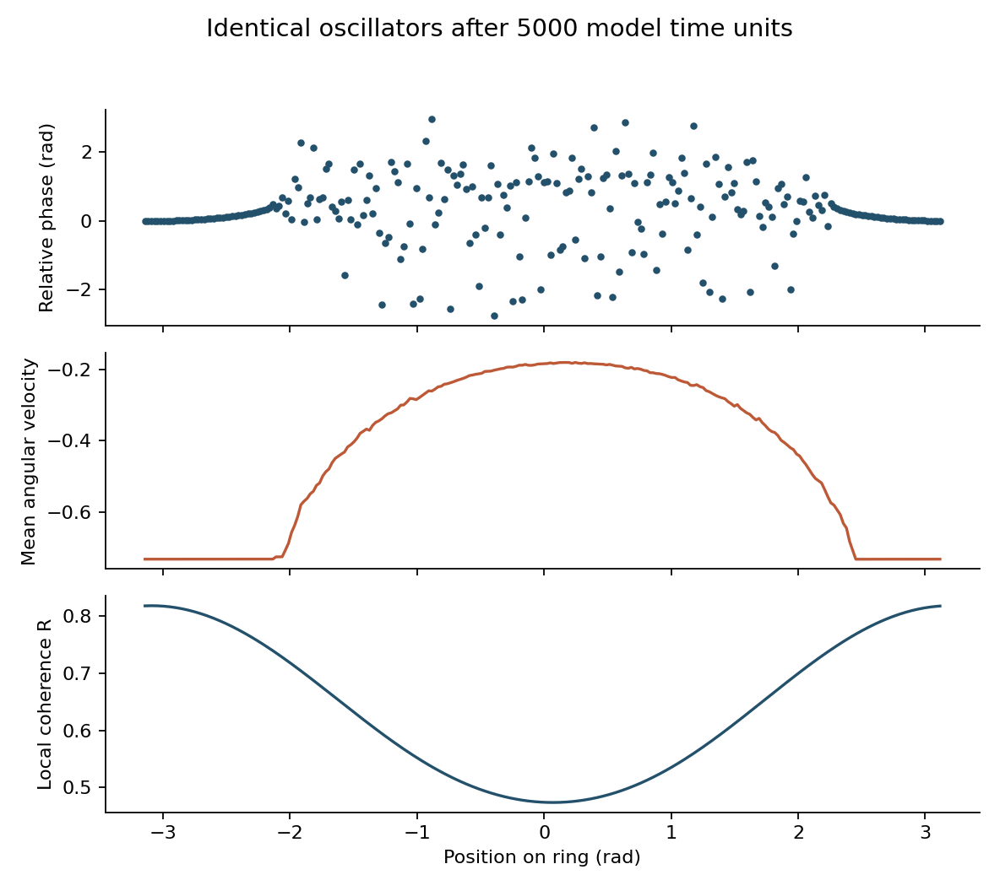

图 3 较宽高斯初相的一组，在模型时间 5000 时的状态。第一行仅是相位快照，第二行的平均角速度平台才是锁相区域的重要证据。环的两端在空间上相接。另一组初相也出现并存，但有序区位置不同。

结果：两组的近似等频平台都约为每模型时间单位负 0.732 弧度，其余振荡器的平均角速度伸展到约负 0.18。以离平台小于 0.001 为本次统计阈值，较宽高斯组有 70 个，全环随机组有 72 个振荡器落在平台附近，可记为候选锁相个体；仅凭平均频率还不能证明其相对相位始终有界或从不滑移。这个人数依赖阈值、观察窗和有限规模，不能写成普遍常数。

实现核对：我把用于加速的三项傅里叶表达式与直接逐对求和比较，最大差约为 2.2 乘以十的负十六次方；全同步时的角速度也与解析值吻合。另以幅度 0.001 的余弦小扰动检查全同步附近的局部稳定性，测得衰减率约为负 0.08996236，与线性化预测一致。这能排查一部分计算错误，不能证明全局或长期稳定。

延长观察后出现了重要变化。我固定原先两组分别 70 个和 72 个候选，继续到模型时间 10000，逐积分步记录未折返的相对相位。原步长下，两组分别有 14 个和 24 个候选的相位跨度覆盖至少一整圈；若改用期末净位移超过一圈作为标准，则分别为 12 个和 23 个。两种标准并不相同。

为排除参考个体本身漂移造成的假象，我每组另选一个有序区内部参考。两个参考之间的相对相位跨度均小于 0.14 弧度，各 1000 时间窗的平均频率相近，换参考后的计数一致。把续跑步长减半到 0.0125，仍有完整相对转动，但两组人数分别变为 11 个和 13 个。现象在这些检查中保留，精确人数并未收敛，更广初值集合与长期寿命仍待检验。

上述滑移说的是原先选定个体与参考个体的相对运动，不能据此断定整个并存图案已经消失。固定个体能否长期锁相、图案在哪里、整体持续多久，应分别测量。

另一次规模对照把同一个周期初相函数分别采样成 32、64、128、256、512 个点，步长仍为 0.025。到模型时间 2000，32 点版本已全同步；其余版本仍有平均频率分化。这同时涉及有限规模与初相采样精细度，只能说明这一例子对分辨率敏感，不能推出一个普遍的最小群体规模。

### 怎样判断图案是否成立

一张杂乱快照不足以确认奇美拉态。相位可能只是有规则地错开，也可能仍处于暂态。需要同时观察时间平均频率和局部相干性。

有限时间内的并存还需要与长期稳定区分。Wolfrum与Omel’chenko在一组采用均匀邻域耦合的有限规模算例中，观察到图案突然坍缩为全同步，并研究了混沌暂态。结论有具体的模型和参数范围，不能推广为所有奇美拉态都会消失。本次模拟也只支持指定观察窗内的结果。

[文献：Wolfrum 与 Omel’chenko（2011）](<https://webdoc.sub.gwdg.de/ebook/serien/e/wias/2012/wias_preprints_1618.pdf>)

模型类别也会改变需要的条件。2004年论文强调非局部耦合，后来的Sethia与Sen则在包含振幅变化的全局耦合系统中发现了奇美拉态。早期模型的条件不应直接成为所有后续现象的定义。

[文献：Sethia 与 Sen（2014）](<https://arxiv.org/abs/1312.2682>)

Hagerstrom等人还在光学装置的耦合映射格子中实现了相关的有序与无序并存。这为广义奇美拉提供了实验例子，但装置没有逐项实现上面那圈连续相位振荡器，比较时应保留这一差别。

[文献：Hagerstrom 等（2012）](<https://photonics.umd.edu/pubs/ja-44/>)

### 把它变成一个创作实验

可试做：让一圈点按各自相位缓慢、低对比地明暗变化，并提供暂停，避免高速强闪。先保持所有参数相同，只改变初始相位的分布。把开局、全局平均同步程度和局部节奏放在一起看。再把相位滞后缓慢改变，观察区域如何扩张或消失。这比给每个点分别写随机噪声，更容易看出共同作用造成的结构。

这种模型可以用来生成局部整齐、局部松散的群体动画或多声部织体，让不同节奏从相互作用中产生。它是一种生成素材的思路，不能由此直接推论人群、组织或社会怎样运作。

## 四 亮点怎样成为高光或颜料

同一个白斑，放在一处像反光，挪到另一处却像白漆。亮度没有变，变的是它与物体明暗和形状的关系。下面用受控实验和两幅自制图，分别检查这种关系与一个简单图像统计量能告诉我们什么。

### 视觉不是逐像素读数

Adelson在亮度错觉研究中改变图案的几何组织，同时保留相关灰度和部分边缘关系，观看效果随之显著改变。这说明文中比较的简单低层模型还不充分，但不能推出视觉每一步都依赖有意识推理，也不能用同一机制解释所有色彩错觉。

[文献：Adelson（1993）](<https://web.mit.edu/9.35/www/archives/2020/vision/papers/brightness_transparency.pdf>)

Kim、Marlow与Anderson进一步改变高光相对于漫反射明暗的位置和方向，观察到光泽判断随相合程度变化。实验使用的是受控刺激，尚不能概括为任何图片挪动高光都会降低光泽感。

[文献：Kim Marlow 与 Anderson（2011）](<https://pdfs.semanticscholar.org/4ea1/abb042414d5d517ac78f5a71be8a48342424.pdf>)

论文末尾的纯镜面图是一个需要保留的反例：没有漫反射明暗可作比较，图像仍可呈现黑色光泽表面的观感。因此，高光与漫反射相合不是一切光泽的必要条件。这是作者的视觉示意，本次没有另做被试实验。

### 我做了两张像素分布完全相同的图

本次构造：左图用一个简单球面法线、漫反射项和集中的高光项生成。右图先把高光项旋转 180 度，再把球体内部像素按排名重映射到左图的同一组数值。这样两图的像素直方图完全一样，但亮点与球面明暗的关系改变了。

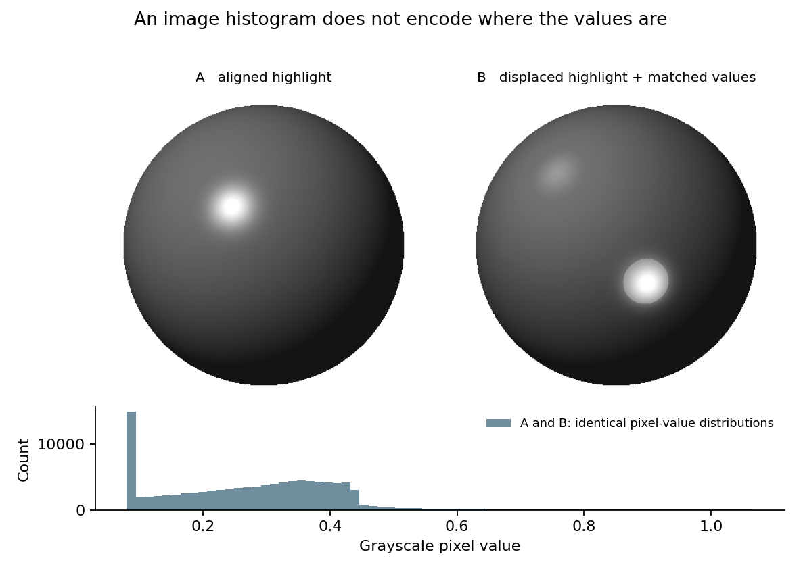

图 4 自制的数值示意图。两图球体内部的像素数值排序后最大差为零，因此直方图完全相同。右图不是一次物理正确的重新照明；重映射也改变了其他局部对比关系。

可以先不看标题，比较哪边像反光、哪边像画上去的斑点。计算已确认两图直方图相同，所以直方图无法区分它们；至于观看者是否有稳定的知觉差异，本次没有收集评分，也未检验特定神经机制。

这幅演示确定了一个统计量遗漏的信息。若要进一步判断这些信息怎样影响人的观看，还需要知觉实验，两种工作应分开记录。

### 简单计算也可能接近复杂知觉

新的限制证据：Morimoto 等人于 2026 年发表研究，用 3888 张物体图像的光泽判断训练网络。一个 15×15×3 的卷积核，加上最大池化与偏置，已能在所测试图像范围内较好预测平均人类评分。实验分别留出新形状或新光照进行验证。单核模型不是一个生物神经元，也没有证明真实视觉只用这一操作。

[文献：Morimoto 等（2026）](<https://www.nature.com/articles/s41562-026-02445-0>)

为了把这个结构看得更具体，我读取了一枚公开的 15×15 RGB 数值滤波器，用不同于论文测试集的本章球体图做了分布外探针。白背景下最强响应落在轮廓边缘；改成共同灰背景后才移向高光。完整预处理与读出尚未复现，因此这些是滤波响应，不是人类评分预测。它提醒我先核对模型响应了什么，再解释一个总分。

局部计算也能捕捉空间关系，因此研究不必只在“看一个统计量”和“完整恢复真实世界”之间选择。接近人类评分与正确估计反射参数，仍是两个不同的评价目标；使用模型前需要先选定目标。

### 可以马上做的画面检查

可试做：先选一张自己画的、有明确漫反射明暗的釉面陶瓷或涂漆物体，把高光单独放在一层。只移动这层，不动轮廓和大明暗，然后盲排三个版本，记录反光、贴纸、发光三种印象。再加入物体轻微转动的两帧，看高光是否像黏在表面。不要在同一轮同时改曝光、饱和度和粗糙度，否则很难知道是哪一步在起作用。

材质看起来不对时，可以先检查明暗与高光等线索是否一致，再决定要不要增加纹理。相近的提问也可用于叙事：同一句话在不同上下文里如何被理解？这只是创作类比，语言机制仍需另找证据。

## 五 环境可以替行动保存历史

行动留下痕迹，痕迹又影响下一次选择，环境便参与了信息跨时间的保存。黏菌经过的路径与白蚁正在建造的表面提供了两种例子，但两者使用的线索和机制需要分别说明。

### 黏菌留下的痕迹帮助它绕过陷阱

实验事实：Reid 等人让 Physarum polycephalum 面对一个 U 形障碍，食物的吸引信号能穿过障碍，但个体不能直接越过干燥的障碍面。在 120 小时内，空白琼脂上有 23/24 到达目标；预先铺满胞外黏液的基底上只有 8/24 到达。预涂覆使新旧路径的差别难以读出。

没有障碍时，两种基底未显示显著的导航损害，平均移动速度也无显著差别。这削弱了单用“走得慢”或“闻不到食物”解释结果的理由。实验支持外部痕迹有助导航，但没有排除内部状态，更未检验主观意识或全部记忆的进化起源。

[文献：Reid 等（2012）](<https://chrisrreid.wordpress.com/wp-content/uploads/2015/12/slime-mould-uses-an-externalized-spatial-e28098memory_-to-navigate-in-complex-environments.pdf>)

### 用方格模型检查痕迹的作用

我做了一个 25×21 格的玩具环境。行动者每次只能走向上下左右相邻空格。它给每个候选位置打分：到目标的直线距离，加上该格过去被访问的次数乘以一个系数，然后选分数最低的格子。每到一格就增加一次痕迹。同分时按固定顺序选择，不加入随机性。

目标方向被刻意安排在U形墙后，行动者一味靠近目标就会受阻。模型把直线距离当作理想吸引线索，未模拟葡萄糖扩散、黏菌变形，也没有拟合生物实验数据。

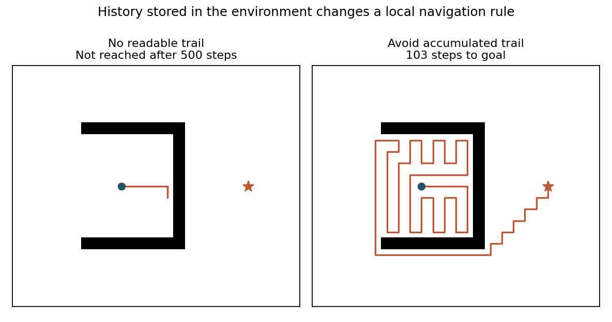

图 5 蓝点为起点，橙色星号为目标，黑色为墙。左图忽略痕迹，在墙边往复；右图按系数 2 避开累积痕迹，绕出开口后到达目标。路径很长，说明成功不等于最短路。

本次结果：系数为 0 时，500 步后仍未到达，路径只涉及 6 个格子；系数 0.1 也未在 500 步内到达。系数 1 用了 425 步，系数 2 用了 103 步。这个对照没有证明越强的回避越好，只有一个地图和一种规则；它证明了增加可读历史可以改变同一个局部决策过程。

可在方格纸上画一个目标和带缺口的障碍，每经过一格便记一个点。比较只接近目标、与同时避开痕迹密集位置的走法。然后把目标换到需要折返的地方，检查回避旧路是否反而增加距离。

### 白蚁建造的表面也会改变下一步的线索

另一组原始实验研究了 Coptotermes gestroi 在人工环境中的早期颗粒堆放。Facchini 等人发现，堆放集中在高曲率处和材料交界等区域；这些区域与较强蒸发相对应。结合模型与实验，作者提出白蚁可能通过蒸发相关线索间接感知表面形状。它没有确定完整的感受器机制，也没有解释所有物种的整座蚁丘。

[文献：Facchini 等（2024）](<https://doi.org/10.7554/eLife.86843.4>)

两章用到的“曲率”含义不同。钩针模型关心内在高斯曲率，白蚁论文分析外在平均曲率及其与扩散边界的关系。纸卷成圆筒后，高斯曲率仍为零，平均曲率却可非零，正好显示了这个区别。

蒸发与形状的对应关系依赖作者使用的扩散近似和实验几何，湿度、边界与材料交界改变后，还需重新分析。从这里可以提出一个设计问题：已建成的部分怎样改变后来者可读的线索？它并没有给出解释所有集体建筑的曲率公式。

### 从生物机制得到一个软件问题

在协作工具或探索游戏中，可以尝试显示最近检查、物品操作或经过路径的痕迹，让后来者少做一次猜测。这是设计推论。是否有效，应比较完成时间、重复劳动和错误，而非只判断界面看起来是否聪明。

还要问一个反方向的问题：当痕迹过期、被别人改变，或目标已经迁移时，系统有没有办法撤销它？

我做了一个刻意的反例：上述系数 2 的行动者到达目标后，新目标立即改成刚才走过的相邻格子，直接折返只需一步。完整保留旧痕迹时，它用了 19 步；每步让痕迹保留 99% 或 90% 时用了 5 步；任务切换时清空旧痕迹则一步到达。单个反例不能选出通用最佳遗忘率，却足以说明持续回避旧路与新的目标可能冲突。

## 六 听见全部频率仍可能不知道结构

再看一个测量的限制：不同对象可能给出完全相同的测量结果。此时继续提高同一种测量的精度，也无法区分它们。反问题中有可以严格验证的例子。

### 鼓的形状与振动频谱

数学事实：Gordon、Webb 与 Wolpert 在 1992 年给出了平面区域的反例，形状不全等，却具有相同的拉普拉斯算子频谱，包括固定边界的 Dirichlet 情形。这回答了“能否由理想鼓膜的全部固有频率唯一恢复形状”的经典问题。结论针对理想模型中的频率列表；敲击位置、各模态振幅、阻尼和空间响应没有因此自动相同。

[文献：Gordon Webb 与 Wolpert（1992）](<https://arxiv.org/abs/math/9207215>)

### 我找到一个六节点的精确小例子

本次枚举小型无向图，寻找连接结构不同、拉普拉斯频谱相同的候选。先比较数值特征值，再用整数算术求特征多项式，最后核对节点度数。这样可以区分严格同谱与小数近似接近。

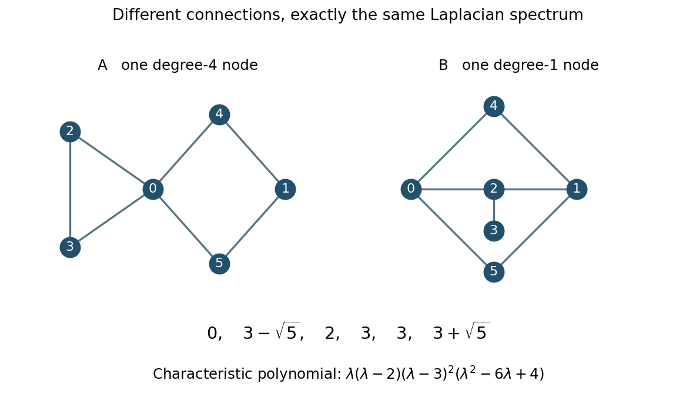

图 6a 本次找到的两个连通图，每个都有六个节点和七条边。左图有一个连接四条边的节点，右图的最大度数只有三，因此重新编号也不能让它们成为同一个图。下方是完全相同的特征值与特征多项式。

两图的特征值都是 0、约 0.763932、2、3、3、约 5.236068；其中 3 重复两次。把这些节点想成质量相同、沿一个标量方向位移的单元，各边提供相同的线性耦合，那么理想小振动的固有角频率与这些特征值的平方根成正比。零值对应整体平移，不是一个可听的零频音符。

这个抽象耦合网络没有模拟两面真实的鼓，但给出了一个可完整核查的反例：模式频率全部相同，连接仍不相同。若要辨认结构，就需要寻找频谱之外的信息。

### 固定一个观察点 仍可能看不见全部差别

继续追问后，我找到了更强的限制。保持两张图相同的单点质量与单条边耦合强度，沿用上述无阻尼运动规则，只把 4 号节点移开同样的小距离，其余节点初始位移和全部速度都为零。若只记录 4 号节点，两条完整的位移曲线也相同。我用整数算术核对：两图不仅原矩阵的特征多项式相同，删去编号 4 节点对应的行与列后，多项式也相同；这使该输入输出通道的响应函数完全一致。

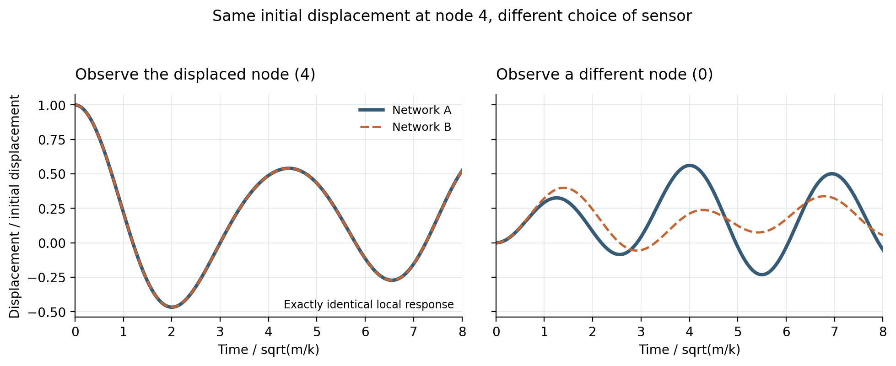

图 6b 同样初始拨动 4 号节点，改变记录位置。左侧两条曲线重合有精确多项式依据；右侧改读 0 号节点就能区分这两个候选网络。位移以初始拨动量归一，时间单位为质量与耦合刚度之比的平方根。

具体到模型时间 1，0 号节点的位移分别约为初始拨动量的 0.29287 和 0.32341。4 号节点自读通道的等价还有更一般的说法：从全静止状态出发，对 4 号节点施加相同的任意时间变化输入，只在 4 号节点读出，仍分不开两图。它没有承诺其他观察点、任意初始状态也相同；区分这两个已知候选，也不等于唯一重建所有未知网络。

还存在真正看不见的内部运动：在左图，让 2、3 号节点等幅反向振动，其余节点不动，是一个合法模态；4 号节点始终不动。右图中 0、1 号节点的反向运动也有类似性质。因此，局部传感器记录到零，并不保证内部没有运动。

这里涉及两个问题。已知运动方程后恢复内部状态，属于可观测性；通过实验辨别连接图，属于结构辨识。不能直接用前者的定理保证后者。实验方案应写清激发位置、初始条件、读出位置，以及待区分的候选。

[文献：Boyd（2007–08）](<https://see.stanford.edu/materials/lsoeldsee263/19-observ.pdf>)

### 换一种观察比继续加精度更重要

可试做：在这两个模型中依次只给一个节点很小的初始位移，观察所有节点最开始的加速度。对于质量和耦合都已知的理想模型，完整记录这些局部响应，就可以逐列读出耦合矩阵，区别两张图。这个实验改变了你记录的内容，而不只是把旧的频率读数多写几位小数。

如果两个解释都能复现现有指标，可以寻找让它们给出不同预测的新观察。音乐中可改变发声方式，图像中可加入运动，交互软件中可观察下一步行动。具体应用仍需分别验证，不能只因提问相似就搬用结论。

## 七 多一条捷径 为什么反而更慢

增加一条路，为什么可能让所有人更慢？下面的路网例子把两个结果放在一起计算：个人换路时节省的时间，以及其他人也调整路线后的均衡时间。

### 四个节点就够了

重新推导经典的归一化 Braess 例子：所有流量从 S 去 T，总量先设为 1。S 到 A、B 到 T 两段路的耗时，都等于各自路段上的流量；A 到 T、S 到 B 两段路的耗时固定为 1。没有中间捷径时，上下两条路线各走一半，总耗时都是 0.5 加 1，即 1.5。

[文献：Braess 等（1968/2005）](<https://homepage.ruhr-uni-bochum.de/Dietrich.Braess/Paradox-BNW.pdf>)

现在增加 A 到 B 的单向零耗时连接。原先分流不变时，一个极小的旅行者改走 S—A—B—T，可以只花 0.5 加 0.5，即 1。它很诱人。可是其他人也会调整。新均衡中，全部流量经过中间路线，两段拥挤路各承受 1，耗时变成 2。独自改回任一外侧路线，仍要花 2，所以没人能单靠换路改善。

这是连续、固定总量的流模型，一个决策者的流量可忽略。均衡要求没有更便宜的单边换路，却不要求总耗时最小。中央分配仍可不用捷径，让上下路线各分一半，达到1.5。新增连接保留了旧方案，却改变了分散选择的均衡。

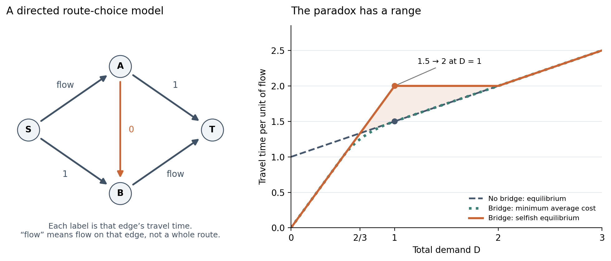

图 7 我按上述方程绘制的路网和需求量曲线。橙线为有捷径的分散均衡，蓝虚线为无捷径的均衡，绿点线为有捷径时最小平均耗时。着色区内新增捷径更慢；这是固定拓扑的精确模型结果。

### 先找它不成立的地方

需求量检查：把总流量改为 D，无捷径时耗时为 1 加 D/2。有捷径时，D 不超过 1，耗时为 2D；D 在 1 到 2 之间，耗时为 2；D 达到 2 后，捷径不再被使用。于是变坏的范围恰好是 2/3 小于 D 小于 2。不能把单位流量下的反例外推到所有拥挤程度。

把总量固定为1，再令捷径耗时为c。只要0不大于c且c小于0.5，均衡耗时就是2减c，仍高于旧路网的1.5。因此反例不依赖捷径恰好零耗时。本次用有理数核对了路线流量、所用路线等成本及未用路线的条件。

还可以保持同一张图，只把两段固定耗时为1的道路，改成耗时等于自身流量的两倍。旧网络仍各分一半，耗时1.5；增加零耗时捷径后，三条路线各走三分之一，耗时降为4/3。旧均衡的读数相同，改变后的响应却不同。

文献边界：在固定需求、连续流量、各路段耗时都与流量成正比的模型中，均衡恰好也使总耗时最小。若允许非负的固定项，Roughgarden 与 Tardos 证明，仿射耗时模型的最坏均衡总成本与最优总成本之比为 4/3；上面的 2 对 1.5 正好达到它。这个上界不能直接套给任意非线性成本或有限人数的游戏。

[文献：Roughgarden 与 Tardos（2002）](<https://www.cs.yale.edu/homes/lans/readings/routing/roughgarden-selfish-2002.pdf>)

### 用十二枚棋子看见每一步的代价

可试做：用 12 枚棋子代表 12 个等权决策者。把两个固定路段的成本设为 12，两个拥堵路段的成本设为经过的棋子数，捷径成本为 0。先让上下路线各放 6 枚。每次只移动一枚，而且只有移动后它自己的完整路线成本严格下降才允许移动；成本相同时留在原处。记录它省了多少，以及所有棋子的平均成本变了多少。

本次已做的程序核对：枚举全部 91 种路线人数分配，并在每一种分配中检查所有单人换路。满足无人能严格改善的分配共有四种：上下路线分别为 0 和 0、0 和 1、1 和 0、1 和 1，其余棋子都走捷径。平均成本从旧网络的 18，分别升到 24、约 23.08、约 23.08、约 22.17。有限玩家并不必然全部走捷径。

再固定一种可复现的移动规则：每次选能省最多成本的换路；并列时先比较出发路线，再比较目标路线，两者都按上、下、中排序。我从 6、6、0 出发，10 步后停在 1、1、10。每次移动都使当事人在那一刻受益，群体平均成本却逐步从 18 升到约 22.17。这是精确游戏计算，没有真人参加。把所有成本再除以 12，就能与总流量为 1 的连续模型对照。

为什么还能保证停下？这类有限等权拥堵游戏存在一个势函数：逐段把第 1 个使用者到当前使用人数的成本累加。一次单人换路造成的势函数变化，恰好等于该人的成本变化，因此严格改善不会在有限状态中兜圈。但势函数并不是总成本。本次路径上，它从 186 降到 156，平均耗时反而升高。这个结论依赖轮流更新；不能据此保证所有人同时响应旧信息时也收敛。

[文献：Rosenthal（1973）](<https://ranger.uta.edu/~weems/NOTES6319/PAPERSONE/rosenthal1973.pdf>)

### 人会这样做吗 弹簧也能回答什么

实验事实：Morgan、Orzen 与 Sefton 的路线选择实验中，Braess 条件有六组、每组八人；网络顺序经过对调，每个网络体验 60 轮，参与者只得到自己走过路线的反馈。后 30 轮的平均成本从基准网络的 58.59 升到增加连接后的 63.43。行为仍持续波动，且没有完全落在理论均衡上。这支持实验室中确会出现这种效应；参数、信息条件和道路结构都与这里的简化算例不同。

[文献：Morgan Orzen 与 Sefton（2009）](<https://faculty.haas.berkeley.edu/rjmorgan/traffic.pdf>)

另一个意外连接来自 Cohen 与 Horowitz 的理想弹簧网络。两根弹簧原先通过一条短绳串联承重，另有两条松弛的备用绳。剪去中间短绳后，备用绳绷紧，让两个弹簧分担负载；新平衡时重物反而更高。论文算例中，支点到重物的距离从 1.375 米减为 1.25 米。这里是理想静力学构造，我没有做剪绳实验。

对应关系是：流量对应张力，耗时对应长度，节点满足守恒，各承载路径连接相同端点。方程可以比较，解释却须区分；弹簧遵守力学平衡，并没有进行个人利益判断。

[文献：Cohen 与 Horowitz（1991）](<https://lab.rockefeller.edu/cohenje/assets/file/185CohenHorowitzNature1991.pdf>)

给多智能体游戏增加捷径、自动化或公共资源行动时，可以分别检查当前收益、重新分配后的结果和更新顺序。还要选定怎样模拟学习：探索、习惯、协作和信息不足，都会影响玩家是否接近理论均衡。单人测试中的速度改善不足以回答这些问题。

## 八 回到原来的形状 也可以离开原地

再把动作缩到微型游泳的尺度。让一个很小的扇贝慢慢张开、快速闭合，直觉上似乎会被快的那一拍推走。但在可以忽略惯性的特定流体模型中，单靠加快回程并不能产生前进，需要检查整个形状变化路径。

### 先限定这个陌生世界

物理前提：雷诺数比较惯性效应与黏性效应。它足够小时，可以考虑忽略惯性的 Stokes 近似。Purcell 讨论的关键情形是：静止背景中的不可压缩牛顿流体，物体靠自身变形游动，整体无外加净力或净力矩。若形状沿同一路径变过去，再沿原路径倒回来，完整周期的净位移为零；仅改变两程的快慢无济于事。

[文献：Purcell（1977）](<https://www.math.uwaterloo.ca/~mdunphy/purcell.pdf>)

原路开合与周期运动需要区分。周期只要求结束时形状重复，中间未必沿原路线倒回。实际应用还要核对惯性、流体性质、周围边界及外部驱动，不能仅看动作是否像扇贝开合。

### 三颗球把问题变得可算

Najafi 与 Golestanian 提出三个共线小球、两条可伸缩连接的简化模型。球的移动扰动流体，流体又影响其他球。若先缩左段，再缩右段，再伸左段，最后伸右段，形状恢复了，位置却可以发生净变化。缩左与伸左发生时，右段处在不同状态，因而不能把两步视为彼此完全抵消。

[文献：Najafi 与 Golestanian（2004）](<https://arxiv.org/abs/cond-mat/0402070>)

本次计算：把两段平均球心间距都归一为 1，小球半径为 0.05。设置左间距为 1 加 0.2 cos(θ)，右间距为 1 加 0.2 cos(θ 加 φ)，θ 在一周期内走完 2π。使用论文的远距离 Oseen 相互作用近似，在每个形状上解三个球的速度与零总外力约束；连接本身的流体阻力、热噪声和惯性都没有加入。 长度单位为平均球心间距 ℓ，时间单位为周期 T，速度单位为 ℓ/T，力单位为 6πηaℓ/T，其中 η 是黏度，a = 0.05ℓ 是有量纲的球半径。

结果：相位差 φ 为 0 或 π 时，每圈净位移在数值精度内为零；φ 为 π/2 时，净位移约为平均间距的负 0.003928；反过来绕同一个形状循环，位移变成正 0.003928。这里只是规定坐标下的左右方向。把一周期拆成 128 到 2048 段复算，结果保持一致。

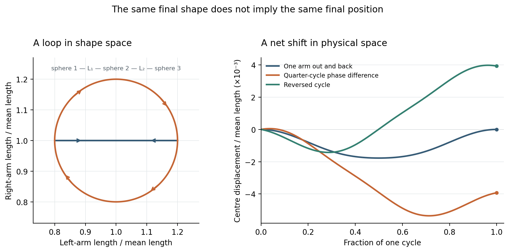

图 8 自行计算的三球游泳模型。左图是两段长度组成的形状参数平面，并非小球实际走出的空间路线。右图才是几何中心的位置变化；每条曲线都回到初始形状，但不一定回到初始位置。

机制可以用一张纸理解：在横轴记左段长度、纵轴记右段长度。只动一段再退回，只沿一条线往返；错开两段的动作，会围出一个有方向的闭合圈。后续解析研究表明，小振幅近似下，每圈位移与这个有向面积成正比。顺、逆时针改变符号。

[文献：Golestanian 与 Ajdari（2008）](<https://arxiv.org/abs/0711.3700>)

本次另做了负对照：保留同一个形状闭合圈，关闭球体之间经流体传递的相互影响，只留下各自阻力。净位移回到零。闭合圈的作用依赖具体的环境耦合，不能单凭动作图判断系统会前进。

### 快慢不改变每圈距离 却会改变耗能

把同一个形状循环重新安排快慢，净位移不变，并不表示时间安排毫无意义。我保持总周期为 1，只把 θ 从均匀的 2πt 改成 2πt 加 0.6 sin(2πt)。路径仍绕同一圈，净位移仍约负 0.003928，但按各球力乘速度积分得到的总耗散功增加了约 18%。这是该模型内的比较，不含马达本身的损耗。

还可以反过来求一个受限最优解：在形状路径和总周期都固定时，把局部功率写成 g(θ) 乘 θ 变化率的平方，用 Cauchy–Schwarz 不等式可得最低耗散的时间安排。它沿阻力代价较高的段走慢些，代价低的段走快些，使瞬时功率恒定。此例比均匀安排少耗约 3%，每圈距离相同。它只优化这条给定路径，不是所有游法的全局最优。

### 一条没有直接抄下的公式

核对文献时发现，2004年论文的一条小振幅表达式后来被Earl等人修正；2008年的作者说明也把早期关系解释为较宽参数范围内的拟合。四步伸缩循环的每圈位移，主导项随小振幅平方变化。若固定每步伸缩速度，周期也随振幅变化，因此平均速度的阶数要另外计算。

[文献：Earl 等（2007）](<https://arxiv.org/abs/cond-mat/0701511>)

我按缩小振幅的方式复查，数值结果接近后续推导的阶数。另把 Oseen 近似换成包含领先有限尺寸修正的 RPY 球对近似，主算例位移变为约负 0.003904，差约 0.6%。两者都仍有物理近似：很多位小数只能说明积分稳定，不能等同于真实游泳距离有那么高的精度。

[文献：Wajnryb 等（2013）](<https://www.fuw.edu.pl/~piotrek/publications/Rotne_Prager_Yamakawa.pdf>)

### 改变流体 就能改变结论的适用范围

上述位移和耗能计算仍只适用于牛顿流体。实验边界：Qiu 等人制造了单铰链微型扇贝，让它在剪切增稠或剪切变稀的非牛顿流体中开合。开、合速度不同时可以出现净推进；同一流体中的对称开合，以及牛顿流体中的非对称开合，是未观察到净推进的对照。这里改变的是流体随剪切速率响应的方式，并没有推翻原先牛顿流体条件下的定理。

[文献：Qiu 等（2014）](<https://infoscience.epfl.ch/bitstreams/0c7c3cd2-c77b-4ccd-892e-df9e53deb8a6/download>)

可试做：画出“缩左、缩右、伸左、伸右”与“缩左、伸左、缩右、伸右”两套四格动作，分别在长度参数平面连线。它们用了相同的动作清单，却走出不同路径。若制作微观生物动画或双滑杆移动谜题，可让第二条臂的相位成为真正有因果作用的参数，而不是随意叠加抖动。纸上动作图本身只展示顺序；净推进仍需相应的流体模型来判定。

这个例子要求区分形状复原与完整状态复原。它可以帮助重新检查“回到原点”具体指什么，但没有为成长、叙事或人生提供物理证明。

## 九 信息更强 为什么未必赢下一整局

设一个两回合游戏：在每个回合末单独比较，A拥有的信息都足够模拟B。但第一步必须当场作决定，不能等第二回合结束再改。本章的小例子考察这种时间限制，说明逐个检查点的优势为何未必能接成全过程的优势。

### 先说清楚什么叫更有信息

这里用能否模拟另一种提示来比较信息：拿到一种提示后，若能通过不依赖隐藏真相的随机加工生成另一种提示，就能照搬后者的任何单次决策方法。这是Blackwell信息比较的核心。de Oliveira给出了有限随机映射的简明证明，也讨论提示分时到来时的因果约束。

[文献：de Oliveira（2018）](<https://henriquedeoliveira.com/wp-content/uploads/2020/12/blackwells-informativeness-theorem-using-diagrams.pdf>)

### 一枚隐藏硬币 两次不能撤回的猜测

设一枚公平硬币的正反面固定不变，玩家不知道结果。第一回合收到一个提示，立刻写下第一次猜测；第二回合收到新提示，再写第二次。第一笔不能修改，中间也不公布答案或得分。比较的是同一玩家使用两种提示方案时的最优成绩，记忆、行动选择与随机化能力都相同。

A 的第一次提示有 90% 的概率正确，第二次为 60%；B 分别为 75% 和 80%。每种方案中，两次提示在给定真实硬币结果后独立产生。不能漏掉“给定真相”这个条件：两次观测总体上仍会因共同的隐藏真相而相关。

A 的早期提示可以按 3/16 的概率翻转，变成 B 的早期提示。更出乎直觉的是，把两次提示的完整结果一起看，也存在一个固定的随机转换，将 A 完全变成 B。因此，无论只在第一回合末做一个决定，还是等第二回合末才做一个决定，A 都至少不差。这里说的是各时刻累计的信息，不是说 A 的第二条新提示更准确。

### 整局计分会让答案改变

给这局游戏定一个完全公开的计分表：两次都对得 11 分；只有第一次对得 9 分；只有第二次对得 10 分；两次都错得 0 分。这是按整段行动共同计分，不能拆成两个互不关联的单回合分数。

本次精算：我枚举了按可达行为去重后的全部 64 种确定性方案，包括如何把第一次提示映成第一次猜测，以及如何把完整提示历史映成第二次猜测。A 的最优期望分数是 9.9，B 是 9.95。允许私人随机化也不会提高这个最大值，因为随机方案是这些确定性方案的混合。

一个达到最优的 A 策略，是两次都相信第一次提示：0.9 乘 11 得到 9.9。B 的最优策略是每次跟随当次提示：两次都对的概率为 0.60，只有第一次对为 0.15，只有第二次对为 0.20；于是 0.60 乘 11，加 0.15 乘 9，再加 0.20 乘 10，得到 9.95。差距只有 0.05 分。它的价值是一个精确反例，不是某种提示产品具有实用优势的估计。

### 可跳过的核对 为什么不能现场模仿

把两次二元提示记成 00、01、10、11。一个事后有效的转换是：00 保持 00，11 保持 11；01 按 1/6、1/3、1/2 的概率变成 00、01、10；10 按 1/2、1/3、1/6 的概率变成 01、10、11。我逐项用有理数核对了两种真相下的输出概率，完全吻合 B。

这个转换第一步就需要未来信息：完整结果为00时，先输出0的概率是1；完整结果为01时，却只有一半。第一回合只看到开头的0，无法知道将来属于哪种情况。不过，找到一个不能按时实施的转换还不够，本次又检查了其他可能的按时转换。

精确的矛盾如下：为了复现 B 的第一次提示，见到 A 第一位 0 时，必须以 13/16 的概率先输出 0。把完整 A 结果 ij 变成 B 的 00 的概率记作 xij，则 x00 不超过 13/16，所有 xij 都非负。在真相分别为 0、1 的两种情况下，B 输出 00 的概率之差组合 P(00\|0) 减 6P(00\|1)，由 A 转换时等于 (3/10)x00 减 (21/10)x10 减 (16/5)x11，至多为 39/160。但 B 要求这个组合为 0.60 减 6 乘 0.05，即 3/10，超过了上界。

这两套分时提示不同于在原方案上免费增加信息。若保留旧信息、增加可忽略的新提示，又不改行动、时序和计分，最优玩家可以选择不用新提示。本例的问题是，逐时刻成立的模拟办法无法拼成一套不利用未来信息的策略。

### 把它变成提示系统的检查题

可试做：先用四种提示组合及其概率，手算“始终跟第一次”与“分别跟两次”两种策略，再用表格枚举其余方案。若只想玩几局理解流程，可以用卡片产生提示；少量试玩不足以验证 0.05 分的细小差距。此处没有实际招募玩家做实验。

评估游戏、教学界面或创作工具的提示时，可以先写明决定何时必须作出、之后能否撤销、最后怎样评价。事后整理完整的说明，未必是当时可用的帮助。它与游泳例子都涉及顺序，但数学机制不同，不能相互证明。

### 一个边界：噪声帮的是哪一步

Kay讨论过独立噪声有助于次优检测器的情况，也比较了能读取原始数据的最优检测器。接下来的算例据此区分规则固定的机器与允许调整规则的观察者。

[文献：Kay（2000）](<https://www.ele.uri.edu/faculty/kay/New%20web/downloadable%20files/00809511.pdf>)

本次精算：信号等可能为 −0.5 或 +0.5；机器只在输入大于固定门槛 1 时猜正，其余猜负。无噪声时正确率是 1/2。在门槛前加入独立、零均值的均匀噪声 \[−1.5,1.5\] 后，负信号仍不过门槛，正信号有 1/3 概率越过，正确率变为 2/3。

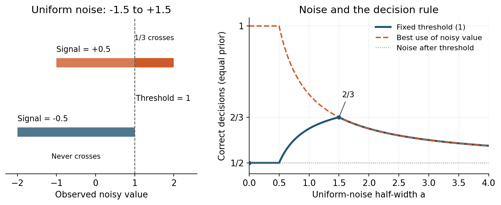

图 9 自制门槛模型。横轴只调节均匀噪声的半宽，2/3 的峰值仅属于这套固定门槛与噪声族。橙蓝线重合仅表示此处的猜对率相同，不表示信息完全等价。

若噪声加在已经恒为 0 的输出之后，正确率仍为 1/2。能读取原始实数、调整规则的观察者原本可全对；只读加噪后的实数且不知道噪声实际取值时，最好为 2/3。帮助受限读出，不等于增加了原始信息。

纸笔检查：画出负信号对应的 \[−2,1\] 与正信号对应的 \[−1,2\]，在 1 处划线，按长度计算越线概率；再把门槛改成 0。先问噪声加在哪一步、规则能否改变，再讨论它有没有用。

## 十 知道结局以后，还能期待什么

观众已知道结局，还会继续问什么？这一章以叙述顺序为线索，比较结果、原因和角色所知的信息怎样陆续出现。下文涉及《罗密欧与朱丽叶》的结局。

### 同一个终点，可以留下不同的未知

文本事实：这部戏的序诗已经说出恋人的死亡，以及死亡将终结两家的争斗。第五幕第二场却仍细写一封未送达的信、受阻的传话者和修士赶往墓地的新计划。知道终点，没有自动告诉我们每一步怎样走到那里。

[原文：莎士比亚《罗密欧与朱丽叶》](<https://www.folger.edu/explore/shakespeares-works/romeo-and-juliet/read/PRO/>)

一种读法是，注意力转向事情怎样变得不可挽回，以及角色知道或误解了什么。观众即便知道结局，也可能希望某一步改变。文本容许这种解释，却不能证明所有观众都会紧张，或预告结局必然提高作品评价。

叙事学家 Meir Sternberg 在一篇访谈中，把事件发生的顺序与读者得知事件的顺序分开，并主张从悬念、好奇与惊讶等效果回看形式。同一种写法可以产生不同效果，同一效果也可由不同写法产生。这是一种理论立场，适合用来提问，不能拿来保证读者反应。

[文献：Sternberg（2011）](<https://riviste.unimi.it/index.php/enthymema/article/download/1186/1395>)

据此，剪辑和写作时可以问：读者在等什么尚未发生的结果，在追问什么已发生的原因，又会在哪里修正此前的理解？这些问题可以交织，不必每段齐备。它们比单纯统计藏了多少信息更具体。

一个有限的实验例子：Hoeken 与 van Vliet 使用单篇小说片段，比较预告结局与未预告的版本，读后悬念均分同为七分制的 5.26。但两版都保留另一处意外，评分也只在读后询问；这不能证明全程体验相同，更不能推广到所有故事。创作上可以继续检查被保留下来的问题，而不只检查结局是否公布。

[文献：Hoeken 与 van Vliet（2000）](<https://www.researchgate.net/publication/222121244_Suspense_curiosity_and_surprise_How_discourse_structure_influences_the_affective_and_cognitive_processing_of_a_story>)

### “剧透让故事更好”为什么仍不能当配方

实验证据并不单向。Leavitt 与 Christenfeld 的 2011 年研究，用三类共十二篇短篇小说比较阅读条件。放在故事外的预先揭示段落提高了平均喜好；但把揭示段落直接写成故事开头时，没有检测到同样的提升。即使在这项常被概括为“剧透有益”的研究里，呈现方式也不能随意互换。它没有单独证实“理解更流畅”或“悬念更强”就是原因。

[文献：Leavitt 与 Christenfeld（2011）](<https://bear.warrington.ufl.edu/brenner/mar7588/Papers/leavitt-Psychological%20Science-2011.pdf>)

Johnson与Rosenbaum在后续研究摘要中报告，412人的实验里，未剧透故事的乐趣、悬念、感动与总体享受评分更高。本次只取得出版方摘要，未读到完整方法，不能精确解释两项研究为何不同。至少，这些结果要求把喜好、悬念和理解分开比较，不能对所有故事给出同一种建议。

[文献：Johnson 与 Rosenbaum（2015，摘要）](<https://journals.sagepub.com/doi/10.1177/0093650214564051>)

### 一个叙述顺序练习

下面是同一组虚构事件的两种讲法。器物只是故事道具，没有提供真实维修步骤。

### A 按事件顺序讲

修理师把八音盒缺掉的第三个音补齐了。客人听了一遍，却没有伸手接。“以前每到这里，父亲都会替它哼一声。”客人说。修理师重新打开盒子，让第三个音空了出来。盒子再响时，客人低声接上那个音，把它收进口袋。

### B 先交出结果，再补上原因

交付前，修理师重新打开八音盒，让第三个音空了出来。半小时前，他刚把这个缺音补齐。客人听了一遍，却没有伸手接。“以前每到这里，父亲都会替它哼一声。”客人说。此刻，盒子再响，客人低声接上那个音，把它收进口袋。

A先呈现修复，再让客人的反应改变读者对修复的理解；B先给出撤回修复的动作，再交代原因。两版沿用同一组虚构事件，均保留缺音与记忆的联系。以上是写作意图，尚未通过试读确认。

可试做：把五件事各写在一张卡片上，保持事件不变，只调整揭示顺序。再把其中一版改成六个镜头：在哪一帧让观众看见结果，在哪一帧才允许理解原因？先写出每个停顿处希望观众问的问题，再检查画面或文字是否真的给了提问的依据。

若找人试读，不要让同一人先读 A 再读 B，然后把第二遍的熟悉感当成版本优势。可以让不同读者各自初读一版，分别问“想知道原因吗”“担心接下来会怎样吗”“能跟上事件吗”“喜欢吗”，并请他们指出卡住的位置。少量反馈用于修改，不足以推断普遍效果；这两版还改了时间连接词，也不是严格只变一个因素的实验。

这一章和分时信息的共同提问是：信息何时到达，会怎样影响之后的判断？故事没有沿用计分游戏的数学模型，读者也不必追求统一的最优分数，因此只能借用问题，不能搬用证明。

## 几条线如何相连

回看这些例子，每章都可以指出一种具体遗漏：基频比没有描述分音，外形没有直接给出内在距离，全局均值盖住了局部节奏，直方图不记录空间组织，单个行动者的状态也未包含环境痕迹。频谱与路网例子则进一步显示，精确读数仍可能不足以区分结构或预测调整后的结果。

时间问题也各有对象：微型游泳区分形状路径与走完路径的速度；提示系统区分事后完整与当时可用；叙述区分事件发生与读者得知。比较它们时，需要先说明谁在何时能使用哪些信息。

复查没有给出整齐一致的结果。所测参数族中的音色谷底得以保留，部分短窗锁相候选却在长时间观察中滑移；原本帮助导航的旧痕迹，目标反转后又导致绕行。它们各自修正了原来的判断，不应被整理成同一条规律。

### 描述也需要知道该忘记什么

这些例子不要求把所有细节都保留下来。Shalizi 与 Crutchfield 的预测状态框架，把对未来给出相同条件分布的不同历史归为一类。在论文定义的随机过程和预测任务中，这种表示保留所需的预测信息，并去掉不会改变预测的历史差异。这里的数学最优性有明确适用范围，不能直接等同于发现了所有现实因果。

[文献：Shalizi 与 Crutchfield（2001）](<https://csc.ucdavis.edu/~cmg/papers/cmppss.pdf>)

我核算了一个简单例子：无限循环的 AABB 序列，若起始相位均匀随机，A 与 B 各占一半，AA、AB、BA、BB 也各占四分之一。独立公平随机序列的理论单字母与双字母分布恰好相同。但看到 AA 后，循环序列的下一个字母一定是 B，随机序列则仍各有一半概率。换一种条件统计，就能区分它们。

反过来，如果已经知道规则就是 AABB 循环，为预测后续只需确定循环的四个相位，无需保存全部历史。若已经知道它是独立公平随机序列，历史对下一次概率预测没有帮助。这里比较的是已知模型所需的预测信息；有限样本并不能保证你已经识别出正确模型。

最后可以把问题收窄到一次具体判断：哪个差别会改变它？有时要补充一个遗漏的关系，有时要让过期痕迹消退；若现有测量无法区分两个解释，就需要换一种观察，或者保留尚不能决定的结论。

## 来源与阅读范围

检索、原文阅读与计算均在这次夜间探索中进行。以下保留文献入口、实际阅读范围与访问限制，便于回查。访问日期为北京时间 2026 年 10 月 6 日。

[Plomp 与 Levelt 1965 Tonal Consonance and Critical Bandwidth](<https://www.mpi.nl/world/materials/publications/levelt/Plomp_Levelt_Tonal_1965.pdf>)

原始论文与作者机构存档可读；核对了摘要和实验结论。

[Sethares 1993 Local Consonance and the Relationship Between Timbre and Scale 及作者计算程序](<https://sethares.engr.wisc.edu/comprog.html>)

作者程序页与[原论文 PDF](<https://sethares.engr.wisc.edu/paperspdf/consonance.pdf>) 可读。本次计算依据公开参数独立实现。

[Marjieh 等 2024 Timbral effects on consonance disentangle psychoacoustic mechanisms and suggest perceptual origins for musical scales](<https://www.nature.com/articles/s41467-024-45812-z>)

已读期刊最终版 PDF，并复算公开八度评分的平均曲线。进一步按作者导出规则核对原始记录：两条件的未失败参与记录为 196、185，进入评分 CSV 的贡献者为 188、181；两种人数是参与记录与保留评分的不同口径，并非 CSV 版本不同。没有试听或观看视频。[最终版 PDF](<https://upload.wikimedia.org/wikipedia/commons/4/4c/Timbral_effects_on_consonance_disentangle_psychoacoustic_mechanisms_and_suggest_perceptual_origins_for_musical_scales.pdf>)；[公开曲线与分析入口](<https://pmcharrison.gitlab.io/timbre-and-consonance-paper/supplementary.html>)；[原始数据及导出代码](<https://gitlab.com/raja.marjieh/consonance-and-timbre-data>)。

[McDermott 等 2016 Indifference to dissonance in native Amazonians reveals cultural variation in music perception](<https://mcdermottlab.mit.edu/papers/McDermott_etal_2016_consonance.pdf>)

作者实验室 PDF 全文可读；重点核对粗糙度与协和偏好的分离、控制实验及其解释范围。

[Henderson 与 Taimiņa 2001 Crocheting the Hyperbolic Plane](<https://pi.math.cornell.edu/~dtaimina/crochet/hplane.htm>)

作者 Cornell 页面全文可读；包含构造、近似条件、度量和嵌入限制。

[Cornell 数学材料 The Poincaré model for the hyperbolic plane Section 7](<https://pi.math.cornell.edu/~mec/Winter2009/Mihai/section7.html>)

课程材料可读；用于核对曲率为负一时的圆周公式。

[Klein Efrati 与 Sharon 2007 Shaping of Elastic Sheets by Prescription of Non Euclidean Metrics](<https://doi.org/10.1126/science.1135994>)

阅读原始论文的[大学教学存档 PDF](<https://materias.df.uba.ar/geoDifa2014c2/files/2012/07/Klein_2007.pdf>)，核对局部收缩与整体形变的实验。

[Efrati Sharon 与 Kupferman 2009 Elastic theory of unconstrained non Euclidean plates](<https://arxiv.org/abs/0810.2411>)

阅读作者预印本，核对厚度标度、参考度量及薄板理论范围；正式期刊版本为 Journal of the Mechanics and Physics of Solids 57。

[Abrams 与 Strogatz 2004 Chimera States for Coupled Oscillators](<https://arxiv.org/abs/nlin/0407045>)

作者预印本全文可读；核对模型方程、余弦耦合、图 1 参数和初相形式。此次未复现其窄高斯初相的图案；改变初相宽度后得到有限时间并存。

[Wolfrum 与 Omel’chenko 2011 Chimera states are chaotic transients](<https://webdoc.sub.gwdg.de/ebook/serien/e/wias/2012/wias_preprints_1618.pdf>)

此前仅能读取摘要；本次进一步读到大学图书馆公开镜像的作者预印本全文，核对邻域均匀耦合、α = 1.46、R/N 约 0.35 及坍缩统计。它不同于本笔记的余弦耦合模型；寿命拟合没有迁移到本次算例。原机构存档仍遇到安全验证，未执行验证。

[Sethia 与 Sen 2014 Chimera states the existence criteria revisited](<https://arxiv.org/abs/1312.2682>)

阅读作者 2014 年修订版全文；用来限制非局部耦合必须存在的泛化。

[Hagerstrom 等 2012 Experimental observation of chimeras in coupled map lattices](<https://photonics.umd.edu/pubs/ja-44/>)

研究实验室页面及论文 PDF 可读；实验对象为耦合映射格子，没有观看其补充视频。

[Adelson 1993 Perceptual Organization and the Judgment of Brightness](<https://web.mit.edu/9.35/www/archives/2020/vision/papers/brightness_transparency.pdf>)

MIT 课程存档的原始论文可读；核对图案组织、亮度与明度的区分及所讨论模型的范围。

[Kim Marlow 与 Anderson 2011 The perception of gloss depends on highlight congruence with surface shading](<https://pdfs.semanticscholar.org/4ea1/abb042414d5d517ac78f5a71be8a48342424.pdf>)

进一步阅读期刊最终版 PDF 的方法、实验 1、3、4 与末尾讨论，核对亮度控制与纯镜面图的反例；结论不唯一识别神经算法。

[Morimoto 等 2026 Human gloss perception reproduced by tiny neural networks](<https://www.nature.com/articles/s41562-026-02445-0>)

核对出版方正文及方法：按形状和光照分别做 12 组留出验证。另读取作者公开仓库的一枚示例滤波器，做了分布外响应探针；未复现完整评分模型、重新训练或下载大规模数据集。[作者代码与数据](<https://github.com/takuma929/gloss_tinynetworks>)。

[Reid 等 2012 Slime mold uses an externalized spatial memory to navigate in complex environments](<https://chrisrreid.wordpress.com/wp-content/uploads/2015/12/slime-mould-uses-an-externalized-spatial-e28098memory_-to-navigate-in-complex-environments.pdf>)

作者公开的最终 PNAS 论文可读；核对 120 小时观察窗、两组各 24 个体、无障碍控制与平均速度。没有观看补充视频，也没有饲养生物。

[Facchini 等 2024 Substrate evaporation drives collective construction in termites](<https://doi.org/10.7554/eLife.86843.4>)

核对原论文公开摘要、正文与附录提取，以及 eLife 审阅意见；网页直开遇到验证。限定为人工场地的早期行为，并区分平均曲率、高斯曲率与边界效应。

[Gordon Webb 与 Wolpert 1992 One cannot hear the shape of a drum](<https://arxiv.org/abs/math/9207215>)

阅读原始研究公告，核对非全等平面域及 Dirichlet 频谱的结论。文中六节点网络是本次独立搜索和整数核对的示例，没有声称重新证明全部鼓膜定理。

[Shalizi 与 Crutchfield 2001 Computational Mechanics Pattern and Prediction Structure and Simplicity](<https://csc.ucdavis.edu/~cmg/papers/cmppss.pdf>)

阅读原始论文的定义、充分统计量、最小性与限制部分。AABB 与独立公平随机序列的比较为本次精确概率核算，不是从有限数据识别模型的实证结果。

[Braess 1968 / Braess Nagurney 与 Wakolbinger 2005 On a Paradox of Traffic Planning](<https://homepage.ruhr-uni-bochum.de/Dietrich.Braess/Paradox-BNW.pdf>)

阅读原始论文的作者公开英文译本。文中的归一化四节点算例重新推导；没有将原文讨论的最大路径耗时目标与一般总耗时目标混为一谈。

[Roughgarden 与 Tardos 2002 How Bad Is Selfish Routing](<https://www.cs.yale.edu/homes/lans/readings/routing/roughgarden-selfish-2002.pdf>)

原始期刊论文全文可读；核对连续流定义、Corollary 4.2、仿射耗时的 4/3 界与适用条件。正比例成本对照和需求量曲线由本次独立计算。

[Morgan Orzen 与 Sefton 2009 Network Architecture and Traffic Flows](<https://faculty.haas.berkeley.edu/rjmorgan/traffic.pdf>)

实际阅读的是作者公开的 2007 年 7 月稿，期刊版发表于 2009 年。核对方法、六个 Braess 独立小组、表 8 及持续波动；没有把所有逐轮选择当成独立实验。

[Cohen 与 Horowitz 1991 Paradoxical behaviour of mechanical and electrical networks](<https://lab.rockefeller.edu/cohenje/assets/file/185CohenHorowitzNature1991.pdf>)

阅读作者实验室公开原文并目视核对第 700 页图示与分数。弹簧为无质量、零自然长度的理想元件；结论为静态平衡比较，没有实际搭建装置。

[Rosenthal 1973 A Class of Games Possessing Pure-Strategy Nash Equilibria](<https://ranger.uta.edu/~weems/NOTES6319/PAPERSONE/rosenthal1973.pdf>)

原始三页论文全文可读；核对有限拥堵游戏的势函数证明。本次进一步对全部 91 种人数分配的单人换路验证势函数差值，并区分顺序与同时更新。

[Purcell 1977 Life at low Reynolds number](<https://www.math.uwaterloo.ca/~mdunphy/purcell.pdf>)

原始扫描论文可读；目视核对前三页的雷诺数、往复动作及双铰链形状空间论述，并参考大学课程文字转录。未观看原讲座或演示。

[Najafi 与 Golestanian 2004 Simple swimmer at low Reynolds number Three linked spheres](<https://arxiv.org/abs/cond-mat/0402070>)

阅读原始预印本模型与四步循环；早期渐近表达式须结合后续修正使用。PDF 内的重新编译日期不当作论文发表年份。

[Golestanian 与 Ajdari 2008 Analytic results for the three sphere swimmer at low Reynolds number](<https://arxiv.org/abs/0711.3700>)

阅读 2008 年修订稿的运动方程、形状面积关系、功率与效率部分及注释 25。本次直接解小矩阵，不是完整流体数值模拟。

[Earl 等 2007 Modeling microscopic swimmers at low Reynolds number](<https://arxiv.org/abs/cond-mat/0701511>)

重点核对第三节的原公式修正、每周期位移与小振幅极限。没有重复其格子 Boltzmann 或多粒子碰撞模拟。

[Qiu 等 2014 Swimming by reciprocal motion at low Reynolds number](<https://infoscience.epfl.ch/bitstreams/0c7c3cd2-c77b-4ccd-892e-df9e53deb8a6/download>)

出版方与 PMC 直开遇到验证；从 EPFL 公开存档下载期刊最终版，核对对称驱动、牛顿流体与体相环境控制。补充影片没有观看，生物医学用途不作为本笔记结论。

[Wajnryb 等 2013 Generalization of the Rotne Prager Yamakawa mobility and shear disturbance tensors](<https://www.fuw.edu.pl/~piotrek/publications/Rotne_Prager_Yamakawa.pdf>)

作者公开期刊论文可读，核对非重叠球的式 3.12 及近似限制。RPY 比较包含领先球对修正，不能替代多体效应、近接润滑与完整流场验证。

[Boyd 2007–08 Observability and state estimation EE263 Lecture 19](<https://see.stanford.edu/materials/lsoeldsee263/19-observ.pdf>)

阅读作者课程讲义关于已知系统矩阵的前提、不可观测子空间、Cayley–Hamilton 化简和连续时间观测。六节点模型的局部响应、多项式与隐藏模态为本次独立计算；未观看课程视频。

[de Oliveira 2018 Blackwell’s Informativeness Theorem Using Diagrams](<https://henriquedeoliveira.com/wp-content/uploads/2020/12/blackwells-informativeness-theorem-using-diagrams.pdf>)

实际阅读作者 2017 年 11 月 30 日全文稿，正式发表于 2018 年。核对有限集合前提、Theorem 1、动态信息的 Definition 2 与 Theorem 5。文中的两回合概率、不可行性证明和分数均为本次独立构造，另经独立复算。未将原始 Blackwell 文献的访问受限说成全文阅读。

[Shakespeare《Romeo and Juliet》序诗与第五幕第二场，Folger Shakespeare Library 校订文本](<https://www.folger.edu/explore/shakespeares-works/romeo-and-juliet/read/PRO/>)

已读序诗 1–14 行与第五幕第二场 1–30 行的英文原文。关于读者提问的分析是本笔记的解读；没有观看演出或测量观众反应。另见[第五幕第二场](<https://www.folger.edu/explore/shakespeares-works/romeo-and-juliet/read/5/2/>)。

[Sternberg 2011 Reconceptualizing Narratology. Arguments for a Functionalist and Constructivist Approach to Narrative](<https://riviste.unimi.it/index.php/enthymema/article/download/1186/1395>)

已读期刊公开访谈 PDF，重点为第 2、3、6–8 节，关于顺序、叙事效果与形式关系的论述。作为作者的理论主张使用，没有将其当作读者实验或公认的唯一叙事理论。

[Leavitt 与 Christenfeld 2011 Story Spoilers Don’t Spoil Stories](<https://bear.warrington.ufl.edu/brenner/mar7588/Papers/leavitt-Psychological%20Science-2011.pdf>)

已读大学教学网站存放的期刊最终版三页 PDF，核对方法、结果与讨论。外置揭示段落和故事内开头的结果分开报告；未把未检出差异写成严格等效，也未把机制猜想写成已证实中介。

[Johnson 与 Rosenbaum 2015 Spoiler Alert: Consequences of Narrative Spoilers for Dimensions of Enjoyment, Appreciation, and Transportation](<https://journals.sagepub.com/doi/10.1177/0093650214564051>)

仅已读出版方及作者机构的摘要和书目信息。在线首发 2014 年，卷期出版于 2015 年。全文受限；不据摘要比较详细效应量、具体操纵或解释与 2011 年研究的分歧。

[Hoeken 与 van Vliet 2000 Suspense, curiosity, and surprise: How discourse structure influences the affective and cognitive processing of a story](<https://www.researchgate.net/publication/222121244_Suspense_curiosity_and_surprise_How_discourse_structure_influences_the_affective_and_cognitive_processing_of_a_story>)

已读作者公开上传页面中的期刊全文，未成功下载 PDF。核对单篇文本、四版本的随机分配、读后单题悬念评分与保留的意外事件。两个均值相同不构成等效性证明；没有把讨论中的视角切换解释写成已验证机制。

[Kay 2000 Can Detectability Be Improved by Adding Noise?](<https://www.ele.uri.edu/faculty/kay/New%20web/downloadable%20files/00809511.pdf>)

已读作者大学网页存放的期刊最终版三页 PDF，目视核对公式符号，并独立重算文中符号检测器的二项分布结果与单峰噪声负对照。正文的 ±0.5 固定门槛例子为本次另构造的精确模型，非作者原数值算例；2/3 仅为指定均匀噪声族内的峰值。
